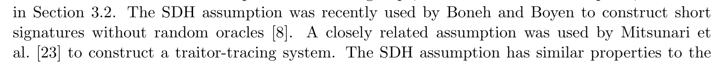

<!--
headingDivider: 1
-->
<!--
_class: title
-->
# マイナンバーカード, BBS署名, ZKP
 
光成滋生
 
last update: 2026/01/14

# 概要
## 目的
- マイナンバーカードの仕組みと課題を理解する
- SD-JWTやBBS署名などの選択開示署名の概念を理解する
- ZKP

# 目次
## 用語一覧
- 本人確認
- マイナンバーカード
- 選択的開示可能署名
- SD-JWT, BBS署名, グループ署名

# 本人確認ガイドライン
## 本人確認 ＝ 身元確認 ＋ 当人認証
- 身元確認 ＝ 登録する基本4情報などが正しいことを確認する
  - L3: 対面で公的身分証を元に確認
  - L2: 郵送などの非対面で公的身分証を元に確認
  - L1: 自己申告

- 当人確認 ＝ 登録された情報と、今回の情報を認証の3要素（生体・所持・知識）で照合
  - L3: 耐タンパ性ハードウェアを用いた複数の認証
  - L2: 3要素のうち複数用いる認証
  - L1: 3要素のうち1要素を用いる認証

- サービスレベルに応じてレベルは異なるが銀行などではL2+L2以上が多い
- 参考: [IPA「サービスに応じたデジタル本人確認ガイドラインの検討」](https://www.digital.go.jp/assets/contents/node/basic_page/field_ref_resources/093e09a7-2ffe-4a41-971a-5c0dcfd3c0b3/20220125_meeting_trust_dx_02.pdf)

# マイナンバーカード
## 公的個人認証サービス
- 署名用電子証明書
  - 「基本4情報（氏名・住所・生年月日・性別）＋個人の検証鍵」にCAが署名したもの
  - マイナンバーカードは証明書を耐タンパー性のハードウェアに格納
  - いろいろなシーンで使ってほしい by デジタル庁
  - 利用者証明用電子証明書（本人の認証用）には基本4情報は含まれない
## 利用時の手順
1. なんらかの文書に署名鍵で署名する（要 署名用電子証明書のパスワード）
2. 「文書 + 署名 + 署名用電子証明書」を相手に送る
3. 相手はCAの検証鍵で署名用電子証明書の正しさを確認
4. 署名用電子証明書に含まれる検証鍵で文書の正しさを確認
  ユーザの証明書が失効されていないかの検証も必要

# 署名の流れ
## 行政機関向け（左）と民間事業者向け（右）の違い
-  
## 電子証明書の扱い
- 署名の検証に必要な電子証明書は直接民間事業者には渡さない
- CRL（証明書失効リスト）はシリアル番号と失効日時のリスト

# 署名のシーケンス図

## 主な処理
- [10]でデータのハッシュ値に対して署名する
  - 署名用電子証明書の
  認証パス・有効期間の検証
  - 署名用電子証明書の有効性確認
  （行政機関のみ）
## 署名検証は行わない
- 署名対象データ・署名対象ハッシュ値・署名値の確認をしない
- 署名検証は自分（RPアプリ）でやる[17]
  - 実際にはPF（プラットフォーム）事業者に依頼する [JPKIサービス](https://www.digital.go.jp/policies/mynumber/private-business/jpki-introduction/)

# プライバシー
## 基本4情報は直接渡さない
- しかし代わりに絶対的な権限がデジタル認証アプリサーバーに集中する可能性
- 原理的には、いつ、だれが、どのサービスに何の情報を渡したのか把握できる
## [プライバシーポリシー](https://services.digital.go.jp/auth-and-sign/privacy-policy/)
- 保有する情報を利用目的以外には使わない・提供しない
- 「情報の全部または一部の処理を第三者に委託する」場合もある

# Apple Walletのマイナンバーカード
## カード代替電磁的記録（属性証明機能）
- マイナンバーカードに記録された基本4情報（氏名・住所・生年月日・性別）
  ＋その情報が正しいことを示す情報
  ＋送信者が本人であることを証明する情報
- 大多数のオンラインサービスでは十分な本人確認になる

## iPhoneの[Verify with Wallet API](https://developer.apple.com/wallet/get-started-with-verify-with-wallet/)
- Apple Walletに格納された個人情報を扱うAPI
- 2025年9月対応しているのはUSの一部の州と日本のみ
## 仕様
- ISO/IEC 18015-5: モバイル運転免許証の規定
- ISO/IEC 23220: モバイルデバイス上で動作するデジタル身分証の規定

# Apple Walletで確認できる項目
## 要求できる項目
- N歳（以上）であること
- ID写真
- 姓・名
- 住所
- 誕生日
- マイナンバー
- 性別
## 信頼性
- Appleとそのソフトウェアを信頼するしかない

# 選択的開示可能な署名
## 基本4情報（に限らないが）の一部のみを開示して確認できる暗号技術
- W3Cの[VC : Verifiable Credentials （検証可能な認証情報）](https://www.w3.org/TR/vc-data-model-2.0/)などで規格策定中
  - 大きく二種類の方法
    - ハッシュ関数ベースのもの（SD-JWT）
    - ペアリング暗号ベースのもの（BBS署名）
## メリットとデメリット

項目|SD-JWT|BBS署名
-|-|-
実装|容易|難しい
検証コスト|低い|大きい
*unlinkability* （後述）|弱い|強い

# SD-JWT
## 用語
- JOSE (JSON Object Signing and Encryption) : JSONを用いた署名と暗号化の規格
  - JSON + Base64URL
- JWS (JSON Web Signature) : 署名に関する規格
- JWE (JSON Web Encryption) : 暗号化に関する規格
- JWK (JSON Web Key) : 鍵に関する規格
- JWA (JSON Web Algorithms) : アルゴリズムに関する規格
- JWT (JSON Web Token) : クレーム（値）に関する規格（「ジョット」と発音）
- [SD-JWT (Selective Disclosure for JWTs)](https://datatracker.ietf.org/doc/draft-ietf-oauth-selective-disclosure-jwt/)
  - JWTで選択的開示を実現するための規格
- CBOR (Concise Binary Object Representation) : JSONのバイナリ版
  - COSE (CBOR Object Signing and Encryption) : CBORを用いた署名と暗号化の規格

# SD-JWTのコアアイデア
## salt+ハッシュ関数を使う

クレーム|クレーム値|salt (128bit)|ハッシュ値(_sd)
-|-|-|-
姓|山田|1aef...|`H("山田", "1aef...")`
名|太郎|584a...|`H("太郎", "584a...")`
誕生日|2000/01/01|39ff...|`H("2000/01/01", "39ff...")`

- クレーム値全体を署名するのではなくハッシュ値全体に対して信頼できる機関が署名する
  - ハッシュ値だけ公開する
- 検証方法
  - 検証者はハッシュ値を含む署名を検証
  - 開示したいクレーム値に対してsaltとクレーム値を要求し, ハッシュ値が正しいことを確認
- saltが128bitあるのでsaltが非公開だとハッシュ値からクレーム値を求められない

# SD-JWTの暗号学的な欠点
## 署名は常に同じ
- いろんなサービスで同じSD-JWTを提示する
## saltの漏洩
- クレーム値のドメインが小さいとsaltが漏洩するとハッシュ値からクレーム値を計算できる
  - H(salt, クレーム値)=hash値となるクレーム値の総当たりが可能
  - 性別なら精々数パターン, 誕生日も365*100程度

# unlinkability （連結不可能性）とは
## あちこちのサービスで利用したときに追跡されないこと
- 検証のために相手に渡すデータがいつも同じだと追跡される

- 3rd party cookieのようなもの
- プライバシーを保つにはunlinkabilityが重要

# ペアリングベースの署名
## ドラフト
- Revisiting BBS Signatures, EUROCRYPT'23
  - [draft-irtf-cfrg-bbs-signatures](https://datatracker.ietf.org/doc/draft-irtf-cfrg-bbs-signatures/)
## フロー

- CAが基本4情報等に対してBBS署名を発行
- ユーザは開示情報を決めて「証明prf」を生成
- 検証者は開示情報とprfをCAの検証鍵で検証
## SD-JWTに対する利点
- 同じ開示情報に対するprfでも毎回異なるのでunlinkabilityが高い

# BBS署名のPoC
## ブラウザで動作する[デモ](https://github.com/herumi/misc/tree/main/bbs)
- C++/LLVMで実装したものをWasm用にコンパイルしてNode.jsモジュール化
  - TypeScriptで利用してブラウザで動かす
- 細かいデータフォーマットなどは仕様に従ってないプロトタイプ実装

# グループ署名
## メンバーが自身の身元を明かさずに署名できる[傘連判状](https://www.city.ikoma.lg.jp/html/dm/bun/shosai/)のようなもの
### 基本アルゴリズム
- $\text{GKg}(1^λ)→(gpk, ik, ok)$: グループ鍵を生成
  - $gpk$: グループ署名鍵 (group public key)
  - $ik$: 発行者秘密鍵 (issuer key), $ok$: 開示鍵 (opening key)
- $\text{UKg}(gpk, ik)→gsk_i$: 発行者とメンバーの対話により各メンバーの署名鍵を発行
- $\text{Sign}(gpk, gsk_i, m)→σ$: メンバーがメッセージ $m$ に署名
- $\text{Verify}(gpk, m, σ)→\Set{0,1}$: 署名の検証
- $\text{Open}(gpk, ok, m, σ)→\Set{i, ⊥}$: 発行者が署名者の身元を開示
### グループ署名特有の要件
- 匿名性: 発行者以外は署名者が誰か分からない
- 追跡可能性: 発行者は署名者を特定できる

# BBS署名の原型
## Boneh, Boyen, Shacham, "[Short Group Signatures](https://link.springer.com/chapter/10.1007/978-3-540-28628-8_3)", CRYPTO'04
- $G_1=⟨g_1⟩$, $G_2=⟨g_2⟩$: 位数 $r$ の加法巡回群
 $e:G_1×G_2→G_T=⟨g_T⟩$: ペアリング
- アルゴリズム概要
  - 発行者は $γ$ を生成しグループの鍵生成をした後 $γ$ を破棄する
  - グループの公開鍵 $gpk$ （$w=γ g_2$を含む）, 追跡用秘密鍵: $gmsk$
  - 各ユーザの秘密鍵 $gsk_i$ $(x_i,\frac{1}{γ+x_i}g_1)$
  - 署名: sign($gpk$, $gsk_i$, メッセージ $m$) から署名 $σ$ を作る
  - 検証: verify($gpk$, $m$, $σ$) で正しいか確認
  - 公開: open($gpk$, $gmsk$, $m$, $σ$) でメンバーの身元を明かす
## 応用
- 複数メッセージに対応し($\sum_i m_i h_i$)、その一部の秘匿をゼロ知識証明ZKPを使って実現

# 安全性の根拠
## q-SDH (Strong Diffie-Hellman) 仮定
- $P, x P, x^2 P, ..., x^q P∈G$ から, ある$c$ に対する $(c, e(P,P)^{1/(x+c)})$ を求めるのが困難
- 原型は私たちの2001年の放送型暗号の提案に基づく安全性仮定
  - $\Set{\frac{1}{x+a_1}g, \cdots,\frac{1}{x+a_n}g}$ から $\frac{1}{x+a}g$ ($a \not\in \Set{a_1,\dots,a_n}$) を求める問題A
  - $\Set{P, x P, \cdots , x^q P}$ から $(1/x)P$ や $x^{q+1} P$ を求める問題Bと同値であることを示す
  - 特に $\Set{P, x P}$ から $x^2 P$ を求める問題はDHP問題と同値なので, 問題A, Bも困難と予想
- BBS署名の論文

## 問題
- $P, x P, y P$ から $x y P$ を求める困難さと $P,x P$ から $x^2 P$ を求める困難さは同程度であることを示せ

# ゼロ知識証明ZKP (Zero-Knowledge Proof)
## ざっくりとした用語解説
- 主張 (statement) $x$
- 証拠 (witness) $w$
- 関係 (relation) $R$: $w$ が $x$ の正しさ証拠であることを判定する手続き
- ZKP: 証明者 $𝒫$ が検証者 $𝒱$ に, ある主張 $x$ の正しさを *$w$ を教えずに*納得させる対話

## 例
- 楕円曲線の点 $P$ において, 秘密鍵 $s$ と公開鍵 $Q=sP$ の関係
- 主張:「$P$, $Q$ に対する秘密鍵を知っている」
- 証拠:「$s$」
- 関係:「$Q=sP$ となること」
- ZKP: $s$ を教えずに自分が $s$ を知っていることを相手に納得してもらう

# ZKPの求められる性質
## 完全性 (completeness)
- 主張が正しいなら $𝒱$ は（ほぼ）1の確率で受理する
## 健全性 (soundness)
- 正しくないなら $𝒱$ はどんな $𝒫^*$ も騙せない（無視できる確率でしか受理しない）
## ゼロ知識性 (zero-knowledge)
- $𝒱$ は主張が正しいこと以外の $w$ に関する新しい知識を得ない

## 署名との関係
- 「秘密鍵を知っている」という主張に対するZKPを以下のようにすると署名になる
  - メッセージに結びつける
  - 非対話化して後で検証できるようにしたもの

# 詳しい定義
## NP (Nondeterministic Polynomial time) 言語
- $R$: 2変数確率的多項式時間アルゴリズム
- $L=\Set{x∈\Set{0,1}^* \mid ∃w∈\Set{0,1}^{p(|x|)}  \text{ s.t. } R(x,w)=1}$ をNP言語という
  - $x∈L$ を主張, $w$ を証拠という
  - $p(|x|)$ は $x$ の長さに関する多項式
## ゼロ知識性
- 任意のPPT検証者 $𝒱^*$ に対して、PPTシミュレータ $S$ が存在し、
$x \in L$ のとき以下の二つの分布が計算量的識別不可能:

$$\{\mathsf{View}_{𝒱^*}[\langle 𝒫(w), 𝒱^* \rangle(x)]\}_{x \in L} 
\approx_c \{S(x, 1^{|x|})\}_{x \in L}$$

- $\mathsf{View}_{𝒱^*}$: $𝒱^*$ の視点（自身の乱数・受信メッセージのみ観測）
- $S$: $w$ を知らずに $x$ のみから実行記録(transcript)を模倣
- $\approx_c$: 計算量的識別不可能（どんなPPT判別器も negligible な優位性しか持たない）

# ZKPの利用例
## 準同型暗号との組み合わせ
- （前回の講義で）クラウド上の暗号文の処理結果 $c$ を解析者に渡して復号してもらう場面
  - 解析者は暗号文 $c=Enc(m)$ に対して正しい $m$ を返してくれたのか?
  - $Dec(c)=m$ であることを「秘密鍵を教えずに」証明する
## ビットコインのお金の流れを秘匿する
  - A, Bから送金されてC, Dに送られたことは公開される

  - いくら送ったかを隠したい
    - $A+B=C+D$ を満たしていることだけ証明したい
      - マイナスを受け付けないため更に $A, B, C, D ≥ 0$ も必要
## クルデンシャル情報
- 「年齢が18以上であること」を誕生日を教えずに示す

# 範囲証明の大まかなアイデア
## 0か1か
- 「$X=0$」であることのZKPを構成する（詳細は今回は略）
- 「$X=1$」であることのZKPも同様に構成する
- Or-proofにより「$X=0$または$X=1$である」ZKP
## $n$ がbビットであることを示す
- $n=Σ_{i=0}^{b-1} n_i 2^i$ と2進数展開
- 各 $n_i∈[0,1]$ であることのZKP
- $n=Σ_{i=0}^{b-1} n_i 2^i$ であることのZKP（準同型暗号や準同型コミットメントを利用）
- これにより$n∈[0, 2^b-1]$ であることが示せる
- 後は2べきの和として表現することで$n∈[a, b]$ であることのZKPも構成できる

# $Σ$ プロトコル
<!-- _class: image-right-center -->

## 証明者 $𝒫$ と検証者 $𝒱$ の(3-move)対話証明プロトコル
- 主張 $x$, 関係 $R(x,w)=1$, 証拠 $w$ について
$𝒫$ が $w$ を知っていることを $w$ を教えずに $𝒱$ に証明する
1. $𝒫$ は乱数 $r$ をとって $a:=P_1(x,w,r)$ を $𝒱$ に送る
2. challenge: $𝒱$ は乱数 $c$ をとって $𝒫$ に送る
3. $𝒫$ は $z:=P_2(x,w,r,c)$ を $𝒱$ に送り
$𝒱$ は $Ver(x,a,c,z)$ で検証する

# $Σ$ プロトコルの要件
## 完全性
- $w$ を持つ $𝒫$ が正しく実行すると $𝒱$ は常に受理する

## 特別な健全性 (Special Soundness)
- 同じ $a$ に対する2個の受理transcript $(a, c_0, z_0)$, $(a, c_1, z_1)$ ($c_0 ≠ c_1$) から $w$ をPPT計算可能
  - 2個の異なるchallengeに正しく答えられるなら証拠 $w$ を抽出できる
  - この性質により「$𝒫$ は $w$ を知っている」ことを示せる
    - 知識の証明 (Proof of Knowledge)という

## 特別な正直検証者ゼロ知識 (SHVZK: Special honest Verifier ZK)
- $c$ を先に選んでから $(a, c, z)$ を生成するPPTシミュレータ $S$ で, その出力分布 $\Set{(a,c,z)}$ が
実際の受理transcriptの分布と計算量的に識別不可能なものが存在する
  - ランダムに $c$ を選ぶ正直な検証者に対してはZK
  - 悪意ある検証者が $c$ を $a$ に応じて選ぶ場合は保証されない

# $Σ$ プロトコルをより強力な証明に変換する
## チャレンジ空間を大きくする
- 乱数をとる空間 $𝒞$ に対して健全性の誤り確率は $|𝒞|^{-1}$
  - あるいはプロトコルを $k$ 回繰り返すと $|𝒞|^{-k}$ になる
## Fiat-Shamir変換
- $Σ$ プロトコルを非対話化する
  - チャレンジ $c$ をハッシュ関数 $H$ を用いて $c:=H(x,a)$ とする
1. $𝒫$ は $r$ を選び $a:=P_1(x,w,r)$, $c=H(x,a)$, $z:=P_2(x,w,r,c)$ を計算し
証明 $π:=(a,z)$ を $𝒱$ に送る
1. $𝒱$ は $c=H(x,a)$ を計算して $Ver(x,a,c,z)$ をチェックする
- ランダムオラクルモデルの元で安全性が証明される

# ECDLPの知識の証明とSchnorr署名
## $P$: 楕円曲線上の位数 $r$ の生成元, $s$: 秘密鍵, $Q$: 公開鍵
- 「$Q=sP$ の $s$ を知っている」ことの $Σ$ プロトコル
1. $𝒫$ は乱数 $r∈𝔽_r$ を選び $a:=r P$ を $𝒱$ に送る
2. $𝒱$ は乱数 $c∈𝔽_r$ を選び $𝒫$ に送る
3. $𝒫$ は $z:=r + c s$ を $𝒱$ に送り, $𝒱$ は $z P = a + c Q$ で検証する
- 健全性: $(a, c_i, z_i=r + c_i s)$ ($c_0 ≠ c_1$) から $z_0 P - z_1 P=c_0 Q - c_1 Q$ より $s=\frac{z_0 - z_1}{c_0 - c_1}$
## Fiat-Shamir変換による非対話化
- 証明: 乱数 $r$ を選び $a:=r P$, $c:=H(P,Q,a)$, $z=r+c s$ として $π:=(a,z)$ を送る
- 検証: $c=H(P,Q,a)$ を計算して $z P = a + c Q$ をチェック
### Schnorr署名
- メッセージ $m$ に対する署名: $c:=H(P,Q,a,m)$ として生成した証明 $(a,z)$ を署名 $σ$ とする
- 検証: $c=H(P,Q,a,m)$ を計算して $z P = a + c Q$ をチェック
