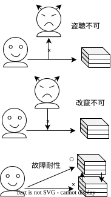
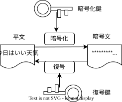
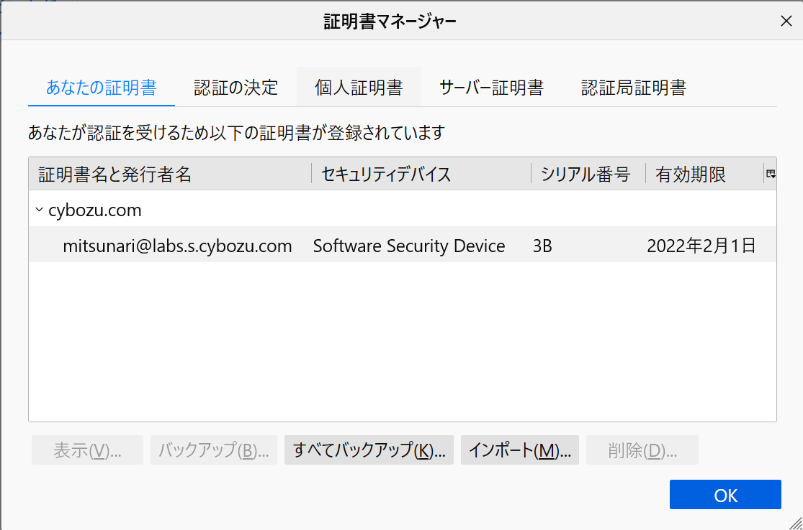
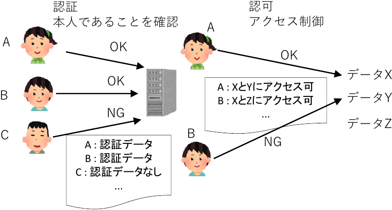
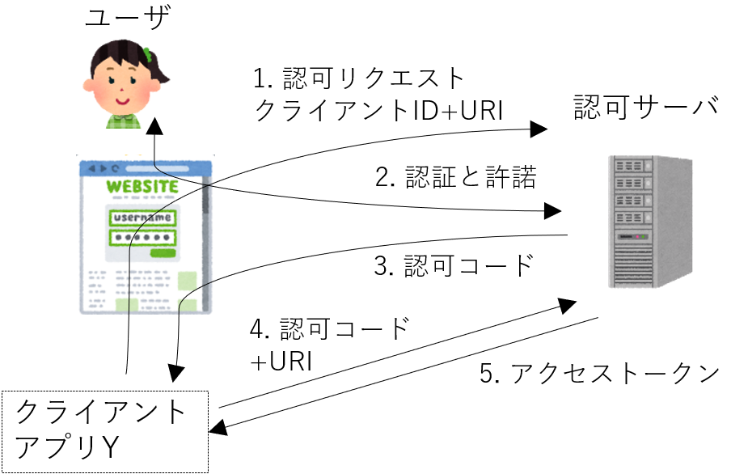

<!--
headingDivider: 1
-->
<!--
_class: title
-->
# 情報セキュリティと暗号技術
 
光成滋生
 
last update: 2026/10/02

# 概要
## 目的
- 安全なネットショッピングに必要なものとは
- 情報セキュリティの基本的な考え方を理解する
- 情報セキュリティを守るための暗号技術の基本的な考え方を理解する
- 実際のサービスにおけるプロトコル例
## 構成
- 情報セキュリティ
- 暗号
- 認証・FIDO
- 認可・OAuthなど

# 情報セキュリティとは
<!-- _class: image-right -->
## ネットショッピングにおける望ましい状態

- 自分がどんな商品を買ったか他人に知られない
- 商品の値段や送付先が勝手に書き換えられない
- いつでも買い物ができる
## 情報セキュリティの三要素
- 機密性 (confidentiality)
  - 許可されていない人が情報にアクセスできないこと
- 完全性 (integrity)
  - 情報が改竄されたり消えたりせずに正確に存在すること
- 可用性 (availability)
  - 許可された人が必要なときに情報にアクセスできること

# 情報セキュリティと暗号技術
## JIS Q 27000
- 日本の産業の標準化のために定められた国家規格で情報セキュリティの用語を定義する
- 日本産業標準調査会JISCが調査審議を行う
## 暗号技術との関係
- 情報セキュリティを守るには様々な技術が必要
  - その中で暗号化・認証・署名・改竄検知・否認防止などの技術を総称して暗号技術という

## 情報セキュリティの三要素と関連する暗号技術
要件|求められる特性|暗号技術の例|
-|-|-|
機密性|データの秘匿|暗号化・アクセス制御|
完全性|データの正確さ|メッセージ認証符号・署名|
可用性|データへのアクセスを担保する|秘密分散|

# 海底ケーブルやデータセンターと紛争
## 世界の通信の可用性を支えるインフラ
- 全世界で約500本・総延長距離約150万km（地球37周分）
- 国際通信の99%を支える
  - NECが25%のシェア・累計45万km（[INTERNET Watch 2026/9/25](https://internet.watch.impress.co.jp/docs/news/2143064.html)）
## ケーブル切断
- 津波・地震・サメなど
- 事故や人為的な破壊・紛争による切断
  - [CIGS 2025/9: 相次ぐ海底ケーブル切断事件](https://cigs.canon/chinese_studies/view_taiwan/20260914_10441.html)
  - [日経新聞 2026/7/17: 米イラン衝突、海底ケーブル集中の急所狙う データの3割が中東経由](https://www.nikkei.com/article/DGXZQOGR099KA0Z00C26A6000000/)

## データセンター自体への攻撃
- [ITmedia NEWS 2026/9/17: ドローン攻撃を受けたAWS中東データセンター、
半年の復旧作業の末に「一部データは回復不能」](https://www.itmedia.co.jp/news/article/2609/17/2000001590/)

# 追加された要件
## 真正性 (authenticity)
- ユーザや、システムなどが本当にその人やものであり、偽物が紛れていないこと
  - 本当に当事者であることを確認する
## 責任追跡性 (accountability)
- システムに対して誰が、いつ、何をしたのかを正確に記録して問題が起きたときに原因を究明できること
## 否認防止 (non-repudiation)
- なんらかの操作を後でなかったことにされないようにすること
## 信頼性 (reliability)
- システムが不具合無く正確に動作していること

# 問題
## 次は何を満たし、何を満たさないか
1. 正当な送信者からのデータが伝送中に破損 （機密性以外の観点で）
2. 不正者が送信した完全なデータ （機密性以外の観点で）
3. 正当な送信者からのデータが伝送中に傍受されて中身が漏洩
4. 年に一度メンテナンスで数日間止まるシステム

# 答え
## 解説
1. 正当な送信者からのデータが伝送中に破損 （機密性以外の観点で）
    - 真正性: ○, 完全性:×, 可用性:×
    - 真正性は暗号化されているか否かに係わらない
2. 不正者が送信した完全なデータ （機密性以外の観点で）
    - 真正性: ×, 完全性:○, 可用性:○
3. 正当な送信者からのデータが伝送中に傍受されて中身が漏洩
    - 真正性: ○, 機密性:×, 可用性:○
    - 暗号化していれば傍受されても機密性は守られた
4. 年に一度メンテナンスで数日間止まるシステム
    - 可用性: ×, 信頼性:○
    - 予定通りに実施されても停止期間が長いと可用性は低い

# 暗号 (encryption)
<!-- _class: image-right-center -->
## 情報を第三者が見てもわからないようにする技術

- 情報セキュリティの機密性を守るために最も重要な要素
## 暗号化と復号
- 平文: 変換前の情報
- 暗号化: 平文を第三者が見てもわからないように変換すること
- 暗号文: 変換された情報
- 復号: 暗号文を元の平文に戻すこと
## 鍵
- 暗号（化）鍵: 暗号化に必要な情報
- 復号鍵: 復号に必要な情報
  - 復号鍵は厳重に管理する必要がある（＝秘密鍵）

# 暗号の種類
## 暗号鍵＝復号鍵
- 共通鍵暗号・秘密鍵暗号・対称鍵暗号と呼ばれる
## 暗号鍵≠復号鍵
- 公開鍵暗号・非対称鍵暗号と呼ばれる
  - 復号鍵は秘密だが暗号鍵は他人に見せてもよい
    - 暗号鍵＝公開鍵
## 暗号技術と暗号
- 暗号技術はデータを守る技術の総称
  - 暗号（化）は暗号技術のうち、主に機密性に関わる技術
  - 暗号技術のことを「暗号」ということも多いので文脈で判断

# 認証 (Authentication)
## 真正性に関わる技術
- パスワードによる認証
  - 他人が推測できない複雑なものを決めて使う
    - できるだけ長い文字数を使う
    - パスワードマネージャを利用する（それが攻撃されるリスクはある）
  - Webサービスごとに異なるパスワードを使う
    - 同じパスワードを使い回すとあるサービスが攻撃を受けてパスワードが漏洩したとき別のサービスに不正ログインされる危険性
  - 秘密の質問
    - 設定が必要なサービスもまだ多い
    - 「出身地は?」など答えを推測されやすいものが多い
    - パスワードを複雑にしてもこちらを攻撃されると無意味
    - ランダムな答えを設定するのが望ましい

# そのほかの認証
## ワンタイムパスワード (OTP: One-Time Password)
- 一度だけ使うパスワード（時間依存なのはTOTP : Time-based OTP）
  - 銀行などが物理的なハードウェアを顧客に配布して表示された値を入力
  - 最近はスマートフォンアプリに表示される値を利用する傾向
## 静脈認証・指紋認証
- 生体情報を利用した認証
- 専用センサが必要（最近はスマホやPCに内蔵）
## クライアント証明書
- 会社などから支給されたデータをブラウザやOSに登録する
  - 登録したブラウザからしかアクセスできない
  - 後の講義で

# 認証の種類
## 一長一短

認証の種類|記憶する必要|紛失の危険性|<nobr>コスト</nobr>|紛失・漏洩時の対策|例
-|-|-|-|-|-
知識認証|ある|ある|低|容易|パスワード パスフレーズ
生体認証|無い|ある（怪我など）|高（最近は低）|困難|指紋認証 虹彩認証 静脈認証 顔認証
<nobr>所有物認証</nobr>|無い|ある|高|容易|TOTP生成器 USBトークン 電子証明書

# 多要素認証と攻撃・対策の変化
## 認証の種類を複数使う
- 知識認証 ＋ 生体認証 or 知識認証 ＋ 所有物認証など
  - 2要素認証 2FA (Two-Factor Authentication) などと呼ばれる
  - スマホのパスワードマネージャがTOTPに対応して普及する
    - スマホが壊れたときの復旧対策が必要

# 偽URLを伴うフィッシング詐欺の横行
## 手口の例
- 本物らしく見える偽ドメインへの誘導
  - cybozu.com.*** （本当のドメインは末尾の***）
  - сybozu.com（cをキリル文字のсに置き換えた）など
- 入力したパスワードやTOTPを攻撃者が本物のサイトに中継する
  - ログイン後のCookieを盗まれてセッションを乗っ取られる
- メール以外の入口
  - レストランのメニューのQRコードが偽物に貼り替えられていた
  - 検索結果の広告枠に偽サイトが表示されていた
  - Free Wi-Fiの偽アクセスポイント

# FIDO (Fast IDentity Online)
## パスワードレス認証の規格
- WebAuthn (Web Authentication)
  - パスワードを使わない、署名を用いた認証（詳細は講義後半で）
  - 秘密鍵がオリジンに紐づくので偽ドメインでは署名できずフィッシングに強い
  - ブラウザやスマホ・専用ハードウェアで実現
- 国内での利用例
  - 2018年Yahoo! JAPANが生体認証を利用したログインとしてWebAuthnを導入
  - パソコンやスマホの安全な領域に秘密鍵の情報を保持
  - 利用するときに顔認証や指紋認証などで本人確認

# AppleやGoogleのパスキー
## 特徴
- スマホが壊れたときの対策として秘密鍵をクラウドに保存
  - エンドツーエンド暗号化されApple/Google自身は読めない
  - 復旧にはデバイスのパスコードが必要
- 秘密鍵の一元管理のリスクよりもフィッシング詐欺・スマホの紛失対策を優先

# 認可 (Authorization)
## アクセス制御
- ユーザの属性に応じてシステムへのアクセス権を決める
- 本人を認証した後に行う

# OAuth
<!-- _class: image-right-center -->

## 他のサービスに自分の情報へのアクセスを許可する仕組み
- あるサービスAに（privateに）写真を登録
- 別のサービスBでその写真を利用したい
- BによるAへのアクセスを許可したい
  - AのIDとパスワードをBに教えないで
  readだけ許可したい
## OAuthの流れ
1. BのアプリYが認可サーバにアクセス権を要求
1. ユーザ認証とアクセスの許諾
1. 認可コードを発行
4. と5. アプリYが認可コードを使って認可サーバからアクセストークンを取得

- その後アプリYが取得したアクセストークンを使ってAにアクセス

# パスワードマネージャと秘密情報の管理
## 端末への攻撃に対する対策
- 個人PCでもローカルには秘密鍵を置かず、パスワードマネージャ(PM)に預ける傾向がある
  - SSH（後の講義）の秘密鍵を.sshに置かず、ログイン時にPMに署名処理を委ねる
  - メリット: 端末が攻撃されても、秘密情報を直接奪取されるリスクを抑えられる
  - デメリット: PMへの攻撃・PMからの情報漏洩

## OSSのサプライチェーンへの攻撃増加
- 近年のOSSは多数のOSSに依存している構造が多い
  - 一つが攻撃されると全体に影響（例:2026/5 [Mini Shai-Hulud第二波の概要と対応指針](https://blog.flatt.tech/entry/mini_shai_hulud_2nd)）
- GitHub ActionsなどのCI（テストなどの自動化ツール）で利用する秘密情報が漏洩する危険性
- 自動化ツールに長期間有効な秘密鍵やアクセストークンを保存しない対策
  - OIDC（OpenID Connect: 後の講義）を使い、短期間・最小権限のアクセストークンを取得
  - Azure Key Vaultなどの秘密情報管理システムを利用して集中管理する
