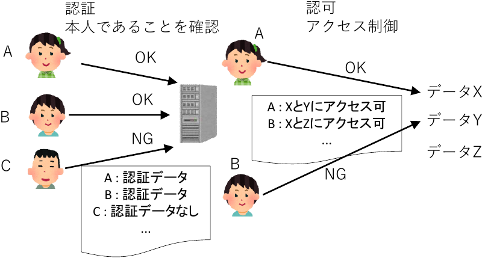

<!--
headingDivider: 1
-->
<!--
_class: title
-->
# 情報セキュリティと暗号技術
 
光成滋生
 

# 情報セキュリティとは
## ネットショッピングにおける望ましい状態

- 自分がどんな商品を買ったか他人に知られない
- 商品の値段や送付先が勝手に書き換えられない
- いつでも買い物ができる
## 情報セキュリティの三要素
- 機密性 (confidentiality)
  - 許可されてない人が情報にアクセスできないこと
- 完全性 (integrity)
  - 情報が改竄されたり消えたりせずに正確に存在すること
- 可用性 (availability)
  - 許可された人が必要なときに情報にアクセスできること

# 情報セキュリティと暗号技術
## JIS Q 27000
- 日本の産業の標準化のために定められた国家規格
- 日本産業標準調査会JISCが調査審議を行う
## 暗号技術との関係
- 情報セキュリティを守るには様々な技術が必要
  - その中で暗号化・認証・署名・改竄検知・否認防止などの技術を総称して暗号技術という

**情報セキュリティの三要素と関連する暗号技術**
要件|求められる特性|暗号技術の例|
-|-|-|
機密性|データの秘匿|暗号化・認証|
完全性|データの正確さ|メッセージ認証符号・署名|
可用性|データへのアクセスを担保する|秘密分散|

# 追加された要件
## 真正性 (authenticity)
- ユーザや、システムなどが本当にその人やものであり、偽物が紛れていないこと
  - 本当に当事者であることを確認する
## 責任追及性 (accountability)
- システムに対して誰が、いつ、何をしたのかを正確に記録して問題が起きたときに原因を追求できること
## 否認防止 (non-repudiation)
- なんらかの操作を後でなかったことにされないようにすること
## 信頼性 (reliability)
- システムが不具合無く正確に動作していること

# 問題
## 次は何を満たし、何を満たさないか
1. 正当な送信者からのデータが伝送中に破損
2. 不正者が送信した完全なデータ
3. 正当な送信者からのデータが伝送中に傍受
4. 年に一度メンテナンスで数日間止まるシステム

# 問題の答え
## 次は何を満たし、何を満たさないか
1. 正当な送信者からのデータが伝送中に破損
2. 不正者が送信した完全なデータ
3. 正当な送信者からのデータが伝送中に傍受
4. 年に一度メンテナンスで数日間止まるシステム

## 答え
1. 真正性: o, 完全性: x
2. 真正性: x, 完全性: o
3. 完全性: o, 機密性: x
4. 信頼性: o, 可用性: x

# 暗号 (encryption)
## 情報を第三者が見てもわからないようにする技術

- 情報セキュリティの機密性を守るために最も重要な要素
## 暗号化と復号
- 平文: 変換前の情報
- 暗号化: 平文を第三者が見てもわからないように変換すること
- 暗号文: 変換された情報
- 復号: 暗号文を元の平文に戻すこと
## 鍵
- 暗号（化）鍵: 暗号化に必要な情報
- 復号鍵: 復号に必要な情報
  - 復号鍵は厳重に管理する必要がある（＝秘密鍵）

# 暗号の種類
## 暗号鍵＝復号鍵
- 秘密鍵暗号・対称鍵暗号と呼ばれる
## 暗号鍵≠復号鍵
- 公開鍵暗号・非対称鍵暗号と呼ばれる
  - 復号鍵は秘密だが暗号鍵は他人に見せてもよい
    - 暗号鍵＝公開鍵
## 暗号技術と暗号
- 暗号技術はデータを守る技術の総称
  - 暗号（化）は暗号技術のうち、主に機密性に関わる技術
  - 暗号技術のことを「暗号」ということも多いので文脈で判断

# 認証 (Authentication)
## 完全性や真正性に関わる技術
- パスワードによる認証
  - 他人が推測できない複雑なものを決めて使う
    - できるだけ長い文字数を使う
    - パスワードマネージャを利用する（それが攻撃されるリスクはある）
  - Webサービスごとに異なるパスワードを使う
    - 同じパスワードを使い回すとあるサービスが攻撃を受けてパスワードが漏洩したとき別のサービスに不正ログインされる危険性
  - 秘密の質問
    - 設定が必要なサービスもまだ多い
    - 「出身地は?」など答えを推測されやすいものが多い
    - パスワードを複雑にしてもこちらを攻撃されると無意味
    - ランダムな答えを設定するのが望ましい

# そのほかの認証
## ワンタイムパスワード (OTP: One Time Password)
- 一度だけ使うパスワード（時間依存なのはTOTP : Time-based OTP）
  - 銀行などが物理的なハードウェアを顧客に配布してそれを入力
  - 最近はスマートフォンアプリに表示される値を利用する傾向
## 静脈認証・指紋認証
- 生体情報を利用した認証
- 専用ハードウェアが必要
## クライアント証明書
- 会社などから支給されたデータをブラウザやOSに登録する
  - 登録したブラウザからしかアクセスできない

# 認証の種類
## 一長一短
認証の種類|記憶する必要|紛失の危険性|<nobr>コスト</nobr>|紛失・漏洩時の対策|例
-|-|-|-|-|-
知識認証|ある|ある|低|容易|パスワード パスフレーズ
生体認証|無い|ある（怪我など）|高|困難|指紋認証 虹彩認証 静脈認証 顔認証
<nobr>所有物認証</nobr>|無い|ある|高|容易|TOTP生成器 USBトークン 電子証明書

# FIDO（Fast IDentity Online）
## 多要素認証を扱いやすくするための規格
- WebAuthn (Web Authentication)
  - デジタル署名を用いたパスワードレスな認証（詳細は講義後半で）
  - ブラウザやスマホ・専用ハードウェアで実現
- 2018年Yahooが生体認証を利用したログインとしてWebAuthnを導入
  - パソコンやスマホの安全な領域に秘密鍵の情報を保持
  - 利用するときに顔認証や指紋認証などで本人確認
  - デジタル署名を用いて認証

# 多要素認証と攻撃・対策の変化
## 認証の種類を複数、組み合わせる（組合せる）
- 知識認証＋生体認証 or 知識認証＋所有物認証など
- 2要素認証 (2FA: 2 Factor Authentication) などと呼ばれる
  - スマホのパスワードマネージャがTOTPに対応して普及する
    - スマホが壊れたときの復旧対策が必要
## 偽URLを伴うフィッシング詐欺の横行
- 偽URLが記載されたメールをクリックして2FAを実行してしまう
- URLに自分でパスワードやTOTPを入力したら危険

## Appleのパスキー
- スマホが壊れたときの対策として秘密鍵をクラウドに保存
- 秘密鍵の一元管理のリスクよりもフィッシング詐欺・スマホの紛失対策を優先

# 認可 (Authorization)
## アクセス制御
- ユーザの属性に応じてシステムへのアクセス権を決める
- 本人を認証した後に行う
