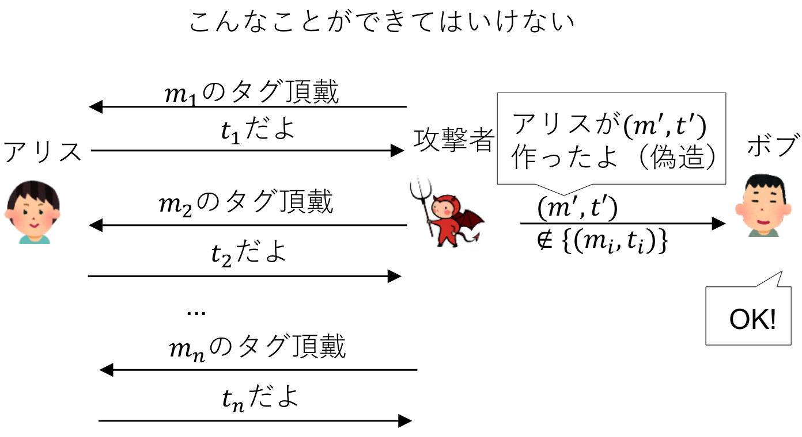
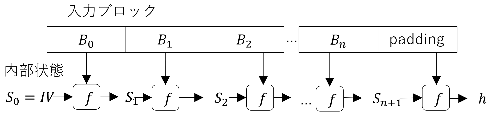

<!--
headingDivider: 1
-->
<!--
_class: title
-->
# 共通鍵暗号2
 
光成滋生
 

# 目次
## 用語一覧
- MAC, 存在的偽造不可能
- IND-CPA安全, IND-CCA2安全, Enc-then-Mac
- ハッシュ関数, SHA-2, 伸長攻撃, SHA-3, XOF
- AEAD, 拡大体
- 軽量暗号, Ascon

# メッセージ認証コード

## MAC (Message Authentication Code)
- データの改竄を検知する暗号技術
- 次の(KeyGen, Mac, Verify)をMACという
## 三つ組アルゴリズム
- $KeyGen(1^λ)=s$: 秘密鍵
- $Mac(s, m)=t$: メッセージ $m$ に対して
MAC値（タグともいう）$t$ を出力
- $Verify(s, m, t) \in \Set{0,1}$
1は正しい（受理）, 0は不正（拒否）
## 正当性
- $Verify(s, m, Mac(s, m))=1$ for $\forall s, m$

# MACの安全性

## 存在的偽造不可能性
- 適応的選択文書攻撃 CMA (Chosen Message Attack)
  - 攻撃者が $m_i$ を選びオラクルに問い合わせて $t_i=Mac(s,m_i)$ の入手を好きなだけ繰り返し $\Set{(m_i,t_i)}$ を得る
- $Verify(s,m,t)=1$ なる $(m,t) \notin \Set{(m_i,t_i)}$
を作れないときCMAに対して（強）存在的偽造不可能
(strong existentially unforgeable) sEUF-CMAという
- 完全性（改竄耐性）/真正性（当人しか作れない）

## MACの例
- CMAC (Cipher-based MAC): ブロック暗号を利用
- HMAC (Hash-based MAC): 後述のハッシュ関数を利用

# 暗号化とMACを組み合わせる
## EtM (Enc-then-Mac)
- 暗号化は秘匿性のため, MACは完全性のために使う
1. KeyGen: $s_1$ を暗号化用の秘密鍵, $s_2$ をMAC用の秘密鍵とする
2. Enc: $m$ に対して $c=Enc(s_1,m)$, $t=Mac(s_2,c)$ を計算して $(c, t)$ を送る
3. Dec: $(c, t)$ に対して $Verify(s_2, c, t)=1$ ならば $m=Dec(s_1,c)$ を返す
そうでなければ失敗・停止（$\bot$ (bot) を返すともいう）
## 安全性に関する定理
- EncがIND-CPA安全, MACが存在的偽造不可能ならばEnc-then-MacはIND-CCA2安全
  - R. Canetti & H. Krawczyk, ["Analysis of Key-Exchange Protocols and Their Use for Building Secure Channels"](https://link.springer.com/chapter/10.1007/3-540-44987-6_28), Eurocrypt 2001
  - H. Krawczyk, ["The Order of Encryption and Authentication for Protecting Communications (or: How Secure is SSL?)"](https://iacr.org/archive/crypto2001/21390309.pdf), CRYPTO 2001

# 安全ではない組み合わせ
## E&M (Enc-and-Mac)
  - $(Enc(s_1,m), Mac(s_2,m))$
  - 一般的な構成では安全とはいえない
## MtE (Mac-then-Enc)
  - $Enc(s, m||Mac(s,m))$
  - 一般的な構成では安全とはいえない
  - （例外）CBCモードやストリーム暗号（CTRモード含む）では安全
    - ただしIVの扱いや関数処理時間など実装上の問題で脆弱になりえる
    - 実際TLS1.3では廃止された

# ハッシュ関数
## 任意サイズのデータを固定長データに変換する関数 $H$
- $H:\Set{0,1}^* → \Set{0,1}^n$. $*$ は任意値, $n$ は固定値 (e.g., 128, 256, or 512)
- $H(x)$ をハッシュ値, メッセージダイジェストなどという
## 暗号学的に安全なハッシュ関数
- 一方向性
$y=H(x)$ が与えられたとき $H(x')=y$ となる $x'$ を見つけるのが難しい
- 衝突困難性
$H(x)=H(x')$ となる $x$, $x'$ ($x ≠ x'$) を見つけるのが難しい
## 衝突困難性が成り立つなら一方向性が成り立つ
- $x\in\Set{0,1}^{2n}$ に対して一方向性が破れれば $H(x)=H(x')$ となる $x'$ が見つかる
- $2^{2n} \gg 2^n$ より $x=x'$ となる確率はとても小さいので衝突困難性が破れる

# 問題
## 一方向性が成り立つなら衝突困難性が成り立つ?
- 成り立たないならそんな例を作れ

# 答えの例
## $H$ を一方向性が成り立つ関数とする
- $x \in \Set{0,1}^m$ ($m>n$) に対して、$x=x_{>0} || x_0$ （$x_{>0}$ は $m-1$ bit, $x_0$ は1bit）と分解する
- $H'(x):=H(x_{>0})$ とする
1. $H'$ は一方向性関数である
  - もし $H'(x)=H'(x')$ となる $x'(≠ x)$ が見つかれば $H(x_{>0})=H(x'_{>0})$.
  $x_{>0}=x'_{>0}$ となる確率はとても小さいので $x_{>0} ≠ x'_{>0}$ となり $H$ の一方向性に矛盾
2. $H'(x||0)=H'(x||1)$ なので衝突困難性が破れる

# ハッシュ関数の歴史
## MD5, SHA-1, SHA-2, SHA-3, ...
- 
- SHA (Secure Hash Algorithm)
  - NISTが標準化
  - 現在はSHA-2が普及（ハッシュ値が256bit, 512bitのSHA-256, SHA-512などがある）
  - SHA-3が2015年に標準化された

# SHA-2 (Secure Hash Algorithm 2)
## 内部構造
- 圧縮関数 $f:B \times S → S$
$B$: 512bitブロック, $S$: 256bit （32bit整数x8個）
## Merkle-Damgård (MD) 構造
- MD5, SHA-1, SHA-2など多くのハッシュ関数で採用
- SHA-256は入力 $m$ を512bitブロックに分割
- 余りはpaddingとして「1＋0...0+サイズ(64bit)」の形のブロック
- 初期値 $S_0$ は定数

# SHA-256の圧縮関数の概要
## 厳密な定義はFIPS 180-4参照
- 512bitのブロックを32bit整数16個に分割
- ビット回転やビットシフト、排他的論理和を組み合わせて32bit整数64個 $W$ に増やす
- 複雑なビット演算 $F$ を64回適用して $S'$ を出力する
- 

# MDの弱点
## 伸長攻撃が可能
- $m$ について「$m$ の大きさと $h=H(m)$」が既知のとき
任意の $m'$ に対して $H(m||pad(m)||m')$ を計算可能
  - $pad(m)$: $m$ のサイズから決まる最後のpaddingデータ
## 理由
- MD構造は最後の内部状態 $S'$ がそのまま $H(m)$ となる
- $S_0=h$ を初期値として $m'$ に対して圧縮関数を適用す
- $H(m||pad(m)||m')$ を計算できる

# 問題
## 脆弱なHMAC
- $H$ をSHA-2とする
- $s$ を秘密鍵として $MAC(s,m):=H(s||m)$ と作ったMACが安全ではない理由は?

# SHA-3
<!-- _class: image-right-center -->

## SHA-2に変わるハッシュ関数
- NISTがハッシュ関数のコンペ(competition)を開催
- 2012年にKeccak（ケチャック）が選ばれ2015年にSHA-3として標準化
## 特徴
- ハッシュ値のサイズは256, 512bitなど
- スポンジ構造
  - 入力データをスポンジに入れる吸収フェーズ
    - 内部状態は1600bit
    - SHA-2の256bitよりずっと大きい
  - スポンジからデータを取り出す搾取フェーズ
    - 内部状態の最初の256bitを出力

# 吸収フェーズ概要
## SHA-3-256のブロック分割
- $r=1088=(1600-256\times 2)$bitのブロック
- 余りは最初に1bitの1, 次にブロック長にあうように0が0個以上, 最後に1bitの1を追加する
- MD構造と異なりデータサイズは追加されない
## 吸収フェーズ
- 初期状態 $S$ は0で初期化
- 各ブロックを $S$ の先頭からxorして複雑な置換関数 $f$ を適用（詳細は略）

# ハッシュ関数の安全性
## 衝突困難性を破るには
- $H$: $n$ bitのハッシュ値のハッシュ関数, $N=2^n$
- $k$ 回ランダムな値のハッシュ値を計算する
  - 2回目でハッシュ値が同じになる（衝突する）確率 $P_2=1/N$
  - $P_3=1-\texttt{（全部異なる確率）}=1-((N-1)/N\times (N-2)/N)$
  - $k$ 回目の $P_k=1-\prod_{i=1}^{k-1}(1-i/N)$
  - $N \gg k$ のとき $e^{-i/N} \approx 1-i/N$ より
$P_k \approx 1 - \prod_{i=1}^{k-1} e^{-i/N} = 1-e^{\sum_{i=1}^{k-1}(-i/N)} = 1-e^{-k(k-1)/2N}$
$k \approx \sqrt{N}$ ならば $P_k \approx 1-e^{-1/2} \approx 0.4=40\%$
- $O(\sqrt{N})=O(2^{n/2})$ 回の計算で衝突困難性を破れる確率になる（大雑把な評価）
  - これを誕生日攻撃 (birthday attack) という
- 理想的な $n$ bitのハッシュ関数は $n/2$ bitセキュリティ安全という

# HMACの構成
<!-- _class: image-right-center -->

## HMAC-SHA-256
- $s$: 256bit秘密鍵, $m$: データ
- $HMAC(s,m)=H(s \oplus C_2 || H(s \oplus C_1 || m))$
  - $C_1=0x3636...36$ (256bit), $C_2=0x5c5c...5c$ (256bit)
  - $||$ はデータの連結, $\oplus$ はビットごとの排他的論理和
## 安全性
- M. Bellare, "New Proofs for NMAC and HMAC:
Security Without Collision-Resistance", CRYPTO2006
  - 圧縮関数がPRFならHMACはPRFであることを示す

# XOF (eXtendable Output Function)
## 可変長出力可能な関数
- ランダム関数やハッシュ関数は固定長出力
- XOFは任意の長さを指定できる: $XOF(m,l)$ はデータ $m$ に対して $l$ bit出力
  - ハッシュ関数やブロック暗号を繰り返し呼び出して実現するのとは異なる
## SHAKE
- SHA-3のスポンジ構造を利用したXOF
  - cSHAKE256(X, L, N, S)
    - X: 入力データ
    - L: 出力データ長 (bit)
    - N: "KMAC"などの文字列, S: アプリ区別用文字列
- 1600bitの内部状態をかき混ぜながら$(1600-c)$ bit出力ずつ出力
  - $c$($c=256, 512$) bitは内部に残しておく（キャパシティ）

# HASH, XOF, MAC, PRFの比較
## 特徴の比較
| 特性 | HASH | XOF | MAC | PRF
|------|------|-----|-----|-----
|関数の形|$H(m)$ | $\text{XOF}(m, \ell)$ | $\text{MAC}(s, m)$ | $\text{PRF}(s, m)$
| 鍵 | なし | なし | あり | あり
| 入力長 | 任意 | 任意 | 任意 | 通常任意 理論では固定
| 出力長 | 固定 | 任意 | 固定$^{*}$ | 通常固定 カウンタ併用で任意長
| 安全性 | 衝突困難 | 衝突困難 | 偽造困難 | ランダム関数と区別不可能

- PRF $\subsetneq$ MAC （PRFはMACになるが, MACだからといってPRFとは限らない）
- $^{*}$: 後述のKMACは任意出力長のPRF（なのでMAC）

# SHA-3ベースのMAC
## KMAC
- スポンジ構造には圧縮関数の構造が無いので伸長攻撃がない
- ハッシュを2回して安全性を高めるのは冗長
  - $\text{KMAC}(s, m)=\text{cSHAKE128}(s||m||256, 256, \texttt{"KMAC"}, \texttt{""})$ の形で安全
  - 厳密には $s||m||256$ の部分はpaddingやbyte encodingなどが行われる
  - 長さは256, 512以外も選べる
    - KDFとして使うときは1024bitなども
  - 詳細はNIST Special Publication 800-185参照

# AEAD (Authenticated Encryption with Associated Data)
## 認証付き暗号
- 秘匿性と完全性の両方を同時に満たす暗号
  - IND-CPA安全（秘匿性）＋ 暗号文の完全性 = IND-CCA2安全
- 共通鍵暗号とMACの組み合わせで実現
  - 組み合わせ方法や実装によって安全でないこともあった
  - 最初から組み合わせることを前提とした設計が望ましい

- 共通鍵暗号・MAC・AEADの違い

暗号技術＼性質|秘匿性|完全性
---|---|---
共通鍵暗号|ある|無い
MAC|無い|ある
AEAD|ある|ある

# AEADのアルゴリズム
<!-- _class: image-right -->

## 暗号化
- 入力: 平文: $m$, ナンス: $n$, 秘密鍵: $s$, 関連データ: $d$
  - ナンス $n$ は同じ値を再利用してはいけない
  - 関連データは暗号化されないが改竄防止対象
- 出力: 暗号文: $c$, 認証タグ: $t$
## 復号
- 入力: ナンス: $n$, 関連データ: $d$, 暗号文: $c$, 認証タグ $t$, 秘密鍵: $s$
- 出力: $t$ が正しいときのみ平文 $m$. それ以外は停止 $\bot$
## 安全性
- 共通鍵暗号の安全性とMACの安全性の両方を併せ持つ

# AEADの例1
<!-- _class: image-right -->

## Chacha20-Poly1305
- [RFC 8439](https://datatracker.ietf.org/doc/html/rfc8439)
- 暗号化: ChaCha20 + MAC: Poly1305
## Poly1305
- $p:=2^{130}-5$
- 256bitの秘密鍵 $k$ から
128bitの $r$ と 128bitの $s$ を生成
- 平文 $m$ を128bitブロック $m_i$ に分割
- $a:=0$ を初期値として
$a:=((a+ m_i)r) \bmod{p}$ で更新
- 最後に128bitの認証タグ $t:=(a+s) \bmod{2^{128}}$ を出力

# AEADの例2
<!-- _class: image-right-center -->

## AES-GCM
- [NIST SP 800-38D](https://nvlpubs.nist.gov/nistpubs/Legacy/SP/nistspecialpublication800-38d.pdf)
- 暗号化: AES-CTR + MAC: GHASH
## GHASH
- $p(x):=x^{128}+x^7+x^2+x+1$
- $𝔽_{2^{128}}:=𝔽_2[x]/(p(x))$
- 128bitの0を秘密鍵 $k$ で暗号化
  - $H:=Enc(k, 0^{128})$
- "関連データ|暗号文|長さ"を
128bitブロック $u_i$ に分割
- $a=0$ を初期値として $a := (a + u_i)H$
ここで加算・乗算は $𝔽_{2^{128}}$ 上で行う

# 拡大体
## 複素数体 $ℂ$
- $a, b \in ℝ$ に対して $a+bi$ ($i^2=-1$) の形が複素数
  - $(a+bi)\pm(c+di)=(a\pm c)+(b\pm d)i$
  - $(a+bi)(c+di)=(ac-bd)+(ad+bc)i$
## これを多項式の形で見直す
- $ℝ[x]$ を実数係数多項式の集合
- $K:=ℝ[x]/(f(x))$ を $f(x):=x^2+1$ で割った余りの集合とする
- $f(x)$ は2次式なので余りの多項式は $a+bx$ ($a,b \in ℝ$) の形
- $K$ の中で $(a+bx)\pm(c+dx)=(a\pm c)+(b\pm d)x$
- $(a+bx)(c+dx)=ac + (ad + bc)x + bdx^2 \equiv (ac - bd) + (ad + bc)x \mod f(x)$
  - $x$ を $i$ にシンボルとして置き換えると同じ形
- これを $ℂ$ は（最小多項式） $x^2+1$ による $ℝ$ の 2次拡大体という

# 有限体の拡大体
## $K:=𝔽_7$ の2次拡大体の例
- $f(x)=x^2+1$ とすると $f(x)$ は $K$ 上で既約（$f(x)$ が $K$ 係数の範囲で因数分解できない）
- $L:=K[x]/(f(x))=\Set{a+bx|a, b \in K}$ は $K$ の2次拡大体
  - 注意: $𝔽_5$ 上では $x^2+1=(x-2)(x+2)$ なので $𝔽_5[x]/(x^2+1)$ は体にならない
## $K:=𝔽_2$ の2次拡大体
- $K=\Set{0,1}$ は加算が $\oplus$（排他的論理和）, 乗算が $\land$（論理積）と同じ
  - $x^2+1=(x+1)^2$ なので既約でない
- $f(x):=x^2+x+1$ は既約だから $L:=K[x]/(f(x))$ は $K$ の2次拡大体
  - $(a+bx)(c+dx)=ac + (ad+bc)x+bdx^2$
  $\equiv ac + (ad+bc)x + bd(x+1)= (ac+bd) + (ad+bc+bd)x$
  - 注意: $𝔽_2$ 上では $-1=1$ なので $x^2=-(x+1)\equiv x+1$
  $x^2$ を $x+1$ に置き換えると思えばよい

# $K:=𝔽_2[x]/(x^2+x+1)$ の演算表
## 乗算
$a$ \ $b$|$0$|$1$|$x$|$x+1$
---|---|---|---|---
0|0|0|0|0
$1$|0|$1$|$x$|$x+1$
$x$|0|$x$|$x+1$|$1$
$x+1$|0|$x+1$|$1$|$x$

## 逆元
$a$|$1$|$x$|$x+1$
--|---|---|---
$a^{-1}$|$1$|$x+1$|$x$

# AES-GCMで使われる拡大体
## $K_1:={𝔽_2}^8=𝔽_2[x]/(f_1(x))$
- $f_1(x):=x^8+x^4+x^3+x+1$ を利用（$x^8$ を $x^4+x^3+x+1$ に置き換える）
## $K_2:={𝔽_2}^{128}=𝔽_2[x]/(f_2(x))$
- $f_2(x):=x^{128}+x^7+x^2+x+1$ を利用（$x^{128}$ を $x^7+x^2+x+1$ に置き換える）
## ビット演算との対応
- $K_1$ の要素は各係数が0, 1の7次多項式なので8bitで表現できる
- 8bitで表現した多項式 $a$, $b$ の加算は係数ごとの加算でそれが "$\oplus$"
よって $a \oplus b$ で多項式の加算ができる
- 8bitの $a=[a_0:a_1:\cdots:a_7]=\sum_{i=0}^7 a_i x^i$ と "$x$" の乗算は
$a x = a_0 x + a_1 x^2 + \cdots + a_7 x^8 = a_0 x + a_1 x^2 + \cdots + a_6 x^7 + a_7 (x^4+x^3+x+1)$
$=[a_7:(a_0+a_7):a_1:(a_2+a_7):(a_3+a_7):a_4:a_5:a_6]$ となる

# 問題
## 2次拡大体
- $K={𝔽_2}^2$ の元 $(a,b)$, $(c, d)$ に対して乗算を $(a c, b d)$ と定義するのでは駄目なのか
## 8次拡大体
- $K=𝔽_2[x]/(f(x))$ の多項式を $f(x)=x^8+x+1$ としては駄目なのか

# 軽量暗号
## 安全性を保ちつつAES-CGMやSHA-2を越える性能が欲しい
- 組み込み用ハードウェア（いわゆるIoT機器）などのリソースが限られた環境でも高性能
## Asconファミリー (AEAD, Hash, XOF)
- 2023年NISTの軽量暗号コンペティションで選ばれた
  - 8~64bit CPU, 2KiB~ MEMでの評価, AES-GCM, SHA-2よりもコンパクト, 速度もトップに近い
  - 320bitの内部状態を攪拌するAscon-pを利用してAEAD, ハッシュ関数, XOFを構成
    - 64bit IV, 128bit key, 128bit nonce（図は[NIST SP 800-232](https://csrc.nist.gov/pubs/sp/800/232/final), 2025/8より引用）
 
- その他の軽量暗号: [CRYPTRECによる安全性評価の動向調査](https://www.cryptrec.go.jp/exreport/cryptrec-ex-3101-2021.pdf), 2022
