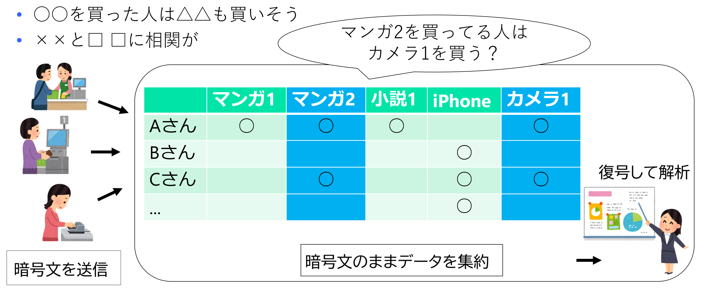

<!--
headingDivider: 1
-->
<!--
_class: title
-->
# ペアリングの応用
 
光成滋生
 
last update: 2026/01/08

# 概要
## 目的
- ペアリングの性質
- 三者間鍵共有, IDベース暗号
- 準同型暗号
- BLS署名
- 秘密分散
- DKG

# ペアリング
## type-1ペアリング (Weil pairing)
- $E/𝔽_p$: 楕円曲線, $G_1:=⟨P_1⟩=\Set{0,P_1,2 P_1,\dots, (r-1)P_1}$: 位数 $r$ の加法巡回群
乗法巡回群表記のテキストもある
- $G_T:=⟨g⟩:=\Set{1,g,g^2,\dots, g^{r-1}} ⊆ 𝔽_{p^k}$: 1の $r$ 乗根 $g$ からなる乗法巡回群
- $e:G_1 × G_1 → G_T$ がペアリングとは $e(a P_1, b P_1) = g^{ab}$ を満たすもの
## 双線型性
- $P, Q, R ∈ G_1$ に対して $P = a P_1, Q = b P_1, R = c P_1$ とすると
  - $e(P+Q, R) = e(P,R) e(Q,R) = g^{(a+b)c}$
  - $e(P, Q+R) = e(P,Q) e(P,R) = g^{a(b+c)}$
    - $G_T$ も加法群とみなすと通常の $f(x+y)=f(x)+f(y)$ の線型性の形
      - 2変数の両方に関して線型なので双線型

# ECDLPとペアリングの関係
## もともとはECDLPを解くために利用された
- $P, aP ∈ G_1$ が与えられたときに $a$ を求めたい
  - $g=e(P, P)$, $e(P, aP)=g^a$ なので $g$, $g^a$ に関するDLPが解ければECDLPも解ける
  - MOV (Menezes, Okamoto, Vanstone) リダクションという
## 3人の間の鍵共有 (Joux, 2000)
- A, B, C がそれぞれ秘密鍵 $a, b, c ∈ 𝔽_r$ を持ち $aP, bP, cP$ を共有する
- A は $e(bP, cP)^a$, B は $e(cP, aP)^b$, C は $e(aP, bP)^c$ を計算する
  - それぞれ $g^{abc}$ になるので鍵共有ができた
- より多数の鍵共有ができるか（多重線型写像の構成）は未解決（否定的な結果が優勢）
## 主な安全性仮定の問題
- CBDH (Computational Bilinear DH): $(P, aP, bP, cP)$ に対して $e(P, P)^{abc}$ を計算する
- DBDH (Decisional BDH): $(P, aP, bP, cP, g')$ に対して $g' = e(P, P)^{abc}$ を判定する

# ID鍵共有
## 鍵管理者の元でIDを使って鍵共有する仕組み (Sakai, Ohgishi, Kasahara)
- $G=⟨P_1⟩$ を位数 $r$ の加法巡回群, $e:G_1 × G_1 → G_T$ をペアリング,
$H:\Set{0,1}^* → G_1$ をハッシュ関数とする
- 鍵管理者が秘密鍵 $s ∈ 𝔽_r$ を選び, $Q=s P_1$ を公開鍵とする
  - IDが $u_i$ であるユーザーに, 鍵管理者が秘密鍵 $s H(u_i)$ を配付
- ユーザーは $u_i$ に対して乱数 $r ∈ 𝔽_r$ を選び, $r P_1$ を送る. $s_1=e(H(u_i), r Q)$ を求める
- ユーザ $u_i$ は $r P_1$ を受け取り $s_2=e(s H(u_i), r P_1)=e(H(u_i), s rP_1)=s_1$ を求める
### 特徴
- CBDH仮定などの下で安全（詳細略）
- 暗号文を作るときは相手のID（と全体の公開鍵）だけを知っていればよい
  - IDはメールアドレスでもよい
- Boneh, FranklinのIDベース暗号に応用されている（があまり知られていなかった）

# type-3ペアリング
## ペアリングの重要性と高速化の必要性
- ペアリングの重要性に伴いより演算効率のよい写像が望まれている
- 現在の主流は非対称ペアリング
 $e:G_1 × G_2 → G_T$: で$G_1 ≠ G_2$ かつ $G_1$ と $G_2$ の間に効率的な同型写像が存在しない

## BLS12-381曲線 (Barreto, Lynn, Scott)
  - BLS写像のBLSとは無関係
  - $E/𝔽_p$: $y^2 = x^3 + 4$ （$p$: 381bit素数）
  - 写像先の $G_T ⊆ 𝔽_{p^{12}}$ は $𝔽_p$ の $k=12$ 次拡大体（BLS12の12）
  - $G_1 := ⟨P_1⟩ ⊆ E(𝔽_p)$: $P_1$ の位数は255bit素数 $r$
  - $G_2 := ⟨P_2⟩ ⊆ E'(𝔽_{p^2})$: 2次拡大体上の楕円曲線 $E': y^2=x^3+4(1+i)$, $i^2=-1$
  - $G_T=⟨g⟩=⟨e(P_1,P_2)⟩$
    - $e(a P_1, b P_2) = e(P_1, P_2)^{ab}=g^{ab}$ を満たす

# 楕円ElGamal暗号の復習
## 構成
- 楕円曲線 $E/𝔽_p$, $G=⟨P⟩ ⊆ E(𝔽_p)$: 位数 $r$ の加法巡回群
- 鍵生成: 秘密鍵 $s ∈ 𝔽_r$, 公開鍵 $Q := s P$
- 暗号化: 平文 $M ∈ ⟨P⟩$ に対してランダム $k ∈ 𝔽_r$ を選び
  - 暗号文: $Enc_0(M;k) := (M + k Q, k P)$
- 復号: $C=(S, T)$ に対して $Dec_0(C):= S - s T (=(M+kQ)-s(k P)=M$
## 準同型性
- 暗号文 $C_1:=Enc_0(M_1)=(S_1,T_1)$, $C_2:=Enc_0(M_2)=(S_2,T_2)$ に対して
$C_1 + C_2 := (S_1 + S_2, T_1 + T_2)$ と定義すると
$Enc_0(M_1;k_1) + Enc_0(M_2;k_2) = Enc_0(M_1 + M_2;k_1+k_2)$ が成り立つ

# Lifted楕円ElGamal暗号による加法準同型暗号
## 楕円ElGamal暗号の問題点
- 楕円ElGamal暗号の*平文は楕円曲線の点*でなければならない
  - 楕円曲線の点に関する「加法準同型暗号」だけれどもそれでは扱いづらい
## Lifted楕円ElGamal暗号（以下Liftedと略）
- 鍵生成（楕円ElGamal暗号と同じ）: 秘密鍵 $s ∈ 𝔽_r$, 公開鍵 $Q := s P$
- 平文 $m∈ 𝔽_r$ に対して $Enc(m):=Enc_0(mP)=(m P + kQ, k P)$ とする
- 復号
  - $DLP_P(m P):=m$ と定義する（$P$ に関するDLPを解く）
  - $Dec(C):=DLP_P(Dec_0(C))$ とすると $Dec(Enc(m))=DLP_P(m P)=m$
  - DLPを解く必要があるが $|m| \sim 2^{32}$ 程度なら十分実用的
## 準同型性
- *整数* $m_1,m_2 ∈ 𝔽_r$ に対して $Enc(m_1) + Enc(m_2) = Enc(m_1 + m_2)$

# ペアリングを用いたLevel2準同型暗号(L2HE)
## 乗算1回可能（Level2）な加法準同型暗号（2018, 光成ら）
- Type-3ペアリング $e:G_1 × G_2 → G_T$, $G_1=⟨P_1⟩$, $G_2=⟨P_2⟩$
- 鍵生成: $s_i∈ 𝔽_r (i=1,2)$ を選び, 公開鍵 $Q_i := s_i P_i ∈ G_i$, $g:=e(P_1,P_2)$ とする
- 暗号化: 平文 $m ∈ 𝔽_r$ に対して $Enc_i(m;k_i)$ を $G_i$ に関するLiftedとする
  - $Enc_1(m;k_1) := (m P_1 + k_1 Q_1, k_1 P_1)=((m+k_1 s_1)P_1,k_1 P_1)$
  - $Enc_2(m;k_2) := (m P_2 + k_2 Q_2, k_2 P_2)=((m+k_2 s_2)P_2,k_2 P_2)$
  - $Enc(m):=(Enc_1(m;k_1), Enc_2(m;k_2))$ : $G_1$, $G_2$ に関するLiftedの組
- 加算: 要素ごとのLifted暗号文の加算

# L2HEの乗算
## 暗号文同士の乗算
- 乗算: $C_1:=(S_1,T_1)=Enc_1(m_1;k_1)$, $C_2:=(S_2,T_2)=Enc_2(m_2;k_2)$ に対して
  - $C_1・C_2 := (e(S_1,S_2),e(S_1,T_2),e(T_1,S_2),e(T_1,T_2))$ とする
- 乗算暗号文の復号
$c:=C_1・C_2=(s,t,u,v)$ に対して
$dec_M(c):=(s v^{s_1 s_2})/(t^{s_2} u^{s_1})$, $Dec_M(c):=DLP_g(dec_M(c))$ とする
## 正当性
- $DLP_g(s)=(m_1 + k_1 s_1)(m_2 + k_2 s_2)$, $DLP_g(t)=(m_1 + k_1 s_1) k_2$
$DLP_g(u)=k_1 (m_2 + k_2 s_2)$, $DLP_g(v)=k_1 k_2$ より
- $dec_M(c)=(m_1 m_2+m_1 k_2 s_2 + k_1 s_1 m_2 + k_1 s_1 k_2 s_2)+k_1 k_2 s_1 s_2$
$- (m_1 + k_1 s_1) k_2 s_2 - k_1 (m_2 + k_2 s_2) s_1 = m_1 m_2$
- これにより整数ベクトル $x=(x_1,…, x_n)$, $y=(y_1,…, y_n)$ の内積
$x・y=∑_{i=1}^n x_i y_i$ を暗号文のまま計算可能になる

# L2HEの応用
<!-- _class: image-right -->

## 暗号文のままクロス集計する
- 登場人物
  - データ所有者
  - データ集約者（暗号文計算）
  - データ解析者（秘密鍵保持）
- 想定場面: 商品購入の相関関係, 喫煙者と肺がん罹患率の関係, etc.
## クロス集計
- ユーザ $i$ のデータ $(x_i,y_i)∈\Set{0,1}^2$ について $X:=Σx_i$, $Y:=Σy_i$, $Z:=Σx_i y_i$ を求める
- データ所有者は $Enc_1(x_i)$, $Enc_2(y_i)$ をデータ集約者に送る
- データ集約者は $Enc_1(X)$, $Enc_2(Y)$, $Enc_M(Z)$ を計算しデータ解析者に送る
- データ解析者は秘密鍵で復号し $X, Y, Z$ を得る
- [L2HEによる暗号文のままクロス集計デモ](https://herumi.github.io/she-wasm/browser/cross-demo-ja.html)

# BLS署名
## CBDH仮定の元で安全な署名
- Boneh, Lynn, Shacham (2001)
  - $H:\Set{0,1}^* → G_1$ をハッシュ関数
- KeyGen: 署名鍵: $s \underset{U}← 𝔽_r$, 検証鍵 $P := s P_1$
- Sign: メッセージ $m$ に対して $σ := s H(m)$
- Verify: $e(H(m), P) = e(σ, P_1)$ ならvalid
  - 正当性: $\text{LHS} = e(H(m), s P_1) = e(s H(m), P_1) = \text{RHS}$
## 特徴
- 署名長が短い（$G_1$ の要素1個）, 乱数不要の決定的アルゴリズム

# type-3ペアリングでのBLS署名
## type-1版をtype-3版に適用する
- $G_i:=⟨P_i⟩$, $H_i:\Set{0,1}^* → G_i$ ($i=1,2$): ハッシュ関数, $b ∈ \Set{1,2}$ を固定
- 署名鍵: $s \underset{U}← 𝔽_r$ に対して
  - $b=1$ のとき 検証鍵 $P := s P_1 ∈ G_1$, 署名 $σ := s H_2(m) ∈ G_2$
    - 検証: $e(P, H_2(m)) = e(P_1, σ)$ ならvalid
  - $b=2$ のとき 検証鍵 $P := s P_2 ∈ G_2$, 署名 $σ := s H_1(m) ∈ G_1$
    - 検証: $e(H_1(m), P) = e(σ, P_2)$ ならvalid
- 検証鍵が小さい方がよいなら $b=1$, 署名が小さい方がよいなら $b=2$
  - Ethereumは $b=1$ （検証鍵が $G_1$ の要素）を採用（以下では $b=1$ とする）
## 安全性仮定
- co-CDH仮定: $P_1, a P_1∈G_1, P_2∈G_2$ に対して $a P_2$ が計算困難（$b=2$ も同様）

<!--
- SXDH (Symmetric external DH)
  - $G_1$, $G_2$ それぞれのDDHが難しい
  - 派生物の仮定がいろいろある
-->

# Shamirの秘密分散法
 <!-- _class: image-right -->

## $(t,n)$ 閾値秘密分散 SSS (Shamir's Secret Sharing)
- $K$: 有限体, 秘密 $s∈K$ を $n$ 個のシェア $s_1, \dots, s_n∈K$ に分割
- 任意の $t$ 個のシェアで秘密を再構成可能
## Lagrange補間による構成法
- $a_1, \dots, a_{t-1}∈K$: ランダム, $a_0:=s$, $f(x):=\sum_{i=0}^{t-1} a_i x^i$
ディーラーはユーザ $i ∈[1,n]$ に秘密のシェア $s_i:=f(i)$ を渡す. みなの ID: $u_i∈K^*$ は共有
- $n$ 人のうち $t$ 人の $S:=\Set{u_{i_1},\dots,u_{i_t}}$ が集まりシェアを共有
  - $u∈S$ に対して $Δ_{u,S}(x):=\prod_{v∈S\setminus{u}} \frac{x - v}{u - v}$ は $t-1$ 次多項式
  $Δ_{u,S}(u)=1$, $Δ_{u,S}(w)=0$ ($w ∈ S\setminus{u}$) なので $g(x):=\sum_{j=1}^t s_{u_j} Δ_{u_j,S}(x)$
  は $g(u_j)=s_{u_j}$ となり $f(x)$ に一致する（$t-1$ 次曲線は $t$ 個の点で一意に定まる）
- 特に $f(0)=s$ が求まる
- $t-1$ 以下の人数が集まっても $f(0)∈K$ は不定なので情報量的安全性を持つ

# SSSの例
## $(2, 3)$ 閾値秘密分散
- 秘密 $s=12 ∈ 𝔽_{257}$, $k=2$ なので $s_1=100$ を選び1次多項式を $f(x)=s + s_1 x$ とする
- ユーザIDは1, 2, 3とする. シェアは $s_1=f(1)=112$, $s_2=f(2)=212$, $s_3=f(3)=55$
## シェアの再構成
- ユーザ1と3が集まった場合: $S=\Set{1,3}$
  - $Δ_{1,\{1,3\}}(x)=\frac{x-3}{1-3}=-x/2+3/2$, $Δ_{3,\{1,3\}}(x)=\frac{x-1}{3-1}=x/2-1/2$
  - $f(x)=112(-x/2+3/2) + 55(x/2-1/2) = (57/2)x + (281/2)$
  - $f(0)=281/2 ≡ 12 \pmod{257}$ が得られる
## 応用例
- 社長の秘密鍵を取締役員でシェア
  - 複数の取締役員の賛成で秘密鍵を復元

# BLS署名への秘密分散の適用
## BLS署名の構成
- $G_1:=⟨P_0⟩$, $G_2:=⟨Q⟩$, $H:\Set{0,1}^* → G_2$: ハッシュ関数とする
- 署名鍵 $s ∈ 𝔽_r$ を $(t,n)$ 閾値秘密分散で分割しシェア $s_i$ をユーザID $u_i$ に配付
## ユーザ $i$ の署名・検証
- 署名鍵: $s_i$, 検証鍵 $P_i := s_i P ∈ G_1$
- メッセージ $m$ に対する署名: $σ_i := s_i H(m) ∈ G_2$
- 検証: $e(P_i, H(m)) = e(P_0, σ_i)$ ならvalid
## 署名の復元
- $t$ 人のユーザの署名 $\Set{σ_{i_j}}$ から $σ := \sum_{j=1}^t σ_{i_j} Δ_{u_{i_j}, S}(0)H(m) = s H(m)$ が得られる
  - 検証鍵と署名の両方が「署名鍵×$G_i$ の元」の形なのでLagrange補間が可能
- 全体の検証鍵 $P=s P_0$ で検証可能: $e(P, H(m))=e(P_0,σ)$ ならvalid
- 単なる秘密分散と異なり署名は*繰り返し利用可能*: 多数決にも利用できる

# 集約署名
## 複数の署名の集約
- ユーザ $i$ の署名鍵 $s_i ∈ 𝔽_r$, 検証鍵 $P_i := s_i P_0 ∈ G_1$
- 集約検証鍵: $P := P_1+\dots+P_n = s P_0$ （$s:=s_1+\dots+s_n$ は誰も知らない）
- メッセージ $m$ に対するユーザの署名: $σ_i := s_i H(m) ∈ G_2$
  - 各ユーザの署名の検証: $e(P_i, H(m)) = e(P_0, σ_i)$ ならvalid
- 集約署名: $σ := σ_1+\dots+σ_n = s H(m)$, $e(P, H(m)) = e(P_0, σ)$ ならvalid
## Rogue key攻撃（ユーザ $n$ が不正な (rogue) 攻撃者とする）
- 検証鍵: $P_n := aP_0 - (P_1 + \dots + P_{n-1})$, 署名: $σ_n := a H(m) - (σ_1 + \dots + σ_{n-1})$
- 集約検証鍵: $P=aP_0$, 集約署名: $σ = a H(m)$ は検証を通ってしまう（$a$ は自由に選ぶ）
- 対策: PoP (Proof of Possession)
  - 事前に各ユーザは自身の検証鍵を自身の署名鍵で署名してみなが検証しておく
  - 攻撃者は自身の署名鍵を知らないので署名できない

# ディーラーの不正対策
## 問題点
- 秘密分散のディーラーに権限集中
  - 秘密情報 $s$ に対して $f(x)=s + s_1 x + \dots + s_{t-1} x^{t-1}$ を作り $f(u_i)$ を配付
  - 各ユーザの $f(u_i)$ を知っている/不正なシェア配付の可能性
## 検証可能な秘密分散VSS (Verifiable Secret Sharing)
- 各ユーザが受け取ったシェアが正しいことを各自が検証可能にする
- ディーラーはシェア配付時に $\Set{Q_j}=\Set{s P_0, s_1 P_0, \dots, s_{t-1} P_0}$ を公開
- 各ユーザは $s P_0 + u_i (s_1 P_0) + \dots + u_i^{t-1} (s_{t-1} P_0) \underset{?}=f(u_i) P_0$ を検証

## 権限集中の対策は?

# 分散鍵生成 DKG (Distributed Key Generation)
<!-- _class: image-right -->

## 全員がディーラーになる
- ユーザID $u_1, \dots, u_n (≠0)$ は既知
- ユーザ $k$ が $f_k(x)=\sum_{i=0}^{t-1} s_{k,i} x^i$ を作り
ユーザ $j$ に $f_k(u_j)$ を秘密裏に配付, $\Set{s_{k,i} P_0}_{i=0,\dots,t-1}$ を公開 (VSS)
  - 受け取ったユーザはシェアの正しさを確認する
- ユーザ $k$ はユーザ $j(≠k)$ からのシェア $f_j(u_k)$ を全て足す
$s_k:=\sum_{j} f_j(u_k)$ を自身の最終シェアとする
  - 対応する検証鍵 $s_k P_0 = \sum_{j} f_j(u_k)P_0$ は誰でも計算可能
- $s:=\sum_{k=1}^n s_{k,0}$ が全体の秘密鍵, $P:=\sum_{k=1}^n s_k P_0 = s P_0$ が公開鍵
- 秘密分散の線型性から $\Set{s_k}$ は $s$ のシェアとなっている

# 後出しの不正を防ぐ
## 様々な改善
- ハッシュを使って後出しジャンケンを防止
  - $h_i:=Hash(s_{k,0}P_0, \dots, s_{k,t-1}P_0)$ を全員が公開した後, $\Set{s_{k,i}P_0}$ を公開して検証
  - より安全にはコミットメント（余裕があれば後の講義で）を使う
- 違反者の除外
- ユーザ $k$ のPoPを実行
- 詳細は [R.Gennaro, "Secure Distributed Key Generation for Discrete-Log Based Cryptosystems", 2006](https://link.springer.com/article/10.1007/s00145-006-0347-3)など