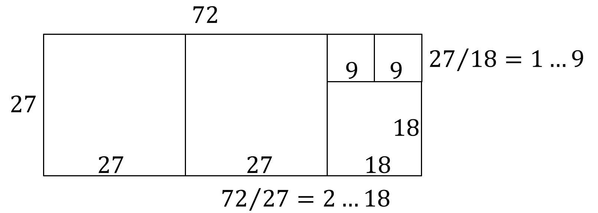

<!--
headingDivider: 1
-->
<!--
_class: title
-->
# 公開鍵暗号
 
光成滋生
 

# DH (Diffie-Hellman) 鍵共有
## 盗聴者のいる通信経路で安全に通信する方法
### AとBの間の鍵共有
- $p$: 素数, $g$: 0でない整数 ($0 < g < p$) を選び $p$ と $g$ を共有する（public）
- A は $x \in [1, p-1]$ をランダムに選んで $X:=g^x \bmod{p}$ （$p$ で割った余り）を B に送る
- B は $y \in [1, p-1]$ をランダムに選んで $Y:=g^y \bmod{p}$ を A に送る
- A は $s_1=Y^x \bmod{p}$, B は $s_2=X^y \bmod{p}$ を計算する

# これでうまくいくのか?
## $s_1=s_2=s$
- 整数 $a$, $b$ に対して $(a \bmod{p}) \times (b \bmod{p}) \bmod{p} = (a \times b) \bmod{p}$
- よって $a^b \bmod{p} = (a \bmod{p})^b \bmod{p}$
- $s_1=Y^x \bmod{p} = (g^y \bmod{p})^x \bmod{p} = (g^y)^x \bmod{p} = g^{xy} \bmod{p} = s_2$
  - 以降、煩雑なので $\bmod{p}$ は省略する
## 安全なのか?
- 盗聴者は $p$, $g$, $X$, $Y$ を盗聴できる
- 盗聴者はこれらの情報から $s$ を計算できるか?
- $X=g^x$ が分かっているのだから、$g$, $g^2$, $g^3$, ... と計算して $X=g^x$ となる $x$ を探せばよい
- そうすれば $Y^x = g^{xy} = s$ も計算できる
  - $p$ が十分大きいと、$x$ を見つけるのが困難であることが知られている

# 離散対数問題 DLP (Discrete Logarithm Problem)
## 定式化
- $p$, $g$, $X$ が与えられたとき、$X=g^x \bmod{p}$ となる $x$ を求める問題
  - $y=a^x$ のとき $x=\log_a y$ を底 $a$ について $y$ の対数と呼んだ
  - 今回はその整数版なので離散対数という
## DLP を解くコスト
- 2025年現在, 大きな$p$について一般数体篩法 GNFS (General Number Field Sieve) が最良の手法
- 計算コストは $L_p[1/3, (64/9)^{1/3}]$
  - $L_p[a, c] := \exp\left((c + o(1))(\log p)^a (\log \log p)^{1-a}\right)$: 準指数時間
  - $f(x)$ が $o(g(n))$ であるとは $\lim_{x \to \infty} f(x)/g(x) = 0$ であること
  - $L_p[1, c] \sim p^c$ （$\log p$ の指数時間）, $L_p[0, c] \sim (\log p)^c$ （$\log p$ の多項式時間）
- 例えば $p = 2^{2048}$ で $2^{116}$, $p=2^{3000}$ で $2^{137}$ 程度
  - 3000bit の素数を使うと128bitセキュリティの安全性があるとみなせる

# DH問題
## DLP が困難だけでOKか?
- $x$, $y$ を求められなくても直接 $s$ を求める方法があるかもしれない
### DHP (Diffie-Hellman Problem)
- $p$, $g$, $X=g^x \bmod{p}$, $Y=g^y \bmod{p}$ が与えられたとき $s=g^{xy} \bmod{p}$ を求めよ
### DLPとDHPの関係
- 先程見たようにDLPが解ければDHPも解ける
  - 問題としてはDHPの方が易しい
  - 2025年現在, DHPを解く最良の手法はDLPを解くこと
  - DHPがDLPより真に易しいか・同じぐらいの難しさかは不明
## 安全性の言い換え
- DHPが困難ならDH鍵共有は安全

# PQC (Post-Quantum Cryptography)
## 量子計算機に対しても安全な暗号技術
- 耐量子計算機暗号
- $\log p$ の多項式時間でDLPを解く量子アルゴリズムが知られている
- 量子計算機が実用化されるとDH鍵共有は安全でなくなる
- 量子計算機に安全な鍵共有方法が必要

## ML-KEM (Module-Lattice Key Encapsulation Mechanism)
- [FIPS 203](https://csrc.nist.gov/pubs/fips/203/final): 2024年NISTで標準化された
- ブラウザ Chrome, Edge, Firefoxなどで利用可能になってきている

- 詳細は後の講義で

# 楕円曲線
<!-- _class: image-right-center -->

## 楕円曲線 EC (Elliptic Curve) とは
- 「楕円」でも「曲線」でも無い「楕円曲線」という数学用語
  - イメージ的には「複素曲線」で浮輪の表面のようなもの
  - 代数的な定義は後述
## 楕円曲線の点集合
- $G$ を $\Set{0, P, 2P, \dots, (r-1)P}$ という形で表せる
楕円曲線の $r$ 個の点集合とする
  - $G$ には $aP \pm bP := ((a \pm b)\bmod{r})P$
  という*加減算*が定義されている
  - $(a P + b P) + c P = a P + (b P + c P) = (a+b+c) P$
  - $aP := P + P + \cdots + P$ （$a$ 個の $P$ の和）, $a(b P) = (ab) P$
  - $0$ は整数の0に相当する点, $-aP := (r-a)P$ とする

# ECDH鍵共有
## DH鍵共有の類推
- A は $x \in [1, r-1]$ をランダムに選んで $X:= x P$ を B に送る
- B は $y \in [1, r-1]$ をランダムに選んで $Y:= y P$ を A に送る
- A は $s_1=x Y = x y P$, B は $s_2 = y X = y x P = x y P$ を計算する

## DH鍵共有との比較
- $g^x$, $g^y$ の代わりに $x P$, $y P$. $g^{xy}$ の代わりに $xy P$

# ECDH鍵共有の安全性
## DLPとDHPの楕円曲線版
- ECDLP: $P$, $X=x P$ が与えられたとき $x$ を求めよ
- ECDHP: $P$, $X=x P$, $Y = y P$ が与えられたとき $x y P$ を求めよ
## ECDHPの難しさ
- 2025年現在, ECDHPを解く最良の手法はECDLPを解くこと
  - DHPと同様にECDHPがECDLPより真に易しいか・同じぐらいの難しさかは不明
- DH鍵共有が3000bitで128bitセキュリティだったのに対して
ECDH鍵共有は256bitの小さい鍵で同じセキュリティレベル
## ECDHの量子計算機に対する安全性
- $n$ bitのECDHは $O(n^3)$ の多項式時間で解けるので安全ではないが
TLS1.3で標準的に使われている鍵共有手法

# 抽象的な定義
## DHとECDHの共通点
- どちらも群構造を利用している
## 群とは集合 $G$ が次の性質を満たすもの
- $f:G \times G \to G$ が存在し, $f(a,b)$ を $a \cdot b$ と書く（$a b$ と書くことも）
  - 結合則: $(a b) c = a (b c)$ for $\forall a, b, c \in G$
  - 単位元: $e \in G$ が存在して$e a = a e = a$ （$e=1$ と書くことがある）
  - 逆元: $\forall a \in G$ に対して $a^{-1} \in G$ が存在して $a a^{-1} = a^{-1} a = e$
## 可換群
- 群 $G$ について $\forall a, b \in G$ に対して $a b = b a$ が成り立つ
- このとき $a b$ を $a + b$ と書き, 単位元を $e=0$, 逆元を $-a$ と書くことがある（加法群という）

# 群の例
## 整数の集合 $G:=\mathbb{Z}$
- $a, b \in G$ に対して $f(a,b):=a+b$, 0が単位元の可換群
## 0以外の有理数の集合 $G:=\mathbb{Q}^*$
- $a, b \in G$ に対して $f(a,b):=a b$, 1が単位元の可換群
## 2行2列の実数行列で逆行列を持つ行列の集合 $G:=GL_2(\mathbb{R})$
- $a, b \in G$ に対して $f(a,b):=a b$ （行列の積）,  単位行列が単位元の非可換な群
## $p$ で割った余りで考える集合 $G:=\langle g \rangle := \Set{1, g^1, g^2, \ldots, g^{r-1}}$
- $a, b \in G$ に対して $f(a,b):=a b$, 1が単位元の可換群
## 楕円曲線の点の部分集合 $G:=\Set{0, P, \dots, (r-1)P}$: 可換群

# 巡回群
## 群 $G$ が巡回群であるとは
- $g \in G$ に対して $\langle g \rangle:= \Set{e, g, g^2, g^3, \ldots}$ を $g$ で生成される部分群（巡回群）という
  - $\langle e \rangle = \Set{e}$.
- $g^r=e$ となる $r$ が存在すれば $\langle g \rangle = \Set{e, g, g^2, \ldots, g^{r-1}}$ となり有限巡回群という
  - $r$ を $\langle g \rangle$ の位数といい $r = |\langle g \rangle|$ と書く
- 巡回群は可換群である
  - $a, b \in \langle g \rangle$ に対して $a=g^x$, $b=g^y$ と書けて $a b = g^{x+y} = g^{y+x} = b a$
## 有限巡回群 $G=\langle g \rangle$ に関するDH鍵共有
- $x, y \in [1, r-1]$ をランダムに選んで $X=g^x$, $Y=g^y$ を交換し $g^{xy}$ を共有する
- DH鍵共有とECDHの鍵共有は $f(a,b)$ を $a b$ と書くか $a + b$ と書くかの違いだけ
- 実際論文によっては楕円曲線の演算を $g^a$ の形で書いてあるものもある（講義では $+$ を使う）

# スカラー倍算の計算
## $n P$ の計算
- $n P = P + \cdots + P$ （$n$ 個の $P$ の和）を逐次的に計算すると $O(n)$ かかる
- $n \approx r \approx 2^{256}$ なら不可能
## バイナリ法
- $n$ を2進数で表現する $n=\sum_{i=0}^{L-1} n_i 2^i$. ($n_i \in \{0,1\}$, $L \approx \log_2 r \approx 256$)
- $2^i P$ ($i=0, \dots, L-1)$ を計算する（2倍していくだけなので $L-1$ 回でOK）
- $nP=\sum_{i=0}^{L-1} n_i 2^i P$ なので $n_i=1$ となる $i$ だけ $2^i P$ を加算する
## 演算コスト
- 2倍算(D: $2P$) : $L-1$ 回
- 加算(A: $P+Q$) : $n$ はランダムなので平均的に半分ぐらいが $n_i=1$. よって $L/2$ 回
- 合計 $(L-1)D + (L/2)A$

# 楕円曲線のためにしばらく数学の準備
## 合同
- 整数 $m(>0)$, $a$, $b$ に対して $a \equiv b \pmod{m}$ とは $(a-b) \bmod{p} = 0$ のときをいう
  - $m$ で割った余りが同じ. このとき $a$ と $b$ は $m$ を法として合同という
  - 注意: 「$a \bmod{m}$」は $a$ を $m$ で割った余り（0以上 $m$ 未満の整数）
## 整数環
- 整数 $m(>0)$ に対して集合 $\mathbb{Z}/m\mathbb{Z} := \{0, 1, 2, \ldots, m-1\}$ とする（$\mathbb{Z}/m$ と略記する）
- 加減算: $a \pm b := (a \pm b) \bmod{p}$. 乗法: $a b := (a b) \bmod{p}$ for $a, b \in \mathbb{Z}/m$
  - 加算と乗算は可換: $a + b = b + a$, $a b = b a$
  - 加法に関する単位元 $0$: $a + 0 = a$, 乗法に関する単位元 $1$: $a \times 1 = a$
  - 結合法則: $(a + b) + c = a + (b + c)$, $(a b) c = a (b c)$
  - 分配法則: $a (b + c) = a b + a c$
- これらを満たすものを可換環という

# 除算の定義
## 思考
- $\mathbb{Z}/m \ni a, b(\neq 0)$ に対して除算 $a/b$ を定義したいが$a/b$ は整数にならない場合がある
- まず逆数 $1/a$ を考える
## 逆数とは
- $ax=1$ となる $x$ が $a$ の逆数
- 整数環でも $ab \equiv 1 \pmod{m}$ となる $b$ があれば $b$ を $a$ の逆数と呼んでよいのでは

- 例えば $m=7$ のとき $3 \times 5 \equiv 1 \pmod{7}$ なので $3$ の逆数 $1/3=5$ とする
- 例えば $m=6$ のとき $3 \times x \not\equiv 1 \pmod{6}$ なので $3$ の逆数は存在しない
  - $3 \times 1 \equiv 3$, $3 \times 2 \equiv 0$, $3 \times 3 \equiv 3$, $3 \times 4 \equiv 0$, $3 \times 5 \equiv 3$
# 有限体
## 素数 $p$ に対する整数環
- $\mathbb{F}_p := \mathbb{Z}/p = \{0, 1, 2, \ldots, p-1\}$
- **定理**: $\forall a \in {\mathbb{F}_p}^*:=\mathbb{F}_p \setminus \{0\}$ に対して $a$ の逆数が存在する
  - つまり $a b \equiv 1 \pmod{p}$ となる $b \in {\mathbb{F}_p}^*$ が存在する
- $\mathbb{F}_p$ は四則演算ができる
  - 逆元の存在: $a \in {\mathbb{F}_p}^*$ に対して $a^{-1} \in {\mathbb{F}_p}^*$ が存在して $a a^{-1} = 1$
  - 問: 逆元は存在すればただ一つしかないことを示せ
- このとき $\mathbb{F}_p$ を有限体という
  - 無限集合だけど四則演算が出来るものを体という

# Euclidの互除法
## 最大公約数 $\gcd(a, b)$ の性質
- $\gcd(a, 0)=a$, $\gcd(a,b)=\gcd(b,a)$.
- $\gcd(a,b)=\gcd(a-b,b)$
  - $c:=\gcd(a,b)$, $c':=\gcd(a-b,b)$ とすると $a = ca'$, $b = cb'$ と書けて $a−b = c(a'−b')$. よって $c$ は $a−b$ と $b$ の公約数となり，$c'$ の最大性から $c \le c'$.
  同様に $a − b = c'x, b = c'y$ と書くと $a = c'(x + y)$. よって $c'$ は $a$ と $b$ の公約数となり, $c$ の最大性から $c' \le c$．よって $c = c'$.
- $b\neq 0$ のとき $\gcd(a,b)=\gcd(a \bmod{b}, b)$.
  - $a$ を $b$ で割った余りになるまで $a-b$ に置き換えることを繰り返す
- $c=\gcd(a,b)$ に対して $b=0$ なら $c=a$ で終了
  - $b>0$ なら $r_0 := a \bmod{b}$ として $c=\gcd(r_0,b)=\gcd(b,r_0)$. $r_0=0$ なら終了
  - $r_0>0$ なら $r_1:=b \bmod{r_0}$ として $c=\gcd(r_1,r_0)$. $r_1=0$ なら終了
  - これを繰り返すといずれ終了し $c$ が求まる

# $\gcd(72, 27)$ の例
## 72と27の長方形を書く

- $\gcd(72,27)=\gcd(18,27)=\gcd(27,18)=\gcd(9,18)=\gcd(18,9)=9$

# 拡張Euclidの互除法
## $a$, $b$ に対して $a x + b y = \gcd(a, b)$ となる整数 $x$, $y$ が存在し求められる
- 先程の例で4回で終わったとする
  - $r_0:=a \bmod{b}$: $a = q_0 b + r_0$.
  - $r_1:=b \bmod{r_0}$: $b = q_1 r_0 + r_1$.
  - $r_2:=r_0\bmod{r_1}$: $r_0 = q_2 r_1 + r_2$.
  - $r_3:=r_1\bmod{r_2}=0$: $r_1 = q_3 r_2 + r_3$.
- これを順に代入すると
- $\gcd(a,b)=\gcd(r_0,r_1)=r_2=r_0-q_2 r_1=r_0 - q_2(b-q_1 r_0)$
$=(1+q_1 q_2)r_0 + b(-q_2)=(1+q_1 q_2) (a-b q_0) + b(-q_2)$
$=a(1+q_1 q_2) + b(-q_0 q_1 q_2 - q_2)=a x + by$ となる $(x,y)$ が求まった
# 有限体の逆元
## 拡張Euclidの互除法を用いて逆元を求める
- $\forall a \in {\mathbb{F}_p}^*$ に対して $a$ と $p$ は互いに素である（$p$ は素数だから）
  - つまり $\gcd(a, p)=1$
- 互除法を用いて $a x + p y = \gcd(a,p)=1$ となる整数 $x$, $y$ が存在する
- これは $a x \equiv 1 \pmod{p}$, つまり $x \bmod{p}$ は $a$ の逆数
## $\mathbb{Z}/m$ が有限体になる条件
- $m$ が合成数 $m=uv$ ($u, v > 1$) のとき, $u v \equiv 0 \pmod{m}$ なので $u$ の逆数は存在しない
- よって $\mathbb{Z}/m$ が有限体になる必要十分条件は $m$ が素数である

### 別の方法も紹介する

# 二項定理
## 組合せ（組み合わせ）の数
- $n$ 個の中から $k$ 個選ぶ組合せ ${n \choose k} := \frac{n!}{k!(n-k)!}$. 例 ${5 \choose 2} = \frac{5!}{2!3!} = 10$
- $(x+y)^n = \sum_{k=0}^{n} {n \choose k} x^k y^{n-k}$ が成り立つ
  - 問題: 数学的帰納法を使って証明せよ
- 素数 $p$ と $0 < k < p$ に対して ${p \choose k}$ は $p$ の倍数
  - ${p \choose k} = \frac{p!}{k!(p-k)!}$ の分子に $p$ があり, 分母に $p$ がない
- $(x+y)^p \equiv x^p + y^p \pmod{p}$
  - $(x+y)^p = \sum_{k=0}^{p} {p \choose k} x^k y^{p-k} \equiv x^p + y^p \pmod{p}$
- $x^p \equiv x \pmod{p}$
  - $x^p \equiv (1+(x-1))^p \equiv 1 + (x-1)^p \equiv 1 + \cdots + 1 \equiv x \pmod{p}$

# Fermatの小定理
## 素数 $p$ と $a\in {\mathbb{F}_p}^*$ に対して $a^{p-1} \equiv 1 \pmod{p}$
- $a^p \equiv a \pmod{p}$ より $a(a^{p-1}-1) \equiv 0 \pmod{p}$
- $a$ と $p$ は互いに素なので $a^{p-1}-1 \equiv 0 \pmod{p}$.
## 逆元の計算
- Fermatの小定理より $a \in {\mathbb{F}_p}^*$ に対して $a (a^{p-2}) \equiv 1 \pmod{p}$.
- これは $a^{-1} = a^{p-2} \bmod{p}$ を意味するので逆元を計算できる
## 注意
- $a=0$ のときは $a^{p-2}=0$ になってしまう（そもそも逆元は存在しない）

# 楕円曲線の定義
<!-- _class: image-right-center -->

## 体 $K$ 上の楕円曲線 $E/K$ とは
- $E(K):=\Set{(x,y) \in K^2 \mid y^2=x^3+a x + b} \cup \Set{O}$
  - 条件: $a, b \in K$ で $4 a^3 + 27 b^2 \neq 0$ （$x^3+ax+b=0$ が重解を持たない）
## 実数上のグラフ
- $E$ の定義方程式 $y^2=x^3+a x + b$ のグラフと $O$ の集合
- $x$ 軸に対して対象
- $O$ をシンボル的に無限遠点とする（$(0,0)$ ではない）
## 楕円曲線に加算を定義する
- 一般の $P, Q \in E(K)$ について $P+Q \in E(K)$ を次で定義する:
$P$ と $Q$ を通る直線 $l_1$ と $E(K)$ の交点 $R'$ をとり,
$R'$ の $y$ 座標の符号を反転させた点を $R':=P+Q$ とする

# 定義概要
## 特別な点や関係のとき
- $P + O := O + P := P$ for $\forall P \in E(K)$, $-O:=O$
- $P=(x,y)$ について $-P:=(x,-y)$
- $P=Q$ のとき $P$ における接線を考える
- $Q=-P$ のとき直線は $y$ 軸に並行となり $P+(-P):=O$ とする
## $G:=E(K)$ が群であることの確認
- 単位元と逆元は定義から自明
- 結合則: $(P+Q)+R = P+(Q+R)$ for $\forall P, Q, R \in E(K)$
  - グラフのデモ: [desmos](https://www.desmos.com/calculator/28wbmxtqiu)
  - 実はこれを証明するのはとても大変（普通は代数幾何や複素解析の知識を利用）
  - 初等的な証明: K. Nuida, [An Elementary Linear-Algebraic Proof without Computer-Aided Arguments for the Group Law on Elliptic Curves](https://arxiv.org/abs/2008.05705), 2020

# 加法公式の導出
## $P=(x_1,y_1)$, $Q=(x_2,y_2)$, $R=(x_3,y_3)$ とする
- 直線 $l_1:PQ$ の傾き $λ:=(y_2-y_1)/(x_2-x_1)$ （$x_1\neq x_2$ のとき）
- $y=λ (x-x_1)+y_1$ を $y^2=x^3+a x + b$ に代入整理
- $x^3 − λ^2 x^2 + (a + 2 λ(λ x_1 − y_1))x + b − (λ x_1 − y_1)^2=0$
- 3次方程式の解と係数の関係: $x_1+x_2+x_3=λ^2$ より $x_3=λ^2−x_1−x_2$
- これを $l_1$ に代入して $R'$ の $y$ 座標が求まるので $y_3=-λ (x_3−x_1)-y_1$
## $x_1 = x_2$ のとき
- $P = Q$ なら $P$ における接線 $l_1$ の傾きは定義方程式を微分して
$2y y'=3x^2+a$ より $λ=(3 x_1^2 + a)/(2 y_1)$. 後は上記と同様
- $P \neq Q$ なら $P+Q=R=O$ と定義した

# 楕円曲線の演算の定義まとめ
## 単位元
- 任意の $P \in E(K)$ に対して $P+O=O+P=P$
## 逆元
- $-O:=O$
任意の $P:=(x,y) \in E(K) \setminus \Set{O}$ に対して $-P:=(x,-y)$, $P+(-P)=O$
## 加法
- $O$ でない任意の $P:=(x_1,y_1)$, $Q:=(x_2,y_2) \neq -P$ に対して
$x_3:=λ^2-(x_1+x_2)$, $y_3:=-λ (x_3-x_1)-y_1$ とすると $P+Q=(x_3,y_3)$
ただし

$$
λ:=\begin{cases}
\frac{y_2-y_1}{x_2-x_1} & (x_1 \neq x_2) \\
\frac{3 x_1^2 + a}{2 y_1} & (x_1 = x_2)
\end{cases}
$$

# 問題
## 楕円曲線の群の演算の定義
- $x_1=x_2$ かつ $y_1=0$ のときはどうなるか

## mod pのDH鍵共有
- $p$ を大きな素数, $P \in [1, p-1]$ をランダムに固定・共有し
$a \in [1, p-1]$ をランダムに選び $a P$ を相手に送る方式のDH鍵共有は安全か

# 能動的な攻撃者
## ECDHで鍵共有を行い共通鍵暗号で暗号化
- 受動的な攻撃者（盗聴者）に対しては安全
- 能動的な攻撃者（改竄者）に対しては*安全ではない*
## 敵対的中間者攻撃 AitM (Adversary in the Middle) 攻撃
- A と B の間に改竄者が入り込んで盗聴・改竄を行う攻撃
- 以前は MitM (Man in the Middle) 攻撃
- フィッシング詐欺などのアプリケーションレベルの攻撃も含まれる

# ECDH鍵共有へのAitM攻撃
## A と B の間に改竄者 C が入り込む
- A は $x$ を選び $X = x P$ を B に送ったつもり
  - C は $X$ を盗聴し、代わりに $z$ を選び $Z = z P$ を B に送る
  - B は A から $X$ を受け取ったつもりだが実は $Z$ を受け取っている
- B は $y$ を選び $Y = y P$ を A に送ったつもり
  - C は $Y$ を盗聴し、代わりに $Z = z P$ を A に送る
  - A は B から $Y$ を受け取ったつもりだが実は $Z$ を受け取っている

- A は $s_A = x Z = x z P$, B は $s_B = y Z = y z P$ を秘密鍵として使う
- C は $s_A = z X$, $s_B = z Y$ の両方を取得できる

# AitM攻撃への対策
## 署名とは
- ペンや判子などの物理的な署名をデジタル上で実現する暗号技術
  - 電子署名・デジタル署名とも
## 物理的な署名との違い
- コンピュータ上ではデジタルな契約書は簡単にコピーできてしまう
- それだけでは本物か偽物か区別ができない
- 署名者だけが作成できる仕組みを実現する必要性

# 署名の定義
<!-- _class: image-right -->

## 次の三つ組のアルゴリズム
- 鍵生成 $1^λ$ を入力とし署名鍵 $sk$ と検証鍵 $vk$ を出力
  - $Gen(1^λ)=(sk, vk)$
  - メッセージ空間 ${\cal M}$ も決まる
- 署名生成 $sk$ と $m \in {\cal M}$ から署名 $σ$ を出力
  - $Sig(sk, m)=σ$
  - 暗に $vk$ を入力することもある
- 検証 $(vk,m,σ)$ を入力し正当なら1, 不正なら0を出力
  - $Ver(vk, m, σ) \in \Set{0,1}$
## 用語
- 署名鍵 $sk$ は秘密にするので秘密鍵, 検証鍵 $vk$ は他人に見せるので公開鍵ともいう
- 署名アルゴリズム・署名生成・生成された署名を全部「署名」ということが多い

# 署名の性質
## 正当性
- 正しい署名鍵を使って署名すれば正しいと判定される（確率が1）:
$Pr[Ver(vk, m, Sig(sk,m)))=1 \mid Gen(1^λ)=(sk,vk), m \underset{U}\leftarrow {\cal M}]=1$

## 偽造できない
- 署名鍵を持っている人しか正しい署名を作れない
- 偽のメッセージに対する署名を作れない
- 否認できない
  - MACは $sk=vk$ だったのでAとBの両方が正当なMAC値を生成できた
  - 署名は A しか署名できないので A は署名したことを否認できない
  - MACの上位互換
    - ただし一般的にMACの方が高速なので用途に応じて使い分ける

# 署名の強存在的偽造不可能性 sEUF-CMA
## 実験 $Exp_{\cal A}(λ)$
- 挑戦者 $\cal C$ は $Gen(1^λ)=(sk,vk)$ を実行し $vk$ を攻撃者 $\cal A$ に渡す
- $\cal A$ は $q$ 回 $m_i$ を選び $\cal C$ に依頼して $σ_i=Sig(sk,m_i)$ を得る
- $Ver(vk,m^*,σ^*)=1$ なる $(m^*, σ^*) \notin \{(m_i, σ_i)\}_{i=1}^q$ を作れたら1, それ以外は0を出力
## 安全性の定義
- どんなPPT攻撃者 $\cal A$ に対しても優位性 $Adv_{\cal A}(λ):=Pr[Exp_{\cal A}(λ)=1] < negl(λ)$ のときsEUF-CMA安全という

# ECDSA (Elliptic Curve Digital Signature Algorithm)
## 楕円曲線を用いた署名
- $G:=\langle P \rangle=\Set{O, P, \dots, (r-1)P}$: 楕円曲線 $E(\mathbb{F}_p)$ の有限巡回群, $H$: ハッシュ関数
- $Gen(1^λ)$: $s \underset{U}\leftarrow {\mathbb{F}_r}^*$ を署名鍵, $S := s P$ を検証鍵とする
- $Sig(s, m)$: $k \underset{U}\leftarrow {\mathbb{F}_r}^*$ を選び $R := k P$ の $x$ 座標を $t$ として
$σ:=(t, (H(m)+s t)/k \bmod{r})$ を署名とする
- $Ver(S, m, σ=(t, u))$:
$P':=(H(m) P + t S)/u$ の $x$ 座標が $t$ ならば1, それ以外は0を出力
- 分母が0になる場合はやり直す
## 正当性の確認
- $P'=(H(m) P + t s P)/((H(m)+s t)/k)=k P=R$ なので $P'$ の $x$ 座標は $t$

# RSA (Rivest, Shamir, Adleman) の準備
## 歴史
- 1977年公開. ただし1970年代初頭にCocksたちが先に考えていた（CESGの発表）
## RSA関数の生成
- RSAの落とし戸つき一方向性関数 (trapdoor one-way function): $f_e$
  - $p$, $q$ を素数, $n:=p q$, 整数 $a$ に対して $f_a(x):=x^a \bmod{n}$ とする
  - $d, e \in [1, n-1]$ を $d e \equiv 1 \pmod{(p-1)(q-1)}$ となる整数とする
  - $f_e(x)=x^e \bmod{n}$ をRSAの落とし戸つき一方向性関数という
  - $(n,e)$ を公開情報, $(p, q, d)$ を秘密情報とする
## $f_e$ の性質
- $\forall x \in [0, n-1]$ に対して $f_d(f_e(x))=f_e(f_d(x))=x$. すなわち $f_d(x)=f_e^{-1}(x)$
- $f_e:[0,n-1]\to [0,n-1]$ は一方向性置換（全単射）でもある

# RSA仮定
## 素因数分解 IF (Integer Factoring)
- $n=p q$ が与えられたとき $p$, $q$ を求める問題
- 2025年現在, 一般数体篩法 GNFS (General Number Field Sieve) が最良の手法（DLPと同じ）
- 計算コストは $L_n[1/3, (64/9)^{1/3}]$ で
  - 例えば $n = 2^{2048}$ で $2^{116}$, $n=2^{3000}$ で $2^{137}$ 程度
## RSA問題
- $n,e, y:=f_e(x)$ が与えられたとき $x$ を求める問題
- RSA仮定: 十分大きな $p$, $q$ に対してRSA問題はIFと同等に難しい
## $n$ から $p$, $q$ が求まれば
- $(p-1)(q-1)$ が求まるので拡張Euclidの互除法で $e$ の逆元 $d$ が求まる
- IFが解ければRSA問題も解ける / 逆は未解決問題

# RSASSA-PKCS1-v1_5
## 広く使われているRSAを使った署名の一つ [RFC-8017](https://datatracker.ietf.org/doc/html/rfc8017)
- encode関数: $encode(m):=\texttt{0x00|0x01|0xf...f|0x00|T|H(m)}$
  - $H(m)$ の先頭に固定値を連結する. $\texttt{T}$ は固定バイト列
- $Gen(1^λ)$: RSA関数を生成し $d$ を署名鍵, $(n, e)$ を検証鍵とする
- $Sign(d, m)$:
  - $m':=encode(m)$ として $σ:=f_d(m')=m'^d \bmod{n}$ を署名とする
  - *$σ=H(m)^d \bmod{n}$ ではない*
- $Ver((n, e), m, σ)$:
  - $m'' := f_e(σ)=σ^e \bmod{n}$ と $m'=encode(m)$ を求めて
  $m''=m'$ なら1, それ以外は0を返す
## 正当性の確認
- $m'' = f_e(f_d(m'))=m'$ が成り立つ

# RSASSA-PSS (Probabilistic Signature Scheme)
<!-- _class: image-right -->

## より安全なRSAを使った署名方式
- saltを入力可能にすることで同じ $m$ でも
異なる署名を生成できる
- MGF (Mask Generation Function): PRF
  - count:=0, T:=""
  - T := T|Hash(seed|count), count++
- 署名
  - $m$ から $h=H(m)$ を求めて salt と連結
  - もう一度HashしてMGFでmaskを生成
  - maskとsaltを連結してDBを作りmaskとxor
  - それからEMを作りRSA関数で $σ$ を出力

# RSASSA-PSSの検証
<!-- _class: image-right -->

## $Ver(e, m, σ)$
- $EM=σ^d \bmod{n}$ を求め
masked DBとh'を取り出す
- $h'$ からMFGでmaskを生成し
masked DBとxorしてmaskを復元
- maskからsaltを取り出し
$h''=Hash(0..0|h|salt)$ を計算
- $h'=h''$ ならvalid
## 特徴
- saltは途中で復元される
- $σ$ だけからでは $h$ を復元できない