<!--
headingDivider: 1
-->
<!--
_class: title
-->
# 公開鍵暗号2
<br>
光成滋生
<br>
last update: 2025/10/23

# 概要
## 目的
- 現在のブラウザで標準的な暗号プロトコルを理解する
- 署名の応用であるFIDO2, ビットコインやEthereumの仕組みを理解する

# 目次
## 用語一覧
- TLS1.3, ハンドシェイク, 鍵導出アルゴリズム
- HTTP/3, QUIC
- ECH, DNS, DoT, DoH
- FIDO2
- 否認防止
- タイムスタンプ
- Merkle木
- ブロックチェーン, ビットコイン, Ethereum

# TLS1.3 (Transport Layer Security)
## 通信を安全に暗号化するプロトコル
- 暗号化されていないHTTP（に限らない）を安全に通信できるようにする
- [RFC 8446](https://datatracker.ietf.org/doc/html/rfc8446), [RFC 8446bis](https://datatracker.ietf.org/doc/draft-ietf-tls-rfc8446bis/): 2025年9月現在draftが更新中
## 特徴
- 盗聴・改竄を防ぐ
- TLS1.2までに比べてハンドシェイクの効率化
- 暗号化アルゴリズムの整備
- 新しい鍵導出アルゴリズム
- 形式検証
- AEAD
- DNS, ECH

# TLS1.3のハンドシェイク
<!-- _class: image-right -->

## 暗号化通信が始まるまでの流れ
- クライアントからサーバへ接続開始 ClientHello
  - KS :ECDH鍵共有情報 ($a P$), PSK: 事前鍵共有情報
- サーバからクライアントへ応答
  - ServerHello: ECDH完了 ($b P$: $a b P$ を共有)
  - ECDH鍵共有完了でAEADによる暗号化通信開始
  - Certificate: サーバ証明書送信
  - CertificateVerify: 検証鍵でこれまでの通信に署名
  - Finished: 完了, 本来のデータを送信開始
- クライアント
  - Finished: 証明書と署名を検証し通信開始
- 重要: 公開鍵による暗号化は*行わない*
# 鍵導出アルゴリズム
## HKDF (HMAC-based Key Derivation Function)
- HMACを利用した鍵導出関数
  - 短いシードから秘密鍵に利用できる安全な擬似乱数を生成
- HKDF-Extract
  - salt : 秘密ではないランダムな値, x : DH鍵共有などの結果
  - $prk = HMAC(salt, x)$
- HKDF-Expand
  - $prk$ と付加情報 info から複数の安全な擬似乱数を生成
    - $T_1=HMAC(prk, \texttt{""|info|1})$
    - $T_2=HMAC(prk, T_1\texttt{|info|1})$
    - $T_3=HMAC(prk, T_2\texttt{|info|1})$
- Derive-Secret
  - infoにヘッダ情報を付与してHKDF-Expandを呼び出す

# 鍵導出手順
## 詳細はRFC8446参照
- ECDH鍵共有で得られた秘密情報からKDFを用いて複数の鍵を導出
  - どれかの鍵が漏洩してもすぐさま他の鍵に影響がないように個別に鍵を生成する
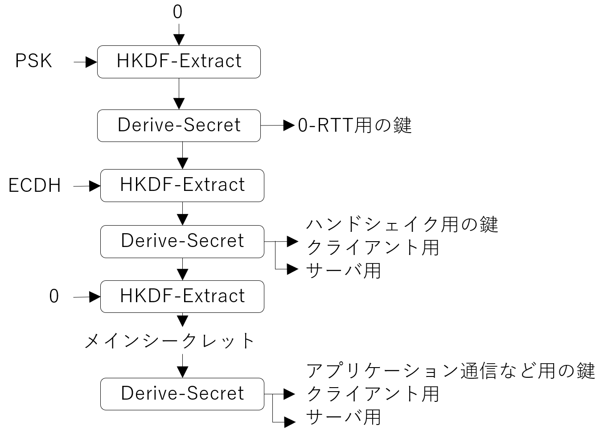

# HTTP/3とQUIC
<!-- _class: image-right -->
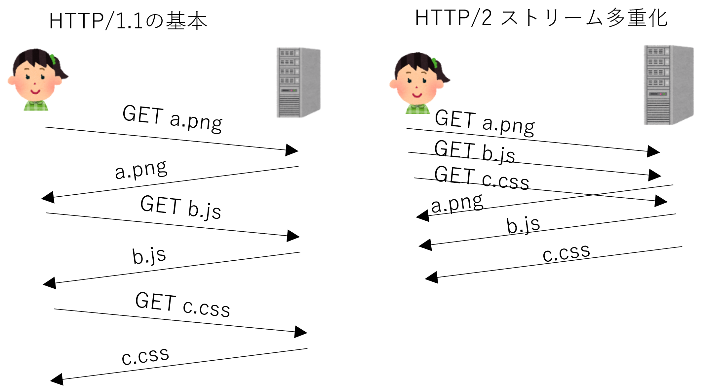
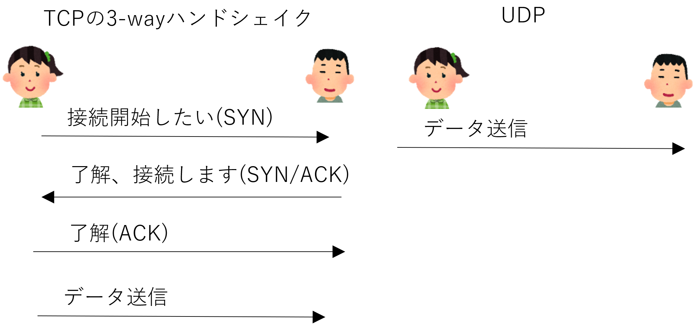
## HTTP (Hypertext Transfer Protocol) の歴史
- HTTP/1.1 (1997): テキストベース on TCP
- HTTP/2 (2015) on TCP
  - ストリームの多重化による並行処理
  - バイナリベースによる通信量の削減
  - HOLB (Head of Line blocking) 問題
    - パケットがロストすると全体が止まる
- QUIC (2012~2021) on UDP
  - TCPの3-wayハンドシェイクを止めて
  UDPによる高速接続
  - Connection IDによるHOLBの解消
  - コネクションマイグレーションによるハンドシェイクの削減
    - 回線が変わっても通信の接続を維持

# HTTP/3
## HTTP/2の機能を引き継ぎQUIC上で動作 (2018)
- QUICの上にTLSを載せると暗号化機能が重複
- TLS1.3は暗号通信が確立するまで
- QUICはそれ以降の通信（暗号化済み）を担当という役割分担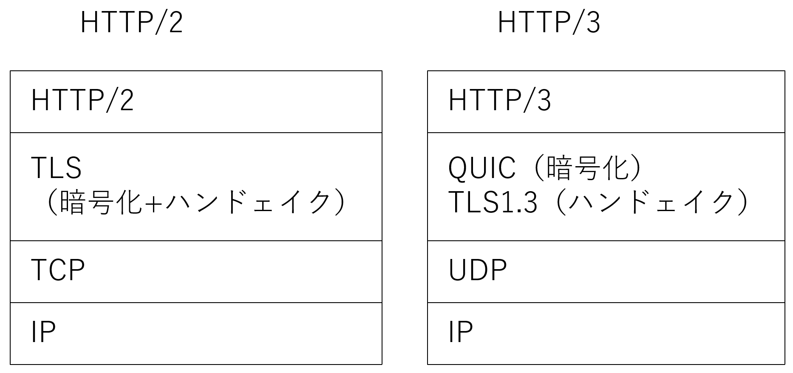

# httpsで通信が始まるところに焦点
## ClientHelloは暗号化されていない
- `https://なんとかかんとか`
  - DNSで名前解決（後述）してIPアドレスを取得してTLSが始まる
- ClientHelloにはSNI (Server Name Indication) 拡張で接続先のドメイン名が書かれている
  - サーバが複数の（サブ）ドメイン名を扱う場合
    - CDN (Content Delivery Network) では異なるドメイン名が同じIPアドレスになる場合
    - `<username>.example.com`のようなblogでユーザ名ごとに異なるサブドメイン
- ClientHelloは盗聴される危険性
  - SNIを見て接続先のドメイン名を特定される
  - 中国の GW (Great Firewall) ではSNIを見て接続を遮断している
  - ロシアも2021年ごろからSNIブロックを開始
    ｰ 2022年3月から[HTTP/3をブロック](https://ooni.org/post/2022-russia-blocks-amid-ru-ua-conflict/)

# ClientHelloのキャプチャ例
## https://herumi.github.io/lecture-crypto/
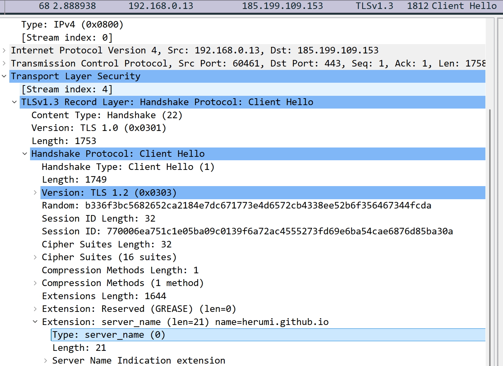
- name=herumi.github.io が平文で見えている
# ECH (Encrypted Client Hello)
## ClientHelloを暗号化する仕組み（策定中）
- ECHに対応していればClientHelloのSNIや暗号用パラメータなどが暗号化される
- 暗号化するための鍵はどうするのか
  - DNSのhttpsレコードにech=...というパラメータがありDNSの名前解決のときに取得
  - これが $a P$ に相当する公開鍵（固定）: HPKE (Hybrid Public Key Encryption)
  - クライアントは乱数 $b$ を使って $abP$ を計算し, TLSのハンドシェイクに近い形で暗号化
```
$ dig https cloudflare-ech.com

; <<>> DiG 9.18.39-0ubuntu0.24.04.1-Ubuntu <<>> https cloudflare-ech.com
;; global options: +cmd
;; Got answer:
;; ->>HEADER<<- opcode: QUERY, status: NOERROR, id: 16690
;; flags: qr rd ra; QUERY: 1, ANSWER: 1, AUTHORITY: 0, ADDITIONAL: 3

;; OPT PSEUDOSECTION:
; EDNS: version: 0, flags:; udp: 65494
;; QUESTION SECTION:
;cloudflare-ech.com.            IN      HTTPS

;; ANSWER SECTION:
cloudflare-ech.com.     131     IN      HTTPS   1 . alpn="h3,h2" ipv4hint=104.18.10.118,104.18.11.118 ech=AEX+DQBBigAgACDBSl4iHCZXblgikvu/41lOBxBOH5cPazCR3roH6u95OQAEAAEAAQASY2xvdWRmbGFyZS1lY2guY29tAAA= ipv6hint=2606:4700::6812:a76,2606:4700::6812:b76

;; ADDITIONAL SECTION:
cloudflare-ech.com.     131     IN      A       104.18.11.118
cloudflare-ech.com.     131     IN      A       104.18.10.118

;; Query time: 0 msec
;; SERVER: 127.0.0.53#53(127.0.0.53) (UDP)
;; WHEN: Fri Oct 10 17:31:11 JST 2025
;; MSG SIZE  rcvd: 227
```


# DNS (Domain Name System)
## ドメイン名を名前解決してIPアドレスに変換する仕組み
- ドメイン: URLの一部（cybozu.co.jpみたいなもの）
- DNSサーバ: ドメイン名とIPアドレスの対応表を持つサーバ（権威サーバ）
  - 名前解決は多段階で行われる
- DNSキャッシュサーバ: DNSサーバの問い合わせを代理で行うサーバ
  - ISPや企業内に設置されていることが多い
- DNSリゾルバ: DNSサーバへの問い合わせ
  - OSやブラウザに組み込まれている
## 安全性の問題
- 古いプロトコル (1983~1987): *平文通信*
  - 盗聴・改竄の危険性
  - DNSキャッシュポイズニング攻撃
    - Kaminsky攻撃(2008): キャッシュサーバの中身を偽の情報で上書き
<span class="any" style="right:0.5em;bottom:3em;">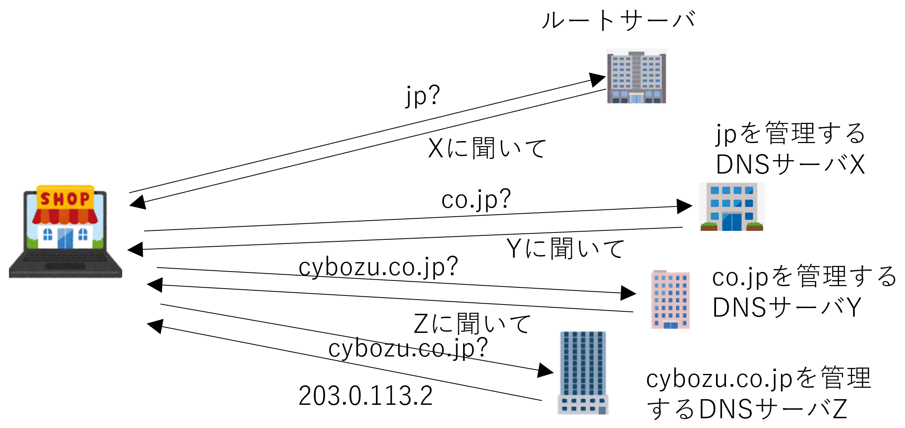</span>

# DNSSec (DNS Security Extensions) と DoT/DoH
<!-- _class: image-right -->
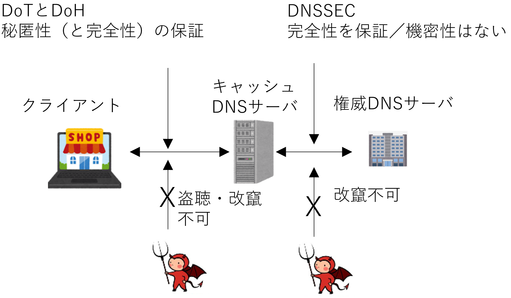
## DNSの安全性を高める仕組み
- DNSSec: 権威サーバのレスポンスに署名を付与
  - 検証することでキャッシュポイズニングを防止
  - データ自体は平文

## DoTとDoH
- DNSクエリとレスポンスをTLSで暗号化
- クライアントとキャッシュDNSサーバ間の通信を保護

|プロトコル|ポート|設定単位|
|---|---|---|
|DoT (DNS over TLS)|853|システム (OS) 全体|
|DoH (DNS over HTTPS)|443|アプリ（ブラウザ）ごと|

- ブラウザのDNS設定を見ると状況が分かる

# パブリックDNSサーバ
## DoT, DoHに対応している主なパブリックDNSサーバ
- Google Public DNS (8.8.8.8)
- Cloudflare (1.1.1.1): CDNの大手. ECHを主導
- Quad9 (9.9.9.9): スイスに拠点があるプライバシー重視の非営利団体

## 頭の片隅に
- DNSサーバには「いつどこにアクセスしにいくか」という情報が伝わる
  - 上記DNSサーバはプライバシーポリシーを公開しているので各自で判断
- 企業内ネットワーク内のローカルサーバはパブリックDNSサーバでは名前解決できない
- 国ごとの事情（日本のISPは緊急避難として児童ポルノをブロックしてる）には対応しない

# FIDO2 (Fast IDentity Online)
## 高速なオンラインID認証
- 多要素認証を統一的に扱う規格
- 登場人物
  - 認証器 (Authenticator)
    - 指紋・虹彩・静脈・顔などの認証機能
    - 認証用に用いる署名鍵の生成・署名機能
    - FIDOアライアンスが認定したことを示すattestation
      - 信頼できる機関（FIDOサーバ）の検証鍵で検証されたもの
  - RP (Relying Party)
    - サービス提供者: FIDOサーバを兼ねることもある
  - FIDOサーバ: ユーザのIDを登録・認証管理するサーバ
  - クライアントアプリ
    - WebAuthn (Web Authentication) を用いたブラウザやアプリ

# 検証鍵の登録
## FIDO2の登録の流れ
- アプリ, RPサーバを経由して認証器で生成した検証鍵を登録する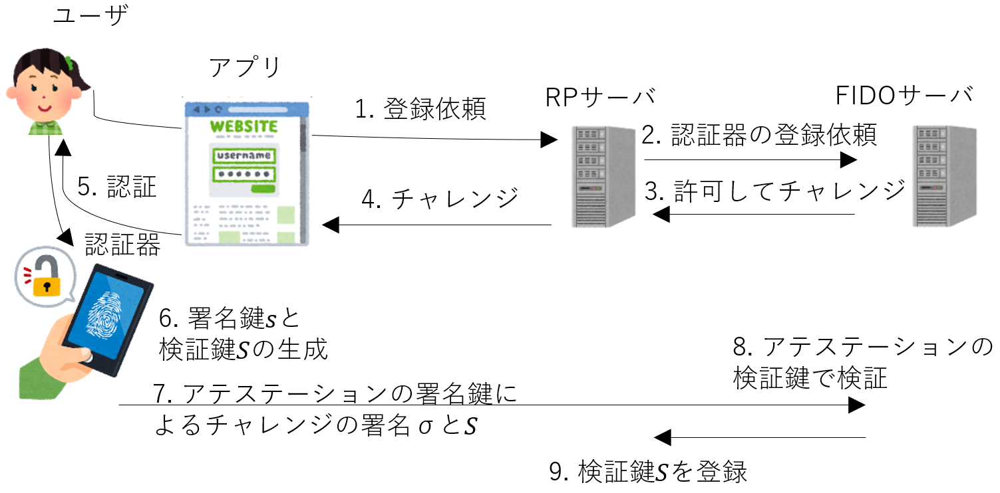
- パスキー (passkey) は署名鍵を暗号化して独自サーバに保存
  - パスキーの厳密な定義はまだない（ベンダー依存）（2025年9月時点）

# 認証の流れ
## Webサービスにログインするとき
- サーバが生成したチャレンジに署名する
- RPサーバに保存されている検証鍵で検証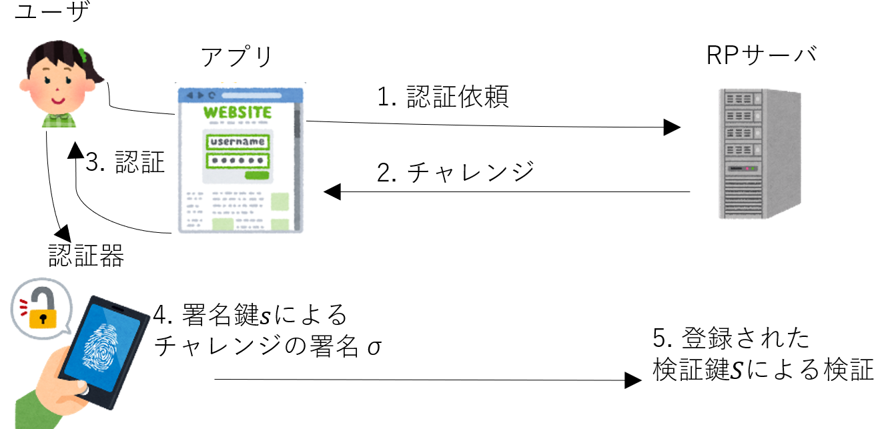
- パスワードなどの情報がネットワークを流れない

# 否認防止
## 正しい署名は署名鍵を持つ本人 $A$ しか作れない
- 署名は否認防止機能を持つ
- しかし $A$ が意図的に署名鍵を漏洩させて署名を無効化したら?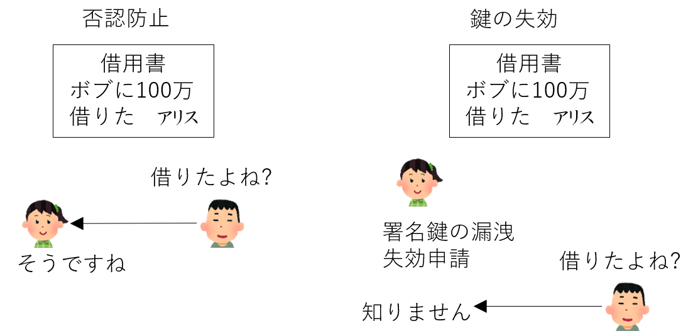
- その署名は私がしたのではないと主張される
- 署名に時刻を関連づける必要性がある

# タイムスタンプ
<!-- _class: image-right -->
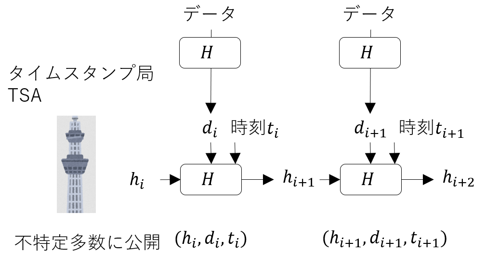
## Haber, Stornetta, 1990
- あるとき確かにそのデータが存在したことを
示す仕組み
- ハッシュ関数 $H$
- 時刻を管理する信頼の置ける機関
  - ハッシュ値を管理するタイムスタンプ局
  - 時刻認証局TSA (Time Stamping Authority)
## 流れ
- 登録したいデータ $m$ のハッシュ値 $d_i:=H(m)$ をTSAに送る
- TSAは現在時刻 $t_i$ と $d_i$, それまでの $h_i$ を元に $h_{i+1}:=H(t_i|d_i|h_i)$ を計算
- $(h_i, d_i, t_i)$ を公開する

# タイムスタンプを用いた否認防止
<!-- _class: image-right -->
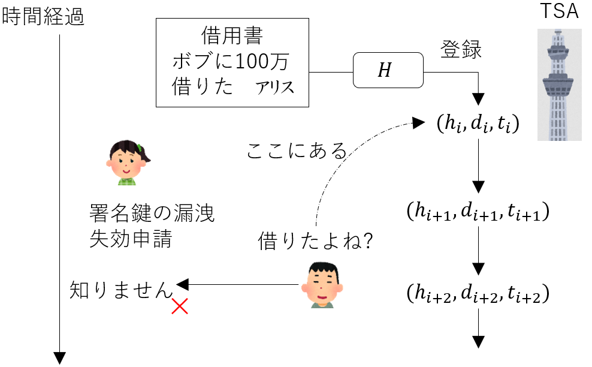
## $A$ は署名を失効させても否認できない
- リンクトークン生成型タイムスタンプISO/IEC 18014-3
  - 署名情報は新聞などで広く周知（昔の話）
- 署名ベースのタイムスタンプ: 繰り返し署名して延長可能
## EUの電子署名規格 eIDAS, - 2024年 [eIDAS 2.0](https://www.european-digital-identity-regulation.com/)
- electronic IDentification and Authentication Services
- EUC間で統一された暗号技術
  - その中でタイムスタンプも規定されている
  - 適格トラストサービスプロバイダーQTSP(Qualified Trust Service Provider) が提供
## 日本
- 2021年総務大臣による時刻認証業務（タイムスタンプサービス）の認定制度開始, 2023年[認定](https://www.soumu.go.jp/menu_news/s-news/01cyber01_02000001_00157.html)
- 時刻源はNICTの原子時計, 2025年3月現在セイコー, MIND, アマノなどの[6社](https://www.soumu.go.jp/main_sosiki/joho_tsusin/top/ninshou-law/timestamp.html)
# Merkle木
## ハッシュ値を一本の鎖ではなく2分木で管理したもの
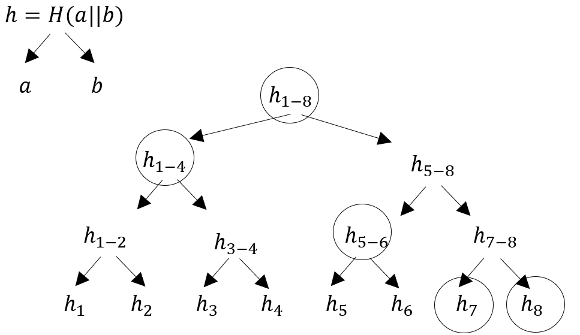
- $h=H(a|b)$ は $a$, $b$ に依存
- 特定の葉ノードが存在することを示すデータ量は全体の個数の $O(\log n)$
  - データ量が多いときに効率よく存在を検証できる

# （パブリック）ブロックチェーン
## ハッシュ値の連鎖をP2P (peer to peer) ネットワークで管理
- 不特定多数の主体が所有するコンピュータが互いに通信
- データが十分分散されると可用性と改竄耐性に優れる
- データ更新性能は低い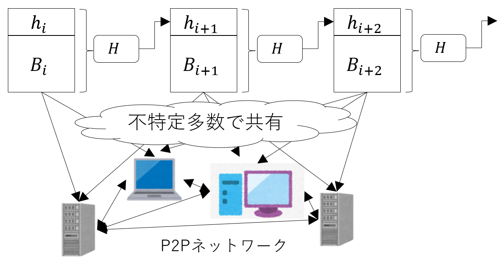

# ビットコイン
## 初めて暗号資産に応用したブロックチェーン
- ハッシュ関数と署名の応用（暗号化技術は使っていない）
## 用語
- ビットコインアドレス: 楕円曲線による署名の検証鍵のハッシュ値で銀行の口座番号に相当
- トランザクション: 「アドレス1からアドレス2に資産が移動した」という取引履歴
- ブロック: トランザクションをいくつかまとめたもの
- UTXO (Unspent Transaction Output): 未使用トランザクション出力
  - あるアドレスに移動したが、まだ別のアドレスに移動していない出力（コイン）
  - 実はトランザクションは「あるUTXOを消費して新しいUTXOを生成する操作」
- ブロックをハッシュ値の連鎖で管理する（資産の移動履歴だけが記録される）
  - ある人の現在の資産残高は記載されていない
    - 所有するアドレスに関連するUTXOで現在の残高を算出

# 「アリスが10BTC持っている」とは
## 以下の状態を指す
- コインの存在: 「コイン10BTCが、アドレス $a_A$ に移動した」という
トランザクション $T$ がブロックチェーンに含まれている
- 所有者: アリスがアドレス $a_A$ に対応する署名鍵 $s_A$ を持っている
- 未使用: 「$a_A$ から別のアドレスに移動した」というトランザクションが存在しない
  - つまり $T$ の出力UTXOが未使用である
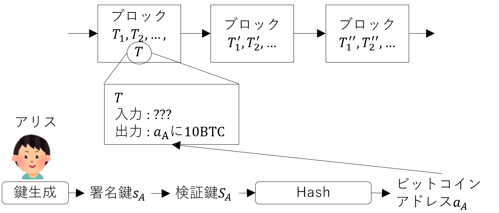

# 「アリスがボブに2BTC送金した」とは
<!-- _class: image-right -->
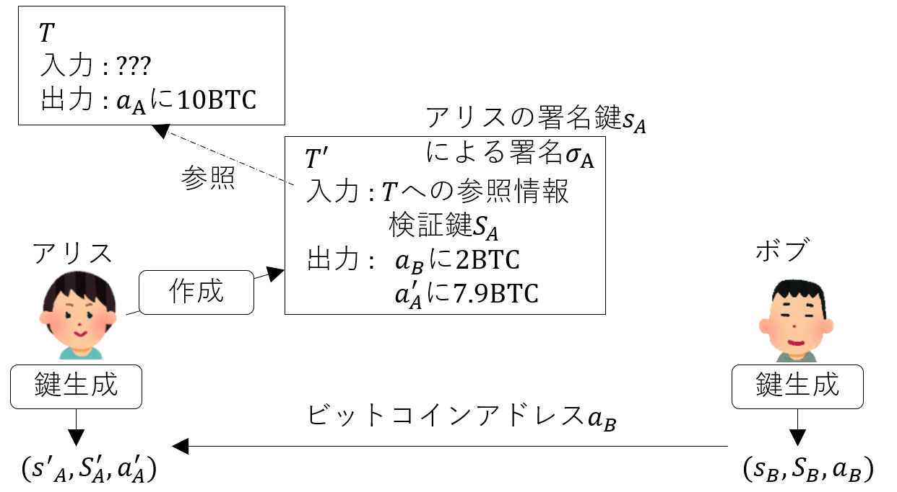
## 以下の操作が完了したときを指す
- （前提）アリスは $a_A$ に対応する署名鍵 $s_A$ を所持
- アリスはお釣り用アドレス $a'_A$ を作る
- ボブは受け取り用アドレス $a_B$ を作る
- アリスが次のトランザクション $T'$ を作成する
  - 入力: 10 BTCのUTXOに $s_A$ で署名
  - 出力1: 2 BTCを $a_B$ へ
  - 出力2: 7.9998 BTC を $a'_A$ へ
  - 手数料: 10-2-7.998=0.0002 BTC はマイナー（ブロック作成者）へ
- マイナーが $T'$ を含むブロックを生成し, そのブロックがブロックチェーンに取り込まれる
- ブロック: ヘッダ＋トランザクションの集合
ヘッダにはMerkle木で管理するハッシュ値, 時刻, ナンスなどが含まれる

# マイニングとブロックチェーンの更新
## マイニング
- ヘッダのハッシュ値が256bit整数としてターゲット値よりも小さくなるようにナンスを選ぶ
  - 2025年9月の時点で先頭79bitが0になるように調整（約 $2^{79}$ 回の試行が必要: 早い者勝ち）
- ブロックの検証
  - ブロックに含まれる $T'$ の正しさを $T$ に含まれる $S_A$ で署名の検証をする
  - 二重送金などが行われないかを確認する
  - ブロックの先頭のトランザクションに手数料が送られる（100ブロック確認後に使用可能）
- ブロックチェーン全体の正しさと更新を報酬を受け取ることで担保する仕組み
## ブロックチェーンの更新
<span class="any" style="left:50%;top:70%;">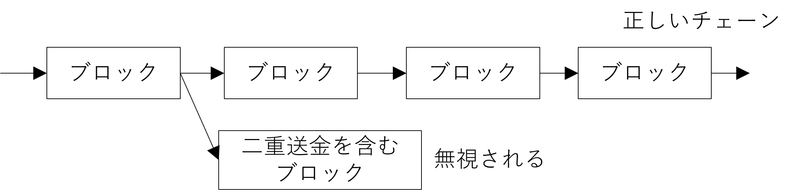</span>
- 最も長いチェーンが正しいチェーンである
- 不正なブロックは無視される
- 7ブロック追加されれば概ね正しいと扱われる

# ビットコインのまとめ
## 特徴
- P2Pネットワークによる非中央集権型のシステム
- 公開鍵暗号とハッシュ関数による安全性の確保
- ブロックチェーンによる改竄耐性とマイニングによる合意形成
## 課題
- PoW (Proof of Work)
  - 莫大な電力消費, 大規模マイニングプールによる中央集権化の懸念
- 低いトランザクション処理性能
  - 約7トランザクション/秒（1ブロック/約10分）
  - ライトニングネットワーク: オフチェーン（チェーン外）での高速・小額決済
- プライバシー
  - 疑似匿名性：アドレスは公開、取引履歴は追跡可能

# Ethereumの概要
## スマートコントラクトを実行できるブロックチェーン
- スマートコントラクト: ブロックチェーン上で動作するプログラム
  - ビットコインと異なり任意のプログラムを実行可能（トークン発行・自動売買など）
## PoS (Proof of Stake)
- ステーク（担保）を預けてバリデーターになる
  - 任務: ブロックの提案・検証・投票による合意形成とネットワークの維持
  - 報酬: 正直な行動で報酬, 不正行為でステークの没収
- 合意形成の効率化: 複数の署名を一つに集約するBLS署名により通信量を削減
## スケーラビリティの向上
- Danksharding（導入予定）: データ可用性の拡張
- zk-Rollup: ゼロ知識証明を用いたオフチェーン処理と効率的な検証
  - ゼロ知識証明はZcashなどで取引履歴の秘匿化によるプライバシー保護にも利用
