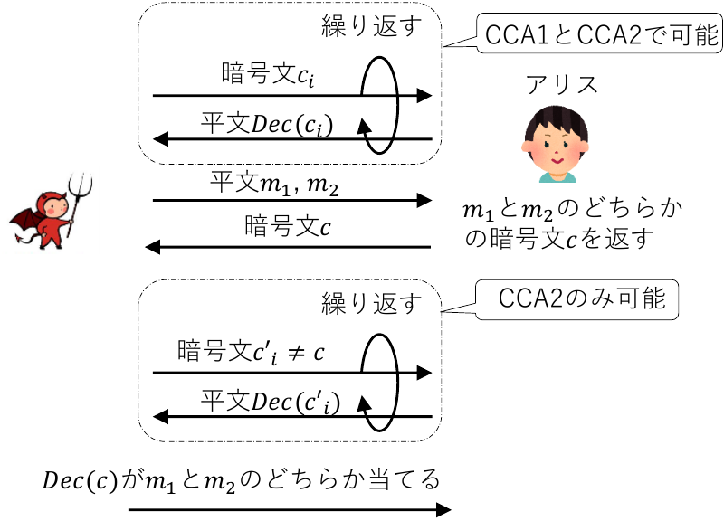
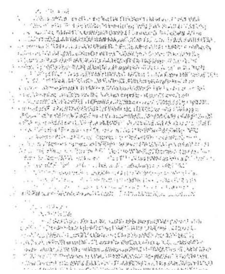

<!--
headingDivider: 1
-->
<!--
_class: title
-->
# 公開鍵暗号3
 
光成滋生
 
last update: 2025/12/04

# 目次
## 用語一覧
- 公開鍵暗号, PKE, PKC, IND-CPA安全, IND-CCA安全, 頑強性, 強秘匿性, RSA-OAEP, ハイブリッド暗号, FO変換, 前方秘匿性

# 公開鍵暗号
## PKEとPKC
<!-- _class: image-right -->

- 「公開鍵暗号」には二種類の意味がある
- PKE (Public Key Encryption)
  - 公開鍵で暗号化して秘密鍵で復号する暗号方式
  公開鍵暗号化・公開鍵暗号方式とも
- PKC (Public Key Cryptography)
  - 公開情報と秘密情報を組み合わせた暗号技術全般
  - 鍵共有, 署名, 暗号化などを含む
    - 今まで紹介してきたのは鍵共有と署名
## 機能と構成要素
- 準同型暗号: 暗号文のまま演算ができる暗号（機能面による命名）
- 楕円曲線暗号: 楕円曲線を使った暗号技術全般（構成要素による命名）
  - 他にペアリング暗号・格子暗号など

# PKEの定義
## PPTアルゴリズムの組 $Π:(Keygen, Enc, Dec)$ がPKEであるとは
- KeyGen: 鍵生成
  - $KeyGen(1^λ) → (pk, sk)$: $λ$: セキュリティパラメータ, $pk$: 公開鍵, $sk$: 秘密鍵
  - 平文空間 ${\cal M}$ も決まる
- Enc: 平文 $m \in {\cal M}$ の暗号化
  - $Enc(pk, m) → c$
- Dec: 暗号文 $c$ の復号（Decは決定的アルゴリズム）
  - $Dec(sk, c) → m$
- 正当性: 任意の $m \in {\cal M}$ に対して $Dec(sk, Enc(pk, m)) = m$

# PKEの特徴
<!-- _class: image-right -->

## 鍵管理
- 共通鍵暗号の場合, $n$ 人の間で個別の二者間通信するには
全体で $n(n-1)/2$ 個の鍵が必要
  - 各自は $n-1$ 個
- PKEの場合, 各人が一つの公開鍵と秘密鍵を持てばよい
  - 各自は $n-1$ 個の公開鍵なので管理しやすい
  （秘匿する必要がない）
## AitM攻撃対策はDH鍵共有と同様必要
- AとBの間に入ったCがA, Bの公開鍵$pk_A, pk_B$の
代わりに$pk_C$ を渡す
- Bは $pk_C$ で暗号化して送信, Cは復号して内容を知り, $pk_A$ で暗号化してAに送信
- 署名などによりAと $pk_A$ の対応を保証する必要がある
# PKEとIND-CPA安全
## IND-CPA安全 （再掲）
- 自分で選んだ平文 $m_1$, $m_2$ のどちらかの暗号文 $c$ をもらってもどちらの平文か当てられない
## 平文当てゲーム $\texttt{Exp}(λ)$: 実験 (experiment)
1. 挑戦者 C (Challenger): $s =KeyGen(1^λ)$
1. 攻撃者 A (Adversary): $m_1, m_2 \in {\cal M}$ を選ぶ
1. C: $b \in\Set{0,1}$ を選び $c=Enc(s,m_b)$ を A に送る
1. A: $c$ から $b' \in \Set{0,1}$ を推測して $b=b'$ ならAの勝ち

- IND-CPA安全とは $Adv_{Exp}(λ):=\left| \Pr \left[Exp(λ)=1\right] - \frac{1}{2} \right|<\texttt{negl}(λ)$ for $∀$ PPT Algo $Exp$
## 共通鍵暗号とPKEの違い
- PKEでは任意の $m$ の暗号文を自分で作れる $c=Enc(pk,m)$ のでIND-CPA安全は必須条件

# 安全ではないPKEの例
## RSA関数をそのまま使うRSA暗号（RSA$_0$ とここでは表記）
- $KeyGen(1^λ)$: RSA関数の設定
  - 素数 $p, q$ と $(e,d)$ を $e d ≡ 1 \pmod{(p-1)(q-1)}$ となるように選び $n:=p q$ とする
  - $pk:=(n,e)$, $sk:=(p,q,d)$, ${\cal M}:=[0,n-1]$
- $Enc(pk, m)$: $m \in {\cal M}$ に対して $c = m^e \bmod n$
- $Dec(sk, c)$: $m = c^d \bmod n$

## RSA$_0$ はIND-CPA安全ではない
- $c=Enc(pk,m_b)$ をもらったら $c_i:=Enc(pk,m_i)$ ($i=1,2$) を計算して
$c=c_1$ か $c=c_2$ かを調べればどちらの平文を暗号化したのか当てられる
- より一般にPKEの暗号化 $Enc$ が決定的アルゴリズムならばIND-CPA安全ではない
  - IND-CPA安全なPKEの暗号化はPPTアルゴリズムでなければならない
  - 便宜上, 暗号化に使った乱数 $r$ を明示的に $Enc(s,m;r)$ と書くことがある

# （楕円）ElGamal暗号
## 定義
- KeyGen: 楕円曲線を用いて位数 $r$ の巡回群 $G=⟨P⟩=\Set{0,P,2 P, \dots, (r-1)P}$ を選ぶ
  - $s \underset{U}\leftarrow  [1,r-1]$: 秘密鍵, $Q = s P$: 公開鍵, ${\cal M} = G$
- Enc: $M \in G$ に対して $k \underset{U}\leftarrow [1,r-1]$ を選び $c:=Enc(Q,M;k) := (k P, M + k Q)$
- Dec: $c=(A,B)$ に対して $Dec(s, c)=B - s A$
## 正当性
- $Dec(s,Enc(Q,M;k))=(M+k Q)-s(k P) = M + k s P - s k P = M$

# 加法準同型暗号
## 暗号文の加算ができる暗号
- 暗号文 $c_1=Enc(m_1), c_2=Enc(m_2)$ に対して $c_1 + c_2$ が定義できて $Dec(c_1 + c_2) = m_1 + m_2$ となっている暗号
- 同じ平文の暗号文を同一視すれば $Enc(m_1) + Enc(m_2) = Enc(m_1 + m_2)$
  - このような写像を準同型写像という
  - $Enc(0)$ が暗号文空間の単位元, $Enc(-m)$ が $Enc(m)$ の逆元
## ElGamal暗号は加法準同型暗号
- $c_i:=Enc(Q,M_i;k_i)=(A_i,B_i)$ に対して $c_1+c_2:=(A_1+A_2,B_1+B_2)$ と定義
- $c_1 + c_2 = ((k_1+k_2) P, (M_1+M_2) + (k_1+k_2) Q) = Enc(Q,M_1+M_2;k_1+k_2)$
# 楕円ElGamal暗号はIND-CPA安全
## 安全性仮定の根拠は?
- IND-CPAのゲームで攻撃者 A は $c=Enc(Q,M_b;k)$ を受け取る
自分で $M_i$ ($i=1,2$) の暗号文 $c_i:=Enc(Q,M_i;k_i)$ を作り比較する
- $c - c_1$, $c - c_2$ はどちらかが0の暗号文なのでそれを判別できるか否かが焦点
- $c'$ が 0 の暗号文かどうか判定できるか否かが焦点
  - $Enc(Q;M;k)=(k P, M + k Q)$ なので2番目の成分が $k Q$ か $M + k Q$ かの違い
## DDH問題 (Decisional DH problem)
- $G=⟨P⟩ \ni P, a P, b P, c P$ が与えられたとき $c = a b$ かを判定する問題
  - もし DH問題が解けるなら $P, aP, b P$ から $a b P$ を求めて $c P$ と比較すればDDHは解ける
## 楕円ElGamal暗号はDDH仮定の元でIND-CPA安全
- $P$, $s P$, $k P$ が分かっているので残りが $k s P$ かそうでないか判定できない

# IND-CCA(1/2)安全（再掲）
<!-- _class: image-right -->

## 選択暗号文攻撃CCA
- 攻撃者 $\cal A$ は好きな暗号文 $c_i (≠ c)$ を選び
対応する平文 $m'=Dec(c_i)$ を得られる状況
  - その時 $Dec(c)$ が $m_i$ のどちらか当てられるか?
- CCA1: $c$ を受け取る前のみクエリ可能
- CCA2: $c$ を受け取った後もクエリ可能
- 当てられないならIND-CCA(1/2)安全
## ElGamal暗号はIND-CCA2安全ではない
- より一般に準同型暗号はIND-CCA2安全ではない
  - $\cal A$ は $c=Enc(M)$ に対して $c'=c+Enc(0)$ を作ると $c'≠ c$ なので
挑戦者に復号してもらうと準同型性から $Dec(c')=Dec(c)+0=M$ が分かる
- 注意: ElGamal暗号がDDH仮定の元でIND-CCA1安全かそうでないかは未解決

# 頑強性 NM（non-malliability）と強秘匿性
## 強秘匿性
- 暗号文 $c=Enc(m)$ から $m$ のいかなる（サイズ以外の）情報も得られない
## 頑強性（非展性とも）
- 暗号文 $c=Enc(m)$ から $m$ と関係のある別の暗号文 $c' ≠ c$ を作れない
## PKEはCCA2攻撃の元で強秘匿性と頑強性は同値
- IND-CCA2 ⇔ NM-CCA2
- 一般には強秘匿性があっても、暗号文をいじれる場合があった（準同型暗号）
- CCA2という強力な攻撃者のモデルを想定した場合、強秘匿性があれば頑強性も保証される
- PKEではIND-CCA2安全が最も強い安全性保証

# RSA-OAEP (optimal asymmetric encryption padding)
<!-- _class: image-right-center -->

## IND-CCA2安全なRSA暗号
- ランダムオラクルモデルの元で安全性証明がある
## $m$ の暗号化
- H: SHA-2 (L=256/8 byte), k:=2048/8 byte
MGF (Mask Generation Function): H(seed|counter)
DB = H("") || 0...0 || 0x01 || m
- dbMask = MGF(seed, |DB|): seedは乱数
- maskedDB = DB ⊕ dbMask
- seedMask = MGF(maskedDB, L)
- maskedSeed = seed ⊕ seedMask
- EM = 0x00 || maskedSeed || maskedDB
- c = Enc(e, EM) = $EM^e \bmod{n}$（$m$ は $k - 2 L - 2=190$ byte 以下）

# ハイブリッド暗号
## PKEと共通鍵暗号の組合せ
- PKEは計算コストが高いので大量のデータの暗号化には不向き
- 共通鍵暗号は高速
- ハイブリッド暗号: PKEで共通鍵を共有し, その共通鍵で共通鍵暗号を使う
## KEM/DEM フレームワーク
- KEM (key encapsulation mechanism)
  - $\text{KEM.Gen}(1^λ) → (sk, pk)$: 公開鍵生成
  - $\text{KEM.Enc}(pk) → (K, C)$: 共通鍵 $K$ とその暗号文 $C$ を生成
  - $\text{KEM.Dec}(sk, C) → K \text{ or } ⊥$: 共通鍵 $K$ を復号
- DEM (data encapsulation mechanism)
  - $\text{DEM.Enc}(K, m) → c$: 共通鍵 $K$ で平文 $m$ を暗号化
  - $\text{DEM.Dec}(K, c) → m \text{ or } ⊥$: 共通鍵 $K$ で暗号文 $c$ を復号

# FO（藤崎-岡本）変換
## IND-CCA2安全なKEM-DEMの構成法
- (Gen, Enc, Dec): PKE, (DEM.Enc, DEM.Dec): 共通鍵暗号, $H_1, H_2$: ハッシュ関数に対して
- $\text{FO.Gen}(1^λ)$: $\text{PKE.Gen}(1^λ) → (pk, sk)$
- $\text{FO.Enc}(pk, m)$: 乱数 $r$ を選び
  $c:=(C_1,C_2):=(\text{PKE.Enc}(pk, r;H_2(m\|r)), \text{DEM.Enc}(H_1(r), m))$
- $\text{FO.Dec}(sk, (C_1,C_2)))$:
$r:=\text{PKE.Dec}(sk, C_1)$, $m:=\text{DEM.Dec}(H_1(r), C_2)$
$C_1=\text{PKE.Enc}(pk, r;H_2(m\|r))$ なら $m$ を返す, そうでなければ $⊥$
## 安全性
- PKE: OW (One-Way)-CPA安全（暗号文から平文を得られない）+αの仮定
- DEM: IND-OT (one-time) 安全（1回の使用だけなら安全）
- OW-CPA安全なKEM + IND-OT安全なDEM → FOはランダムオラクルモデルでIND-CCA2安全
# PKEと前方秘匿性
<!-- _class: image-right -->

## 前方秘匿性 (forward secrecy)
- 秘密鍵が漏洩しても過去の通信内容が守られる性質
## FSがない場合
- 盗聴者は復号できなくても盗聴して暗号文の履歴を保持
- 将来秘密鍵が漏洩すると全ての暗号文を復号できる
## DH鍵共有によるFSの実現
- 都度DH共有することで過去の履歴を保持されても安全
- DH時の秘密情報は毎回破棄
  - 漏洩しても影響はそれだけ
- 注意：DH鍵共有自体が破られたら駄目

# PRISMとTLSなどのFSへの移行
<!-- _class: image-right-center -->

## PRISM
- 2013年アメリカ国家安全保障局NSAによる監視プログラムの存在がSnowdenにより暴露
- インターネットの大部分の通信を監視
- FBIがSnowdenを告訴
  - Lavabit: Snowdenが利用していたメールサービス業者
    - 裁判所がPKEの秘密鍵の提出を要求
    - 読めないサイズのフォントで提出
    - 最終的には電子データの提出/DH鍵共有を使っておけば良かった
## TLS 1.3
- PKEの利用を廃止してDH鍵共有に完全移行
- 実はブラウザで使う限りPKEが使われる機会はほぼ無い
- ECHのHPKE（DH鍵共有の片側固定）はFSは満たさない