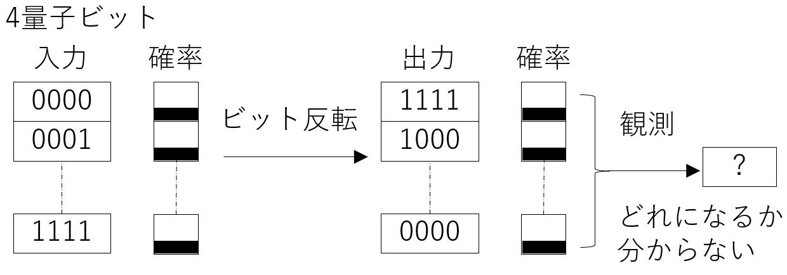
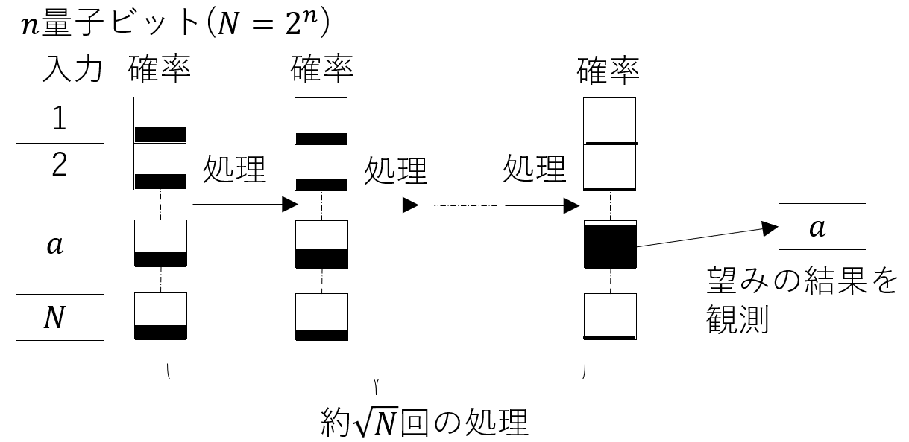

<!--
headingDivider: 1
-->
<!--
_class: title
-->
# 量子計算機と暗号解読
 
光成滋生
 
last update: 2025/10

# 概要
## 古典計算機
- 現在（古典）計算機はビット (0 or 1) を基本単位として計算
- 論理ゲート: AND, OR, NOTなどのビット演算の組合せ
## 量子計算機 QC (Quantum Computer)
- 量子力学で記述される量子状態を利用した計算機
  - 攻撃: 量子計算機を利用して暗号技術を破る量子アルゴリズム
  - 対策: 耐量子計算機暗号（量子計算機が登場しても安全な現在の計算機で実行できる暗号）
  - 量子鍵配送（量子暗号）: 量子の性質を利用した秘密鍵を共有する技術
## 粒子と波
- 粒子は1個, 2個と数えられ, 同じ場所に複数個存在できない
- 波は数えられない広がりを持った状態
- 複数の波が重なり合って干渉する

# 量子
## 粒子と波の両方の性質をもった状態
- 電子, 光子, 原子などの量子状態を最小単位 (qubit) として制御することで計算

## 量子計算機の方式例
- 超電導・イオントラップ・中性原子・光など
  - それぞれの方式の詳細は本講演の範囲外
- 量子状態の持続時間（コヒーレンス時間）・速度・エラー率・動作温度が一長一短
- qubit を増やすだけでなく、エラー率の低減・大規模化・運用コストなども課題
## 誤り訂正
- 量子状態は外部環境の影響を受けやすく誤りが発生しやすい
- 誤り訂正の技術を使って複数の物理qubitで1個の論理qubitを表す
- 実際に計算できるためには誤り耐性量子計算FTQC（Fault-Tolerant QC）が必要
- 実用的なものは100万 qubit程度必要と言われている
## メモリ
- 現在のQCは量子メモリを持たない
- 必要な情報は全てqubitで表現する

# 量子計算機の実装例
## 超伝導方式
- Google: 2019年 53 qubit, 2024年 105 qubit
- [IBMのロードマップ](https://www.ibm.com/quantum/technology#roadmap): 2021年 127 qubit, 2022年 433 qubit, 2023年 1121 qubit Condor
- 大阪大学: 2023年 [64 quibit](https://resou.osaka-u.ac.jp/ja/research/2023/20231220_1), 富士通と理研: 2025年 [256 qubit](https://pr.fujitsu.com/jp/news/2025/04/22.html)
## イオントラップ方式
- 2023/6: [IonQが29 quibit](https://ionq.com/posts/ionq-achieves-new-performance-milestone-of-29-algorithmic-qubits-aq-on-ionq), 2025: Quantinuum 56 qubit
- 2025/6: [1qubitで1/670万のエラー率](https://qiqb.osaka-u.ac.jp/newstopics/pr20250623)

## 中性原子方式
- 2023/10: Atom Computing [1180 quibit](https://atom-computing.com/quantum-startup-atom-computing-first-to-exceed-1000-qubits/)
- 2025/9: [6100 qubit, 0.02%のエラー率](https://www.caltech.edu/about/news/caltech-team-sets-record-with-6100-qubit-array)

- その他: 電子, 光, マイクロ波 etc.

# 量子計算機に必要な線形代数の復習
## 行列
- 複素数を縦に $n$ 個, 横に $m$ 個並べた $A=(a_{ij})$ ($a_{ij} \in ℂ$) を $n$ 行 $m$ 列 （複素）行列という
  - その全体を $M_{n,m}(ℂ)$ と書く（$n=m$ のときは $n$ 次正方行列で $M_n(ℂ)$ と書く）
- $A \in M_{n,m}(ℂ)$, $B \in M_{m,l}(ℂ)$ に対して行列の積 $AB:=((\sum_{k=1}^m a_{ik}b_{kj})_{ij} \in M_{n,l}(ℂ)$
- $A^T$: 行列 $A$ の転置行列 $A^T:=(a_{ji})$ は $m$ 行 $n$ 列の行列
- $A$ のエルミート共役: $A^\dagger := \overline{A}^T=(\overline{a_{ji}})$（$\overline{a_{ji}}$ は $a_{ij}$ の複素共役）
  - $(AB)^\dagger = (\overline{(AB)_{ji})}=\overline{(\sum a_{jk} b_{ki})}=B^\dagger A^\dagger$
## ベクトル
- $n$ 次元縦ベクトル $v, w \in M_{n,1}(ℂ)$ の内積: $v \cdot w := v^\dagger w = \sum_{i=0}^n \overline{v_i} w_i \in ℂ$
- $v$ のノルム（長さ）: $|v| := \sqrt{v \cdot v}$, 単位ベクトル: ノルムが1のベクトル
- $n$ 個の $n$ 次元縦ベクトル $e_1, \dots, e_n$ が $e_i \cdot e_j = δ_{ij}$ のとき $\Set{e_i}$ を正規直交基底という
  - $\Set{e_i:=(0, \dots, 0, 1, 0, \dots, 0)^T}$ （$i$ 番目だけ1）は標準基底

# ユニタリ行列
## 量子力学の演算に必要な行列
- ユニタリ行列: $U^\dagger U = I$ を満たす $n$ 次行列 $U$（$I$ は単位行列）, その全体を $U(n)$ と書く
- $U \in U(n)$ なら $U^{-1}=U^\dagger$ なので $U$ は可逆
- ユニタリ行列はベクトルの長さを変えない
  - $v$ が $|v|=l$ なら $l^2=v^\dagger v=v\dagger (U^\dagger U) v=(Uv)^\dagger (Uv)=|Uv|^2$ なので $|Uv|=l$
  - 同様に $\Set{e_i}$ が正規直交基底なら $\Set{U e_i}$ も正規直交基底（$(Ue_i)^\dagger (Ue_j)=δ_{ij}$）
  - 特に $U$ は単位ベクトルを単位ベクトルに移す
## 固有値と固有ベクトル
- $A$: 行列, $v$: ベクトル, $λ \in ℂ$ について $Av=λv$ を満たすとき $v$: $A$ の固有ベクトル, $λ$: 固有値
- $A$ がユニタリ行列のとき $|v|=1$ とすると $|v|=|Av|=|λ||v|$ なので $|λ|=1$
  - ユニタリ行列の固有値は絶対値が1の複素数なので $λ=e^{iθ}$ ($θ \in ℝ$) と表せる

# 量子計算機の基礎
<!-- _class: image-right -->

## QC の演算の基本単位: 量子ビット (qubit)
- 1 qubitとは複素2次元単位ベクトル $v := (a,b)^T \in M_{2,1}(ℂ)$
  - $|v|=1$ より $|a|^2 + |b|^2 = 1$
  - $v=a(1,0)^T + b(0,1)^T$ は標準基底による表現
  - 慣習的にベクトル $v$ と標準基底 $\Set{(1,0)^T, (0,1)^T}$ を
   $|ψ⟩$, $\Set{|0⟩, |1⟩}$ と書き $|ψ⟩=a |0⟩ + b |1⟩$ と表記する
$ab ≠ 0$ のとき $|ψ⟩$ は $|0⟩, |1⟩$ の混合状態という
## 観測の原理
- $|ψ⟩$ を基底 $(|0⟩,|1⟩)$ に従って「観測」すると $|a|^2$ の確率で $|0⟩$, $|b|^2$ の確率で $|1⟩$ が得られる
## 位相
- $θ \in [0, 1]$ について $|e^{iθ}|=1$ なので $|ψ'⟩:=e^{iθ} |ψ⟩$ の観測結果は $|ψ⟩$ の観測結果と同じ分布
- $|ψ⟩$ と $|ψ'⟩$ は物理的に区別がつかない: 位相変換に対して不変, $e^{iθ}$ を位相因子という

# 量子ゲート
## qubitの状態を変換する演算
- 1 qubit $|ψ⟩=(a,b)^T$ に対して $U \in U(2)$ を掛ける操作: $|ψ⟩ \mapsto U|ψ⟩$ を量子ゲートという
  - $U$ はユニタリ行列なので $|U|ψ⟩|=||ψ⟩|=1$ であり, $U|ψ⟩$ もqubitの状態を表す
- ユニタリ行列は可逆なので量子ゲートは可逆な変換しかできない
  - 例えば古典の AND ゲートは不可逆なので量子ゲートでは実現できない
  - 後述する複数のqubitを用いて $(x,y,z) \mapsto (x, y, z \oplus (x \land y))$ のような形で実現する

## 複製不可能性定理 (no-cloning theorem)
- 未知の量子状態の複製は不可能
- ユニタリ行列の性質から導かれる
  - 古典的な誤り訂正を適用できない
  - 量子誤り訂正符号という異なる手法・理論がひつよう

# 量子ゲートの例
<!-- _class: image-right -->

## 代表的な量子ゲート
- X (NOT) ゲート: $X:=\begin{pmatrix}0 & 1 \\ 1 & 0\end{pmatrix}$
  - $X|0⟩ = |1⟩=(1,0)^T$, $X|1⟩ = |0⟩=(0,1)^T$: 基底の反転
- アダマールゲート: $H:=(1/\sqrt{2})\begin{pmatrix}1 & 1 \\ 1 & -1\end{pmatrix}$
  - $|+⟩ :=H|0⟩ = (1/\sqrt{2}) (|0⟩ + |1⟩)=(1/\sqrt{2})(1,1)^T$
  - $|-⟩ :=H|1⟩ = (1/\sqrt{2}) (|0⟩ - |1⟩)=(1/\sqrt{2})(1,-1)^T$
- 位相回転: $R(θ):=\begin{pmatrix}1 & 0 \\ 0 & e^{iθ}\end{pmatrix}$
  - $R(θ)|0⟩ = |0⟩$, $R(θ)|1⟩ = e^{iθ}|1⟩$
    - $|1⟩$ の位相を $θ$ だけ回転させる
  - $T:=R(π/4)$, $S:=R(π/2)$ と略記することが多い（$T^2=S$）

# 異なる基底での観測
## 相互関係
- $|+⟩= (1/\sqrt{2}) (|0⟩ + |1⟩)$, $|-⟩= (1/\sqrt{2}) (|0⟩ - |1⟩)$
- $|0⟩=(1/\sqrt{2}) (|+⟩ + |-⟩)$, $|1⟩=(1/\sqrt{2}) (|+⟩ - |-⟩)$
## 基底を取り替えて観測する
- $(|0⟩, |1⟩)$ 以外の基底でも観測できる
- $(|+⟩, |-⟩)$ も別の基底なので $|+⟩, |-⟩$ で観測してみる
- $|0⟩$ を $(|0⟩, |1⟩)$ に関して観測すると確率 $1$ で $|0⟩$
- $|0⟩$ を $(|+⟩, |-⟩)$ に関して観測すると確率 $1/2$ で $|+⟩$ か $|-⟩$

# 複数個のqubit
## テンソル積
- 2個の2次元ベクトルの基底を組み合わせて4次元ベクトル空間の基底を作る（*合成系*という）
  - $(a,b)\otimes (c,d):=(ac, ad, bc, bd)$ （表記の都合で横ベクトルで表す）
- 独立に準備された2個の1 qubit $|ψ_1⟩$ と $|ψ_2⟩$ がある状態を $|ψ_1⟩ \otimes |ψ_2⟩$ と表す
- 複素4次元ベクトル空間 $\cal H$ の基底
  - $|00⟩:=|0⟩ \otimes |0⟩ = (1,0) \otimes (1,0)=(1,0,0,0)$
  - $|01⟩:=|0⟩ \otimes |1⟩ = (1,0) \otimes (0,1)=(0,1,0,0)$
  - $|10⟩:=|1⟩ \otimes |0⟩ = (0,1) \otimes (1,0)=(0,0,1,0)$
  - $|11⟩:=|1⟩ \otimes |1⟩ = (0,1) \otimes (0,1)=(0,0,0,1)$
- 一般に $\cal H$ の元は $c_{00}|00⟩ + c_{01}|01⟩ + c_{10}|10⟩ + c_{11}|11⟩$ ($c_{ij} \in ℂ$, $\sum |c_{ij}|^2=1$) の形
  - この基底で観測したとき $|ij⟩$ が得られる確率は $|c_{ij}|^2$
- $n$個のqubitの状態は $2^n$ 次元複素ベクトルとなる
  - $|i_0 i_1 \cdots i_{n-1}⟩$ を $i$ を2進数展開($i=\sum_k i_k 2^k$) したものとみなして $|i⟩$ と略記する
# 量子もつれ (Entanglement)
## 合成系の中でテンソル積で表現できない状態
- テンソル積で表現できる例
  - $(1/\sqrt{2})(|0⟩ + |1⟩) \otimes |0⟩ = (1/\sqrt{2})(|00⟩ + |10⟩)$
  - $(1/\sqrt{2})(|0⟩ + |1⟩) \otimes (1/\sqrt{2})(|0⟩ + |1⟩)=(|00⟩ + |01⟩ + |10⟩ + |11⟩)/2$
- テンソル積で表現できない例
  - $|ψ⟩:=(1/\sqrt{2})(|00⟩ + |11⟩)$
    - $|ψ⟩ = |ψ_1⟩ \otimes |ψ_2⟩$ と表現できない
      - $|ψ_1⟩ = a|0⟩ + b|1⟩$, $|ψ_2⟩ = c|0⟩ + d|1⟩$ とすると
      $ac=1/\sqrt{2}$, $bd=1/\sqrt{2}$, $ad=0$, $bc=0$ となり矛盾
 - このように状態が各qubitの状態のテンソル積で表現できないとき
  $|ψ⟩$ は*量子もつれの状態*にあるという

# 部分測定
## 部分測定の例
- $|ψ⟩=s |00⟩ + t |01⟩ + u |10⟩ + v |11⟩$ とする
- 1個目のqubitについて測定して $|0⟩$ となるのは $s|00⟩$ か $t|01⟩$ のどちらかで確率は $|s|^2 + |t|^2$
  - 測定後の状態は $|ψ'⟩=s|00⟩ + t|01⟩$ を正規化したもの
    - ベクトル $v ≠ 0$ の正規化とはノルムを1にすること: $v \mapsto v/|v|$
  - $||ψ'⟩|^2=|s|^2 + |t|^2$ なので $|ψ'_0⟩:=|ψ'⟩/|ψ'|=(s|00⟩ + t|01⟩)/\sqrt{|s|^2 + |t|^2}$
- 同様に $|1⟩$ となる確率は $|u|^2 + |v|^2$, 測定後は $|ψ'_1⟩:=(u|10⟩ + v|11⟩)/\sqrt{|u|^2 + |v|^2}$
## テンソル積の場合
- $|ψ_1⟩ = a|0⟩ + b|1⟩$, $|ψ_2⟩ = c|0⟩ + d|1⟩$ で $a,b,c,d>0$, $|ψ⟩ = |ψ_1⟩ \otimes |ψ_2⟩$ なら
$s=ac$, $t=ad$, $u=bc$, $v=bd$ となり $|s|^2+|t|^2 = |a|^2(|c|^2 + |d|^2)=|a|^2$
- 確率 $a^2$ で $|ψ'_0⟩=(ac|00⟩ + a d|01⟩)/a = |0⟩ \otimes |ψ_2⟩$
- 確率 $b^2$ で $|ψ'_1⟩=(bc|10⟩ + b d|11⟩)/b = |1⟩ \otimes |ψ_2⟩$. 第2qubitはどちらも同じ（独立）

# 部分測定後の独立性
## 量子もつれの場合
- $|ψ⟩=(1/\sqrt{2})(|00⟩ + |11⟩)$ の場合
- 1個目のqubitを観測して $|0⟩$ が得られる確率は $1/2$, 測定後の状態は $|00⟩$
- 1個目のqubitを観測して $|1⟩$ が得られる確率は $1/2$, 測定後の状態は $|11⟩$
  - 1個目のqubitが $|0⟩$ ならば2個目も $|0⟩$, 1個目が $|1⟩$ なら2個目も $|1⟩$
## 2個のqubitが独立でない
- 1個目のqubitの状態が決まると2個目の状態も決まる
  - 2個のqubitは離れた状態でも成り立つ
  - 量子テレポーテーションや量子暗号（量子鍵配送）のキーとなる現象

# CNOT (Controlled NOT) ゲート
## 2個のqubitに対する量子ゲート
- $CNOT(a|00⟩ + b|01⟩ + c|10⟩ + d|11⟩):=a|00⟩ + b|01⟩ + d|10⟩ + c|11⟩$
  - 後ろ2個の基底の係数が入れ代わる
   
  - 状態 $|x y⟩$ ($x, y \in \Set{0,1}$) に対して $x=0$ のとき $y$ はそのまま, $x=1$ のとき $y$ は反転
  - $(x, y) \mapsto (x, x \oplus y)$ と表せる
- $x= (1/\sqrt{2})(|0⟩ + |1⟩)$, $y=|0⟩$ とすると $x \otimes y = (1/\sqrt{2})(|00⟩ + |10⟩)$
  - $CNOT(x \otimes y)=(1/\sqrt{2})(|00⟩ + |11⟩)$ となり量子もつれの状態になる
- *量子計算の普遍性*: $H$, $T$, $CNOT$ の組合せで任意の量子ゲートを近似できる
  - これら（と $S=T^2$ も追加して）を使って量子回路を組み立てる

# 2qubitに対するアダマールゲート
## $H \otimes H = H^{\otimes 2}$ と表記
- $H=(1/\sqrt{2})\pmatrix{1 & 1 \\ 1 & -1}$ なので
  - $H^{\otimes 2} |00⟩ = \frac{1}{2}(|00⟩ + |01⟩ + |10⟩ + |11⟩)$
  - $H^{\otimes 2} |01⟩ = \frac{1}{2}(|00⟩ - |01⟩ + |10⟩ - |11⟩)$
  - $H^{\otimes 2} |10⟩ = \frac{1}{2}(|00⟩ + |01⟩ - |10⟩ - |11⟩)$
  - $H^{\otimes 2} |11⟩ = \frac{1}{2}(|00⟩ - |01⟩ - |10⟩ + |11⟩)$
- $H^{\otimes 2} |i ⟩ = \frac{1}{2} \sum_{j=0}^{3} (-1)^{i \cdot j} |j⟩$ ($i=0,1,2,3$)
  - $i \cdot j$ は $i, j$ を2進数展開したときの各桁の積の和（$\bmod{2}$）
  - 例えば $i=2=10_2$, $j=3=11_2$ のとき $i \cdot j = 1 \times 1 + 0 \times 1 = 1$
- $H^{\otimes n} |i⟩ = (1/2^{n/2})\sum_{j=0}^{2^n-1} (-1)^{i \cdot j} |j⟩$ ($i=0,1,\dots,2^n-1$)

# 量子計算機における計算
<!-- _class: image-right -->

## 量子計算機の演算処理
- $n$ qubitの状態は $2^n$ 通りのパターンが重なり合った状態
  - $|ψ⟩ = \sum_{i=0}^{2^n-1} c_i |i⟩$ ($c_i \in ℂ$, $\sum |c_i|^2=1$)
- $|ψ⟩$ に標準量子ゲートなどを順番に作用させる回路を作る
  - 遠いところはSWAP演算（3個のCNOTで構成）などの組合せ
- 最終的には観測しないと結果を得られない
  - そのとき $|c_i|^2$ の確率で $|i⟩$ に確定し, これが計算結果
  - もし $|c_0| = \dots = |c_{2^n-1}|$ ならどの $|i⟩$ が得られるかランダム
- 望ましい答えが観測されるように $|c_i|$ を大きくするのが肝
  - 古典計算機における分岐・ループ処理は存在しない
  - 基本的に10回ループする処理は10回分の量子ゲートを展開する
  - 全体的には古典のFPGAの回路設計にイメージが近い
# 一般の関数に対する量子ゲート
## 補助ビット (ancilla) の導入
- 関数 $f : \Set{0,1}^n \to \Set{0,1}$ に対して
$U_f : |x⟩ \otimes |y⟩ \mapsto |x⟩ \otimes |y \oplus f(x)⟩$ と定義する
  - $x$: $n$ qubit, $y$: 1 qubit （$y$ が補助ビット）
- このとき $U_f$ はユニタリ行列になる
  - $U_f(U_f(|x⟩ \otimes |y⟩)) = |x⟩ \otimes |y \oplus f(x) \oplus f(x)⟩ = |x⟩ \otimes |y⟩$, つまり $U_f^{-1} = U_f$
- 位相キックバック
  - $|y⟩:=|-⟩ = (1/\sqrt{2})(|0⟩ - |1⟩)$ とする
    - $f(x)=0$ のとき $U_f(|x⟩ \otimes |-⟩) = |x⟩ \otimes |-⟩$
    - $f(x)=1$ のとき $U_f(|x⟩ \otimes |-⟩) = -|x⟩ \otimes |-⟩$
    - つまり $U_f(|x⟩ \otimes |-⟩) = (-1)^{f(x)} |x⟩ \otimes |-⟩$
    $f(x)$ を位相部分に埋め込む演算 $U_f(|x⟩)=(-1)^{f(x)}|x⟩$ とみなす

# Groverのアルゴリズム
## $N$ 個のデータから特定の条件を満たすものを一つ探す
- 関数 $f(x) = 1$ if $x=a$, それ以外は0 において $f(x)=1$ となる $x=a$ を探す
- 古典計算機なら平均 $N/2$ 回の試行が必要
- Groverのアルゴリズムは $O(\sqrt{N})$ 回の量子クエリで可能
  - $O(\sqrt{N})$ 回のクエリで十分高い確率で $f(x)=1$ なる $x$ が見つかるということ

# Shorのアルゴリズム
## $n=pq$ ($p$, $q$ は素数) を素因数分解するアルゴリズム
- 位数計算問題: 与えられた $g \in [1, n-1]$ の位数を求める問題
  - $g$ の位数: $g^r \equiv 1 \pmod{n}$ となる最小の正整数
- 位数が見つかり $r$ が偶数ならば $(g^{r/2} - 1)(g^{r/2} + 1) \equiv 0 \pmod{n}$
  - このとき有意な確率で $g^{r/2}-1$ と $g^{r/2}+1$ のどちらかは $n$ の非自明な約数を持つ
  - 見つからなければ別の $g$ でやり直す
  - 最大公約数は古典計算機で高速に求められるので $p, q$ が得られる

- 位数計算問題を量子計算機で解き, 全体で $O((\log n)^3)$ で素因数分解できる

# QFT (Quantum Fourier Transform)
## 量子フーリエ変換
- 古典フーリエ変換の量子版
- $n$ qubit の $|x⟩ = \sum_{j=0}^{N-1} x_j | j⟩$, $N:=2^n$
- QFTは $|j⟩$ を $\frac{1}{\sqrt{N}} \sum_{k=0}^{N-1} \exp(2 π i j k / N) |k⟩$ に変換する（$|j⟩$ という状態と位相の相互変換）

  - $O(n^2)$ 個の量子ゲート, $O(n^2)$ ステップで実現可能
## 古典FFT
- $x_k$ を $X_j := (1/\sqrt{N})\sum_{k=0}^{N-1} x_k \exp(-2 π i j k / N)$  に変換する
- 逆変換は $x_k = (1/\sqrt{N}) \sum_{j=0}^{N-1} X_j \exp(2 π i j k / N)$
- $x_l = (1/\sqrt{N}) \sum_{j=0}^{N-1} X_j \exp(2 π i j l / N)= (1/N) \sum_{j,k} x_k \exp(2 π i j (l-k) / N)$
  - $\sum_j \exp(2 π i j (l-k) / N) = N δ_{lk}$

# 量子位相推定 QPE (Quantum Phase Estimation)
## ユニタリ行列 $U$ の固有値を求める
- $U$ の固有値は絶対値が 1 なので $e^{2 π i θ}$ ($θ \in [0,1)$) と表せる
- $U$ の固有ベクトル $|ψ⟩$ が与えられたとき $U|ψ⟩ = e^{2 π i θ} |ψ ⟩$ となる $θ$ を $m$ 桁の精度で求める
## 大まかな手順
- $|0^{\otimes m}⟩$ にアダマールゲートを作用させて $(1/2^{m/2}) \sum_{k=0}^{2^m-1} |k⟩$ を作る
- $U^k$ を作用: $|k⟩ \mapsto \exp(2π i k θ)|k⟩$
  - 結果: $(1/2^{m/2}) \sum_{k=0}^{2^m-1} e^{2 π i k θ} |k⟩ \otimes |ψ⟩$
- 逆QFTを作用: $|k⟩ \mapsto (1/2^{m/2}) \sum_{j=0}^{2^m-1} \exp(-2 π i j k / 2^m) |j⟩$
  - 結果: $(1/2^m) \sum_{k,j} \exp(2 π i k (2^m θ - j)/2^m) |j⟩ \otimes |ψ⟩$
- 測定:
  - ある $j$ について $2^m θ=j$ なら $|j⟩ |ψ⟩$ なので $j$ が求まる
  - $θ \approx j/2^m$ なら40%程度の確率で $|j⟩ |ψ⟩$ になる

# QPEを用いた位数計算の概略
## 演算 $U|x⟩ := |g x \bmod n⟩$
- このとき $U |j⟩ = \exp(2 π i j / r) |w_j⟩$
$|w_j⟩ := (1/\sqrt{r}) \sum_{k=0}^{r-1} \exp(-2 π i k j / r) |g^k \bmod n⟩$ となることが知られている
- 固有値に $j/r$ が含まれている
- QPEにより $j/r$ の近似値が求まる
  - $(1/\sqrt{r})\sum_j |w_j⟩ = |1⟩$ なので $|1⟩$ に対してQPEを適用しても位相が求まる
  - 連分数展開の技法を使って正確な値を求める
- QPEで必要な $U^{2^k}|x⟩ = |g^{2^k} x \bmod n⟩$ は $g^{2^k} x \bmod n$ を古典計算機で事前に求めておく

# 量子計算機によるECDLPの解読
## ECDLPからQPEへ
- $⟨P⟩$: $E(𝔽_p)$ 上の素数位数 $n$ の巡回群. $Q \in ⟨P⟩$ に対して $Q=x P$ となる $x$ を見つける
- $|0,0⟩|0⟩$ にアダマールゲートを作用させて $(1/n)\sum_{a,b}|a,b⟩|0⟩$ を作る
- $U|a,b⟩|0⟩ := |a,b⟩|aP + bQ⟩$ を作用させる
  - 結果: $(1/n)\sum_{a,b}|a,b⟩|aP + bQ⟩ = (1/n) \sum_{R \in S_R}|a,b⟩|R⟩$, $S_R:=\Set{(a,b) \mid a P + b Q = R}$
- 3番目のqubitを測定すると ある $R=c P$ が選ばれ $(1/\sqrt{|S_R|}) \sum_{(a,b) \in S_R} |a,b⟩ |R⟩$ になる（以降 $|R⟩$ は固定なので省略）
- 1, 2番目のqubitに2次元版逆QFTを作用させる
  - $|a,b⟩ \mapsto (1/n) \sum_{j,k} \exp(-2 π i (a j + b k)/n) |j,k⟩$
  - 結果: $(1/(n \sqrt{|S_R|}))\sum_{j,k} (\sum_{(a,b) \in S_R} \exp(-2 π i (a j + b k)/n)) |j,k⟩$
  - この状態を観測する

# 確率の大きいところ
## $|j,k⟩$ が観測される確率
- 全体の係数を無視すると、$v_{j,k}:=\sum_{(a,b)\in S_R} \exp(-2 π i (a j + b k)/n)$ の絶対値の2乗
- $(a,b) \in S_R$ ならば$a P + b (x P) = c P$ より $a \equiv c - b x \pmod{n}$
- $a j + b k \equiv (c - b x) j + b k = c j + b(k - x j) \pmod{n}$
- $k - x j \equiv 0 \pmod{n}$ ならば $v_{j,k} = \sum_b \exp(-2 π i c j / n) = n \exp(-2 π i c j / n)$
  - 位相が揃って確率が最大化. それ以外は打ち消しあって小さくなる
  - つまり $k \equiv x j \pmod{n}$ となる $k,j$ が選ばれる確率が高い
  - 複数回実行して $x$ を求める
- 全体で $O((\log p)^3)$ で解けることが知られている
- ビット数が少ない分, 原理的に素因数分解よりも効率よく求められる

# 素因数分解の評価
## 理論的には
- Beauregard (2003)の見積もりで $n$ bitの数の素因数分解に $2n+3$ bit必要
## 実際に必要なqubitの見積もり
- [Gidney and Ekerå (2019)](https://arxiv.org/abs/1905.09749) : 2048 bit RSAを解くにはエラー率0.1% 2000万 qubit, 8時間
- [Gidney (2025)](https://arxiv.org/abs/2505.15917)（未査読）: 2048 bit RSAを解くにはエラー率0.1% 100万 qubit, 1週間
## 実際に解読できたパターン
- 2001 IBM : 15 = 3x5
- 2012 [Josephson phase qubi](https://arxiv.org/abs/1202.5707) : 21 = 3x7
- 2019 IBM : 35を素因数分解しようとしたが失敗
- (DLP) 2020 [NICT](https://www.nict.go.jp/press/2020/12/09-1.html) : $2^x\equiv 1 \pmod{2}$ は解けたが $4^x \equiv 2 \pmod{7}$ は失敗
- ただし解けた素因数分解は素因数の情報を使ってる（[CRYPTREC](https://www.cryptrec.go.jp/exreport/cryptrec-ex-3005-2020.pdf) : それはありなのか）
- もっと大きい素因数分解に成功したものもあるがそれも全数探索 or 素数の性質を使ってる

# 共通鍵暗号への影響
## 攻撃モデル
- Q1 : 攻撃者は古典オラクルを使う（量子オラクルを使わない）
  - 公開鍵暗号はこちらのモデル
- Q2 : 攻撃者は量子オラクルを使う
  - 共通鍵暗号はこちらのモデルを使うことが多い（実際に攻撃できないことが多い）
## 共通鍵暗号の素朴な安全性評価
- 共通鍵暗号の鍵空間が $2^n$ なら古典では $O(2^n)$
- Groberのアルゴリズムを使う（Q2）と、$O(2^{n/2})$ で解読
- ハッシュ関数の衝突（$h(x)=h(x')$ となる $x≠ x'$）を求める問題
  - 古典 $O(2^{n/2})$ で解ける
  - Q2 : $O(2^{n/3})$ で解ける, ただし量子メモリは $O(2^{n/3})$ : 現実的でない → 当面大丈夫
