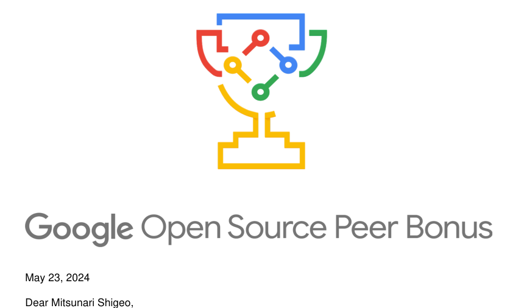
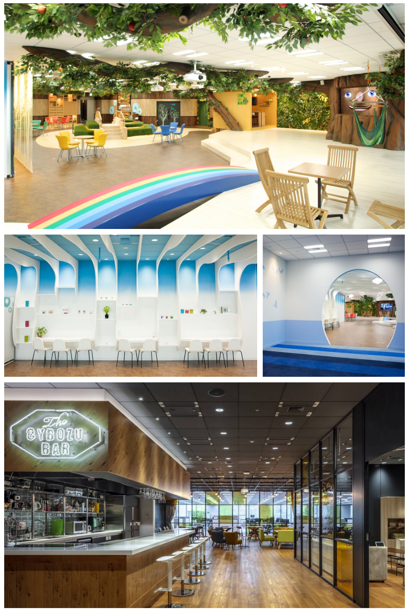

<!--
headingDivider: 1
-->
# 光成滋生
<!-- _class: image-right -->

## サイボウズ・ラボで暗号と高速化のR&D
## OSS開発
- [Xbyak](https://github.com/herumi/xbyak)ファミリー
  - 実行時コード生成可能なx64/AArch64/RISC-V用アセンブリ言語ライブラリ
    - スーパーコンピュータ富岳用AArch64版・RISC-V版も開発
  - TensorFlowやPyTorchなどのAIフレームワークのCPUバックエンドで採用
  - Google Open Source Peer Bonus 2024受賞, Microsoft MVP 2015-2026
- [mcl](https://github.com/herumi/mcl)/[bls](https://github.com/herumi/bls)/[mcl-wasm](https://github.com/herumi/mcl-wasm)
  - 高速なペアリング暗号・BLS署名ライブラリ
  - Ethereum VMなどのブロックチェーンプロジェクトで利用される/3500万DL
  - Ethereum Foundation Grant x 3獲得
- 最近はGCC/LLVM/Goなどのコンパイラの最適化改善Pull Requestを出して貢献

# サイボウズ
<!-- _class: image-right -->

## 企業理念
- チームワークあふれる社会を創る
## 情報共有プラットフォームの開発・運用
- kintone: 業務システム構築プラットフォーム: 42000社
- Garoon: 大規模組織向けグループウェア: のべ8700社
- サイボウズOffice: 中小企業向けグループウェア: のべ84000社
- Mailwise: メール共有システム: のべ17000社
  - 数値は2026年8月末時点
- [採用イベント](https://cybozu.co.jp/recruit/entry/newgrad/)
## サイボウズ・ラボ
- 長期的な視点から、エンジニアリングの専門性によって
チームワークあふれる社会の実現を目指す研究開発部門