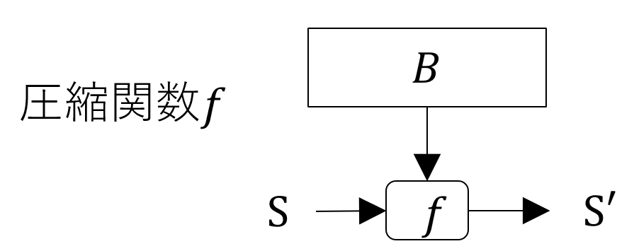
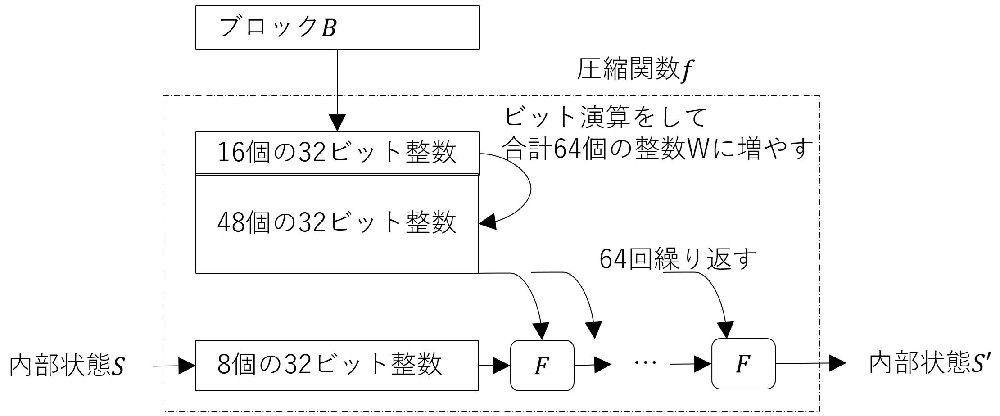
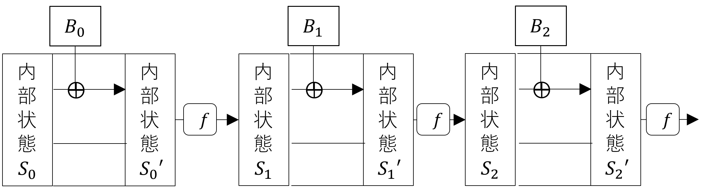

<!--
headingDivider: 1
-->
<!--
_class: title
-->
# 共通鍵暗号
<br>
光成滋生
<br>

# 概要
## 目的
- 共通鍵暗号の基本的な考え方
- ワンタイムパッドと情報理論的安全性の考え方
- 代表的な共通鍵暗号のアルゴリズムの概略
- 計算量の評価について
- 暗号化の安全性の種類
- MAC・ハッシュ関数・AEADなどの理解
- 数学的な定式化も紹介する

# 目次
## 用語一覧
- 共通鍵暗号, 乱数, 排他的論理和 XOR (exclusive or)
- ワンタイムパッド OTP (One-Time Pad), 情報理論的安全性
- PRG, PRF, ストリーム暗号, ChaCha20
- ブロック暗号, AES, 暗号利用モード, ECB, CBC, CTR
- 確率的アルゴリズム, 計算量, O記法, クラス P, クラス NP
- 暗号の安全性, 強秘匿性, 頑強性
- MAC, 存在的偽造不可能
- IND-CPA安全, IND-CCA2安全, Enc-then-Mac
- ハッシュ関数, SHA-2, 伸長攻撃, SHA-3
- AEAD, 拡大体

# 共通鍵暗号とは
## 「暗号鍵＝復号鍵＝秘密鍵」な暗号方式
- 秘密鍵暗号, 対称鍵暗号ともいう
- 秘密鍵は事前に二者間で安全に共有しておく必要がある
- 秘密鍵 $s$ で平文 $m$ を暗号化して暗号文 $c$ を得る: $c=Enc(s, m)$
- 秘密鍵 $s$ で暗号文 $c$ を復号して平文 $m$ を得る: $m=Dec(s, c)$
  - 暗号化して復号したら元に戻る必要がある: $Dec(s, Enc(s, m))=m$

- 秘密鍵: secret key, 暗号化: encrypt, 復号: decrypt, 平文: message, 暗号文: ciphertext

# 共通鍵暗号の種類
## ストリーム暗号
- ノイズ（乱数）を生成し、平文とビット単位で混ぜ合わせて暗号化する
  - 主な方式: ChaCha20
- ストリーム暗号＝乱数＋排他的論理和

## ブロック暗号
- 平文を一定の固まり（ブロック）ごとに分割し、ブロック単位で暗号化する
- 主な方式: AES

# 乱数
## でたらめな数の列
- 「でたらめ」とは?
- それまでに出力されている数の列を見ても次に出る数が予測できないこと
  - 次に出る値が過去の履歴と独立
  - 理想的なコインの裏表の出方
  - 裏が出たら0, 表が出たら1とすると次に出る数の確率は0か1が1/2ずつ
## でたらめではない例
- 010101010...
  - 0と1が交互（ただしコインを振って偶然交互に出る可能性はある）

# 排他的論理和 XOR (exclusive or)
## 定義
- 1bit変数 $a$ と $b$ の排他的論理和（以降xorと略す） $a \oplus b$ は次の表で定義される

$a$|0|0|1|1
-|-|-|-|-
$b$|0|1|0|1
$a \oplus b$|0|1|1|0

## 性質
- $a \oplus b = b \oplus a$ （交換法則）
- $a \oplus 0 = a$ （単位元）
- $a \oplus 1 = \neg a$ （否定）
- $a \oplus (b \oplus c) = (a \oplus b) \oplus c$ （結合法則）
- $(a \oplus b) \oplus b = a$ （同じ値を2回作用させると*元に戻る*）

# ワンタイムパッド OTP (One-Time Pad)
## 乱数とxorを組み合わせた暗号
- $n$ bitの平文 $m$ に対して $n$ bitの乱数 $s$ を用意する
  - $s$ が秘密鍵
- 暗号文は ビットごとに $m$ と $s$ のxorをとり暗号文 $c$ を作る
それをまとめて $c = Enc(s, m) = m \oplus s$ と書く
- 復号はビットごとに暗号文 $c$ と乱数 $s$ のxorをとる
$Dec(s, c)=m$
  - xorの性質により $Dec(s, Enc(s, m))=(m \oplus s) \oplus s = m$
## 特徴
- 平文と秘密鍵の大きさが同じ
- 情報理論的安全性（次のスライド）を持つ

# 情報理論的安全性
## 絶対に破れない暗号?
- $n=1$ のとき暗号文 $c$ は 0 or 1
秘密鍵 $s$ とそのときの平文 $m$ の組み合わせは

秘密鍵＼暗号文|0|1
-|-|-
0|0|1
1|1|0

- 平文 $m$ は確率1/2で0 or 1: これは暗号文 $c$ を知らなくても同じ
- 一般の $n$ bit暗号文のとき $c$ は 000...0 から 111...1 の $2^n$ 通り
- 秘密鍵 $s$ も 000...0 から 111...1 の $2^n$ 通り
- 平文も 000...0 から 111...1 の $2^n$ 通りでどれも同じ確率 $1/2^n$
  - やはり $c$ を知らなくても同じ. $c$ の情報が $m$ の推測に役に立たないので安全という
  - $1/2^n$ の確率でたまたま当たることはある

# 欠点
## 一度しか使えない
- One-Time Pad ＝ 一度きりの便箋
- 同じ秘密鍵で複数回使うと安全性が保てない
  - $c_1=m_1 \oplus s$, $c_2=m_2 \oplus s$ とする（単純化のために1bitで考える）と
  - $c_1 = c_2$ なら $m_1 = m_2$, $c_1 \neq c_2$ なら $m_1 \neq m_2$: 平文の情報が漏れる

## 平文のサイズ＝秘密鍵のサイズ
- 平文 $m$ が1GiBのデータなら秘密鍵 $s$ も1GiB必要
  - $s$ を安全に共有できるのならその方法で $m$ を共有すればよいのでは

## ビット反転に弱い
- 暗号文の特定のビットを反転させると対応する平文のビットが反転する
  - 中身は分からなくても平文を制御できる可能性（完全性は別の方法で担保する）

# 問題
## 秘密鍵の転送
- 64TiBのHDDデータを東京から大阪に転送したい
  - 秘密鍵を安全に送るには?
  - 10Gbpsの専用線で送るとどれぐらい時間がかかる?
## 秘密鍵の2回利用
- 年齢を1バイトの整数値としてOTPによる暗号化を考える
  - 子供の年齢の暗号文が0x1eだったとき, 同じ秘密鍵を利用した大人の暗号文が0x5eだった
  - 大人の年齢は何歳以上?

# 疑似乱数生成器 PRG (Pseudo-Random Generator)
## OTPの秘密鍵を小さくしたい
- PRGは「小さい情報」から「大きな疑似乱数」を作る決定的アルゴリズム
- 情報理論的安全性は無くなる: 代わりに計算量的安全性を考える（後の講義）
  - 決定的 ＝ 入力が同じならいつも同じ出力をするアルゴリズム
  - 「小さい情報」 ＝ $s$ ＝ 秘密鍵


# 疑似ランダム関数 PRF (Pseudo-Random Function)
## 秘密鍵を繰り返し使いたい
- 「小さい情報」 $s$ と「入力」$r$ を与えると疑似乱数を出力する決定的アルゴリズム $F(s,r)$
  - $r$ は秘密でなくてよいが2回同じものを使ってはいけない
- ストリーム暗号 $Enc(s,m):=(r, F(s,r) \oplus m)$, ここで $r$ はランダムに選んだ値


# ストリーム暗号の例
<!-- _class: image-right -->

## ChaCha20
- 入力: 256bitの秘密鍵 $k$ と96bitのナンス $n$
  - ナンス (nonce): 一度だけ使われる値
- 出力: 32bitのカウンタ $b$ 1個につき512bitの乱数
- $b$ を1から始めて1ずつ増やして疑似乱数を生成
- 平文と排他的論理和をとり暗号文とする

# ChaCha20のPRF
## 全体図
- 1/4ラウンド関数 `QR(a,b,c,d)`: `a`,`b`,`c`,`d` は32bit整数
- `rotLeft(x,n)` は `x` を左に `n` bit回転させる
`x=[H:L]`, H:n bit, L:(32-n) bitのとき `rotLeft(x,n)=[L:H]`
```python
def QR(a, b, c, d):
  a ← a + b; d ← d ⊕ a; d ← rotLeft(d, 16);
  c ← c + d; b ← b ⊕ c; b ← rotLeft(b, 12);
  a ← a + b; d ← d ⊕ a; d ← rotLeft(d, 8);
  c ← c + d; b ← b ⊕ c; b ← rotLeft(b, 7);
  return (a, b, c, d)
```
# 1/4ラウンド関数QRの適用方法
## 512bitの内部状態を32bit×4×4の正方形に並べる
- 
- 縦ライン1~4, 斜めライン5~8の4個の $x_i$ に対して `QR()` を適用（合計8回）
- これを10回繰り返す

# AES (Advanced Encryption Standard)
<!-- _class: image-right -->

## 最も広く使われているブロック暗号
- ブロックの単位は128bit
- 秘密鍵のサイズは128, 192, 256bitのいずれか
## 暗号化方法
- 秘密鍵からラウンド鍵を生成
- AddRoundKey（1回）
- ラウンド関数（128bitなら9回）
  - SubBytes
  - ShiftRows
  - MixColumns
  - AddRoundKey
- 最終ラウンド関数（1回）

# AddRoundKeyとSubBytes


## AddRoundKey
- ラウンド鍵との排他的論理和
- 128bitのブロックを8bit×4×4の正方形に並べる
## SubBytes
- 各8bitの値をindexとするテーブル引き
- テーブル (S-Box) の値は固定

# ShiftRowとMixColumns


## ShiftRow
- データをずらす
## MixColumns
- 行列の掛け算
- $x'_0=A_{00}x_0+A_{01}x_1+A_{02}x_2+A_{03}x_3$
- 掛け算や足し算は有限体（後の講義）を利用

# 暗号利用モード
## ブロック暗号の使い方
- ECB (Electronic Codebook) モード

- 平文を128bitごとに分割して暗号化
- 一番単純な使い方
- *安全ではない*

# ECBモードで画像を暗号化
## 32bitカラー画像を白黒2値化した無圧縮データをECBモードで暗号化

- 元の情報がある程度見えてしまう（極端な例）
- 2020年Zoomの暗号化方式がECBモードを使っていたとしてニュースになる
  - （注意）動画などの圧縮データは分割されたブロックが同じ値になる確率は低い

# 確率的アルゴリズム
## そもそもアルゴリズムとは
- 入力に対して出力を返す手続き（ざっくりとした説明）
## 決定的 (deterministic) アルゴリズム
- 同じ入力に対して常に同じ出力を返すアルゴリズム


## 確率的 (probabilistic) アルゴリズム
- 同じ入力に対して異なる出力を返す可能性があるアルゴリズム
- アルゴリズム実行中に乱数を参照して結果を変化させる


# CBC モード
## IV (Initialization Vector) を利用


- CBC=Cipher Block Chaining = ブロックの鎖
- IVは一度しか使わないナンス
- 暗号文と一緒にIVも送る
- $c_1=Enc(s, m_1 \oplus IV)$
- $c_k=Enc(s, m_k \oplus c_{k-1})$ for $k \ge 2$.
## 特徴
- IVが変わると同じ平文でも暗号文が変わる
- ECBでは見えていた鳥の情報が見えない

# CBCモードの利用減少
## 弱点
- 先頭から順番にしか暗号化できない
  - 複数のCPUで並列に暗号化はできない
- 問題: CBCモードの復号は並列化可能か否か?

## TLS1.3で廃止

- パディングオラクル攻撃POODLE (2014)
- ブロック暗号のパディング処理の実装問題
  - ブロックサイズに満たない端数の処理
  - サーバに不正な暗号文を送り返答を利用
  - サーバは復号時にエラー詳細を返してはいけない

# CTR モード
## ブロック暗号をPRFとして利用するストリーム暗号
- CTR = CounTeR
- 「ナンス＋カウンタ」を暗号化して乱数とする
- その乱数と平文のxorをとって暗号化
- 暗号化・復号共に並列処理可能
- パディング処理不要

# 計算量
## アルゴリズムの善し悪し
- 同じ結果を得るならより速いアルゴリズムがよい
- 少ないメモリ・少ない時間
- 入力パラメータの大きさ $n$ について $n$ が大きくなったときの振る舞いをみる
## O記法（オー）
- 関数 $f(n)$ が $n$ の増加に伴いどのように増加するかを表す記法
## 例
- $f(n)=O(1)$: 定数時間: $f(n)$ は $n$ がどんなに増えてもある定数以下である
- $f(n)=O(n^d)$: 多項式時間: $f(n)$ は $n$ が大きいとき高々 $n^d$ の定数倍の大きさ
- $f(n)=O(\log(n))$: 対数時間: $f(n)$ は $n$ が大きいとき高々 $\log(n)$ の定数倍の大きさ
- $f(n)=O(e^n)$: 指数時間: $f(n)$ は $n$ が大きいとき高々 $e^n$ の定数倍の大きさ

# グラフの比較
## O記法での分類

- 定数時間 $<$ 対数時間 $<$ 多項式時間 $<$ 指数時間
- $2^x$ は指数時間, $x^{100}$ は多項式時間
  - $x=10$ のときは $2^x \ll x^{100}$ だけれども
## 例
- $n$ bitの鍵の種類（鍵空間）は $2^n$
- $n$ 個のデータの (merge) ソートは $O(n \log n)$
## 注意
- $O(g(n))$ は「高々 $g(n)$ の定数倍の挙動」なので
$g(n)$ より小さくてもOK
- 「丁度 $g(n)$ 」と言うときは $Θ(g(n))$ を使う

# クラス $P$
## 決定問題
- 与えられた入力に対して「はい」か「いいえ」で答えられる問題
## クラス $P$
- 多項式時間で解ける決定問題の集合

## 素数判定
- 「与えられた自然数 $n$ が素数である」という決定問題
- Agrawal–Kayal–Saxena (AKS2002) で多項式時間で判定できるアルゴリズムが提案された
  - クラス $P$ に属する
  - 暗号ではそれよりも高速な別のPPTアルゴリズムが使われることが多い

# クラス $NP$
## NP＝非決定性多項式時間 (Non-deterministic Polynomial time)
- 「はい」の証拠をもらったとき、それを多項式時間で検証できる決定問題の集合
- クラス $P$ は証拠を多項式時間で検証できるのでクラス $NP$ に含まれる. $P \subset NP$
- 「多項式時間で解けない問題の集合」*ではない*

## SAT (Satisfiability Problem)
- 与えられた論理式 $\phi(x)$ について $\phi(a)=1$ となる $a$ は存在するか?
  - 証拠 $a$ が $\phi(a)=1$ となるのを確認するのは多項式時間なので クラス $NP$ に属する

## $P=NP$ or $P \subsetneq NP$ ?
- $P=NP$ なら暗号理論はやり直し
  - 多項式時間で解けるかそうでないかの境界に安全性の根拠を置くことが多い

# 暗号の安全性
## 計算量の目安
- $n$ bitの秘密鍵の共通鍵暗号の最良の解読が鍵を一つ一つ試すしらみ潰し法しかないとき
$n$ bitセキュリティという
- 2025年現在のコンピュータでは $2^{128}$ 個の計算は無理: $n=128$ なら安全
  - 国家規模なら $n \sim 80$ ぐらいは破られる

## 暗号理論で扱う計算量
- $n$ bitの秘密鍵に対して多項式時間で解読できる場合、安全ではないという
- 指数時間かかるのが理想
- 多項式時間と指数時間の間の準指数時間で解読できる暗号も実用的に扱う

## 暗号文の一部の情報も漏れてほしくない（強秘匿性）
- 例えば $c=Enc(m)$ の $m$ の偶奇やパリティビットが漏洩してほしくない

# 強秘匿性だけで十分か
## 受動的な攻撃者
- 盗聴するだけの攻撃者に対しては安全
- 暗号文を改竄する能動的な攻撃者については?
  - 特定のビットを反転させて平文を制御できた
## 頑強性
- 能動的な攻撃者に対しても安全であって欲しい
- 平文を制御できるような暗号文の改竄ができない
- データの完全性

# 選択暗号文攻撃

## CCA (Chosen Ciphertext Attack)
- 攻撃者は対象暗号文 $c$ に対し暗号文 $c_i (\neq c)$ を選び
対応する平文 $m'=Dec(c_i)$ を得られる状況
  - その時 $m=Dec(c)$ の情報を入手できるか?
- CCA1: $c$ を受け取る前のみクエリ可能
- CCA2: $c$ を受け取った後もクエリ可能
  - 適応的 (adaptive) CCAともいう
  - 試験中に先生に問題の類題の答えを聞ける状況
## IND-CCA(1/2)安全
- CCA(1/2)に対して強秘匿な暗号

# オラクル（oracle）

## 問い合わせ可能なブラックボックス
- 神様の信託（おつげ）
- CCA2みたいな攻撃を想定する状況はあるのか?
## POODLE（再掲）
- CBCモードにおけるパディングオラクル攻撃
- 改竄した暗号文を多数サーバに送り
応答から平文の情報を入手して攻撃

# 問題
## それぞれ理由を記せ
1. ChaCha20はIND-CCA2安全ではない理由
2. CBCモードはIND-CCA2安全ではない理由

# メッセージ認証コード

## MAC (Message Authentication Code)
- データの改竄を検知する暗号技術
- 次の(KeyGen, Mac, Verify)をMACという
## 三つ組アルゴリズム
- $KeyGen(1^λ)=s$: 秘密鍵
- $Mac(s, m)=t$: メッセージ $m$ に対して
MAC値（タグともいう）$t$ を出力
- $Verify(s, m, t) \in \Set{0,1}$
1は正しい（受理）, 0は不正（拒否）
## 正当性
- $Verify(s, m, Mac(s, m))=1$ for $\forall s, m$

# MACの安全性

## 存在的偽造不可能性
- 適応的選択文書攻撃 CMA (Chosen Message Attack)
  - 攻撃者が $m_i$ を選びオラクルに問い合わせて $t_i=Mac(s,m_i)$ の入手を好きなだけ繰り返し $\Set{(m_i,t_i)}$ を得る
- $Verify(s,m,t)=1$ なる $(m,t) \notin \Set{(m_i,t_i)}$
を作れないときCMAに対して（強）存在的偽造不可能
(strong existentially unforgeable) sEUF-CMAという
- 完全性（改竄耐性）/真正性（当人しか作れない）

## MACの例
- CMAC (Cipher-based MAC): ブロック暗号を利用
- HMAC (Hash-based MAC): 後述のハッシュ関数を利用

# 暗号化とMACを組み合わせる
## EtM (Enc-then-Mac)
- 暗号化は秘匿性のため, MACは完全性のために使う
1. KeyGen: $s_1$ を暗号化用の秘密鍵, $s_2$ をMAC用の秘密鍵とする
2. Enc: $m$ に対して $c=Enc(s_1,m)$, $t=Mac(s_2,c)$ を計算して $(c, t)$ を送る
3. Dec: $(c, t)$ に対して $Verify(s_2, c, t)=1$ ならば $m=Dec(s_1,c)$ を返す
そうでなければ失敗・停止（$\bot$ (bot) を返すともいう）
## 安全性に関する定理
- EncがIND-CPA安全, MACが存在的偽造不可能ならばEnc-then-MacはIND-CCA2安全
  - R. Canetti & H. Krawczyk, ["Analysis of Key-Exchange Protocols and Their Use for Building Secure Channels"](https://link.springer.com/chapter/10.1007/3-540-44987-6_28), Eurocrypt 2001
  - H. Krawczyk, ["The Order of Encryption and Authentication for Protecting Communications (or: How Secure is SSL?)"](https://iacr.org/archive/crypto2001/21390309.pdf), CRYPTO 2001

# 安全ではない組み合わせ
## E&M (Enc-and-Mac)
  - $(Enc(s_1,m), Mac(s_2,m))$
  - 一般的な構成では安全とはいえない
## MtE (Mac-then-Enc)
  - $Enc(s, m||Mac(s,m))$
  - 一般的な構成では安全とはいえない
  - （例外）CBCモードやストリーム暗号（CTRモード含む）では安全
    - ただしIVの扱いや関数処理時間など実装上の問題で脆弱になりえる
    - 実際TLS1.3では廃止された

# ハッシュ関数
## 任意サイズのデータを固定長データに変換する関数 $H$
- $H:\Set{0,1}^* \to \Set{0,1}^n$. $*$ は任意値, $n$ は固定値 (e.g., 128, 256, or 512)
- $H(x)$ をハッシュ値, メッセージダイジェストなどという
## 暗号学的に安全なハッシュ関数
- 一方向性
$y=H(x)$ が与えられたとき $H(x')=y$ となる $x'$ を見つけるのが難しい
- 衝突困難性
$H(x)=H(x')$ となる $x$, $x'$ ($x \neq x'$) を見つけるのが難しい
## 衝突困難性が成り立つなら一方向性が成り立つ
- $x\in\Set{0,1}^{2n}$ に対して一方向性が破れれば $H(x)=H(x')$ となる $x'$ が見つかる
- $2^{2n} \gg 2^n$ より $x=x'$ となる確率はとても小さいので衝突困難性が破れる

# 問題
## 一方向性が成り立つなら衝突困難性が成り立つ?
- 成り立たないならそんな例を作れ

# 答えの例
## $H$ を一方向性が成り立つ関数とする
- $x \in \Set{0,1}^m$ ($m>n$) に対して、$x=x_{>0} || x_0$ （$x_{>0}$ は $m-1$ bit, $x_0$ は1bit）と分解する
- $H'(x):=H(x_{>0})$ とする
1. $H'$ は一方向性関数である
  - もし $H'(x)=H'(x')$ となる $x'(\neq x)$ が見つかれば $H(x_{>0})=H(x'_{>0})$.
  $x_{>0}=x'_{>0}$ となる確率はとても小さいので $x_{>0} \neq x'_{>0}$ となり $H$ の一方向性に矛盾
2. $H'(x||0)=H'(x||1)$ なので衝突困難性が破れる

# ハッシュ関数の歴史
## MD5, SHA-1, SHA-2, SHA-3, ...
- 
- SHA (Secure Hash Algorithm)
  - NISTが標準化
  - 現在はSHA-2が普及（ハッシュ値が256bit, 512bitのSHA-256, SHA-512などがある）
  - SHA-3が2015年に標準化された

# SHA-2 (Secure Hash Algorithm 2)
## 内部構造
- 圧縮関数 $f:B \times S \to S$
$B$: 512bitブロック, $S$: 256bit （32bit整数x8個）
## Merkle-Damgård (MD) 構造
- MD5, SHA-1, SHA-2など多くのハッシュ関数で採用
- SHA-256は入力 $m$ を512bitブロックに分割
- 余りはpaddingとして「1＋0...0+サイズ(64bit)」の形のブロック
- 初期値 $S_0$ は定数


# SHA-256の圧縮関数の概要
## 厳密な定義はFIPS 180-4参照
- 512bitのブロックを32bit整数16個に分割
- ビット回転やビットシフト、排他的論理和を組み合わせて32bit整数64個 $W$ に増やす
- 複雑なビット演算 $F$ を64回適用して $S'$ を出力する
- 

# MDの弱点
## 伸長攻撃が可能
- $m$ について「$m$ の大きさと $h=H(m)$」が既知のとき
任意の $m'$ に対して $H(m||pad(m)||m')$ を計算可能
  - $pad(m)$: $m$ のサイズから決まる最後のpaddingデータ
## 理由
- MD構造は最後の内部状態 $S'$ がそのまま $H(m)$ となる
- $S_0=h$ を初期値として $m'$ に対して圧縮関数を適用す
- $H(m||pad(m)||m')$ を計算できる


# 問題
## 脆弱なHMAC
- $H$ をSHA-2とする
- $s$ を秘密鍵として $MAC(s,m):=H(s||m)$ と作ったMACが安全ではない理由は?

# SHA-3
<!-- _class: image-right-center -->

## SHA-2に変わるハッシュ関数
- NISTがハッシュ関数のコンペ(competition)を開催
- 2012年にKeccak（ケチャック）が選ばれ2015年にSHA-3として標準化
## 特徴
- ハッシュ値のサイズは256, 512bitなど
- スポンジ構造
  - 入力データをスポンジに入れる吸収フェーズ
    - 内部状態は1600bit
    - SHA-2の256bitよりずっと大きい
  - スポンジからデータを取り出す搾取フェーズ
    - 内部状態の最初の256bitを出力

# 吸収フェーズ概要
## SHA-3-256のブロック分割
- $r=1088=(1600-256\times 2)$bitのブロック
- 余りは最初に1bitの1, 次にブロック長にあうように0が0個以上, 最後に1bitの1を追加する
- MD構造と異なりデータサイズは追加されない
## 吸収フェーズ
- 初期状態 $S$ は0で初期化
- 各ブロックを $S$ の先頭からxorして複雑な置換関数 $f$ を適用（詳細は略）


# ハッシュ関数の安全性
## 衝突困難性を破るには
- $H$: $n$ bitのハッシュ値のハッシュ関数, $N=2^n$
- $k$ 回ランダムな値のハッシュ値を計算する
  - 2回目でハッシュ値が同じになる（衝突する）確率 $P_2=1/N$
  - $P_3=1-\texttt{（全部異なる確率）}=1-((N-1)/N\times (N-2)/N)$
  - $k$ 回目の $P_k=1-\prod_{i=1}^{k-1}(1-i/N)$
  - $N \gg k$ のとき $e^{-i/N} \approx 1-i/N$ より
$P_k \approx 1 - \prod_{i=1}^{k-1} e^{-i/N} = 1-e^{\sum_{i=1}^{k-1}(-i/N)} = 1-e^{-k(k-1)/2N}$
$k \approx \sqrt{N}$ ならば $P_k \approx 1-e^{-1/2} \approx 0.4=40\%$
- $O(\sqrt{N})=O(2^{n/2})$ 回の計算で衝突困難性を破れる確率になる（大雑把な評価）
  - これを誕生日攻撃 (birthday attack) という
- 理想的な $n$ bitのハッシュ関数は $n/2$ bitセキュリティ安全という

# HMACの構成
<!-- _class: image-right-center -->

## HMAC-SHA-256
- $s$: 256bit秘密鍵, $m$: データ
- $HMAC(s,m)=H(s \oplus C_2 || H(s \oplus C_1 || m))$
  - $C_1=0x3636...36$ (256bit), $C_2=0x5c5c...5c$ (256bit)
  - $||$ はデータの連結, $\oplus$ はビットごとの排他的論理和
## 安全性
- M. Bellare, "New Proofs for NMAC and HMAC:
Security Without Collision-Resistance", CRYPTO2006
  - 圧縮関数がPRFならHMACはPRFであることを示す

# SHA-3ベースのMAC
## SHAKE
- SHA-3のスポンジ構造を利用した可変長出力可能な関数 XOF (eXtendable Output Function)
  - cSHAKE256(X, L, N, S)
    - X: 入力データ
    - L: 出力データ長 (bit)
    - N: "KMAC"などの文字列, S: アプリ区別用文字列
## KMAC
- スポンジ構造には圧縮関数の構造が無いので伸長攻撃がない
- ハッシュを2回して安全性を高めるのは冗長
  - $KMAC(s, m)=cSHAKE256(s||m||256, 256, \texttt{"KMAC"}, \texttt{""})$ の形で安全
  - 厳密には $s||m||256$ の部分はバイトエンコーディングなどが行われる
  - 詳細はNIST Special Publication 800-185参照

# AEAD (Authenticated Encryption with Associated Data)
## 認証付き暗号
- 秘匿性と完全性の両方を同時に満たす暗号
- 共通鍵暗号とMACの組み合わせで実現
  - 組み合わせ方法や実装によって安全でないこともあった
  - 最初から組み合わせることを前提とした設計が望ましい

- 共通鍵暗号・MAC・AEADの違い

暗号技術＼性質|秘匿性|完全性
---|---|---
共通鍵暗号|ある|無い
MAC|無い|ある
AEAD|ある|ある

# AEADのアルゴリズム
<!-- _class: image-right -->

## 暗号化
- 入力: 平文: $m$, ナンス: $n$, 秘密鍵: $s$, 関連データ: $d$
  - ナンス $n$ は同じ値を再利用してはいけない
  - 関連データは暗号化されないが改竄防止対象
- 出力: 暗号文: $c$, 認証タグ: $t$
## 復号
- 入力: ナンス: $n$, 関連データ: $d$, 暗号文: $c$, 認証タグ $t$, 秘密鍵: $s$
- 出力: $t$ が正しいときのみ平文 $m$. それ以外は停止 $\bot$
## 安全性
- 共通鍵暗号の安全性とMACの安全性の両方を併せ持つ

# AEADの例1
<!-- _class: image-right -->

## Chacha20-Poly1305
- [RFC 8439](https://datatracker.ietf.org/doc/html/rfc8439)
- 暗号化: ChaCha20 + MAC: Poly1305
## Poly1305
- $p:=2^{130}-5$
- 256bitの秘密鍵 $k$ から
128bitの $r$ と 128bitの $s$ を生成
- 平文 $m$ を128bitブロック $m_i$ に分割
- $a:=0$ を初期値として
$a:=((a+ m_i)r) \bmod{p}$ で更新
- 最後に128bitの認証タグ $t:=(a+s) \bmod{2^{128}}$ を出力

# AEADの例2
<!-- _class: image-right -->

## AES-GCM
- [NIST SP 800-38D](https://nvlpubs.nist.gov/nistpubs/Legacy/SP/nistspecialpublication800-38d.pdf)
- 暗号化: AES-CTR + MAC: GHASH
## GHASH
- $p(x):=x^{128}+x^7+x^2+x+1$
- $\mathbb{F}_{2^{128}}:=\mathbb{F}_2[x]/(p(x))$
- 128bitの0を秘密鍵 $k$ で暗号化
  - $H:=Enc(k, 0^{128})$
- "関連データ|暗号文|長さ"を
128bitブロック $u_i$ に分割
- $a=0$ を初期値として $a := (a + u_i)H$
ここで加算・乗算は $\mathbb{F}_{2^{128}}$ 上で行う

# 拡大体
## 複素数体 $\mathbb{C}$
- $a, b \in \mathbb{R}$ に対して $a+bi$ ($i^2=-1$) の形が複素数
  - $(a+bi)\pm(c+di)=(a\pm c)+(b\pm d)i$
  - $(a+bi)(c+di)=(ac-bd)+(ad+bc)i$
## これを多項式の形で見直す
- $\mathbb{R}[x]$ を実数係数多項式の集合
- $K:=\mathbb{R}[x]/(f(x))$ を $f(x):=x^2+1$ で割った余りの集合とする
- $f(x)$ は2次式なので余りの多項式は $a+bx$ ($a,b \in \mathbb{R}$) の形
- $K$ の中で $(a+bx)\pm(c+dx)=(a\pm c)+(b\pm d)x$
- $(a+bx)(c+dx)=ac + (ad + bc)x + bdx^2 \equiv (ac - bd) + (ad + bc)x \mod f(x)$
  - $x$ を $i$ にシンボルとして置き換えると同じ形
- これを $\mathbb{C}$ は（最小多項式） $x^2+1$ による $\mathbb{R}$ の 2次拡大体という

# 有限体の拡大体
## $K:=\mathbb{F}_7$ の2次拡大体の例
- $f(x)=x^2+1$ とすると $f(x)$ は $K$ 上で既約（$f(x)$ が $K$ 係数の範囲で因数分解できない）
- $L:=K[x]/(f(x))=\Set{a+bx|a, b \in K}$ は $K$ の2次拡大体
  - 注意: $\mathbb{F}_5$ 上では $x^2+1=(x-2)(x+2)$ なので $\mathbb{F}_5[x]/(x^2+1)$ は体にならない
## $K:=\mathbb{F}_2$ の2次拡大体
- $K=\Set{0,1}$ は加算が $\oplus$（排他的論理和）, 乗算が $\land$（論理積）と同じ
  - $x^2+1=(x+1)^2$ なので既約でない
- $f(x):=x^2+x+1$ は既約だから $L:=K[x]/(f(x))$ は $K$ の2次拡大体
  - $(a+bx)(c+dx)=ac + (ad+bc)x+bdx^2$
  $\equiv ac + (ad+bc)x + bd(x+1)= (ac+bd) + (ad+bc+bd)x$
  - 注意: $\mathbb{F}_2$ 上では $-1=1$ なので $x^2=-(x+1)\equiv x+1$
  $x^2$ を $x+1$ に置き換えると思えばよい

# $K:=\mathbb{F}_2[x]/(x^2+x+1)$ の演算表
## 乗算
$a$ \ $b$|$0$|$1$|$x$|$x+1$
---|---|---|---|---
0|0|0|0|0
$1$|0|$1$|$x$|$x+1$
$x$|0|$x$|$x+1$|$1$
$x+1$|0|$x+1$|$1$|$x$

## 逆元
$a$|$1$|$x$|$x+1$
--|---|---|---
$a^{-1}$|$1$|$x+1$|$x$

# AES-GCMで使われる拡大体
## $K_1:={\mathbb{F}_2}^8=\mathbb{F}_2[x]/(f_1(x))$
- $f_1(x):=x^8+x^4+x^3+x+1$ を利用（$x^8$ を $x^4+x^3+x+1$ に置き換える）
## $K_2:={\mathbb{F}_2}^{128}=\mathbb{F}_2[x]/(f_2(x))$
- $f_2(x):=x^{128}+x^7+x^2+x+1$ を利用（$x^{128}$ を $x^7+x^2+x+1$ に置き換える）
## ビット演算との対応
- $K_1$ の要素は各係数が0, 1の7次多項式なので8bitで表現できる
- 8bitで表現した多項式 $a$, $b$ の加算は係数ごとの加算でそれが "$\oplus$"
よって $a \oplus b$ で多項式の加算ができる
- 8bitの $a=[a_0:a_1:\cdots:a_7]=\sum_{i=0}^7 a_i x^i$ と "$x$" の乗算は
$a x = a_0 x + a_1 x^2 + \cdots + a_7 x^8 = a_0 x + a_1 x^2 + \cdots + a_6 x^7 + a_7 (x^4+x^3+x+1)$
$=[a_7:(a_0+a_7):a_1:(a_2+a_7):(a_3+a_7):a_4:a_5:a_6]$ となる

# 問題
## 2次拡大体
- $K={\mathbb{F}_2}^2$ の元 $(a,b)$, $(c, d)$ に対して乗算を $(a c, b d)$ と定義するのでは駄目なのか
## 8次拡大体
- $K=\mathbb{F}_2[x]/(f(x))$ の多項式を $f(x)=x^8+x+1$ としては駄目なのか